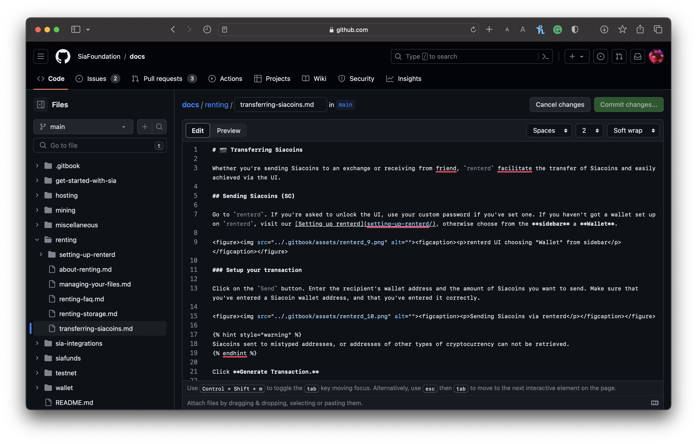
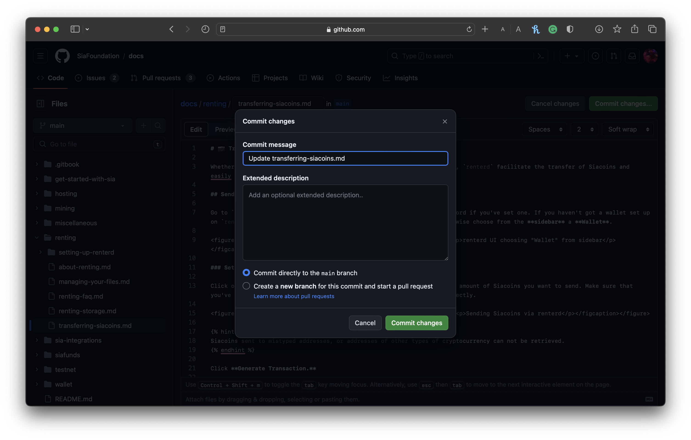

Sia is the world's safest cloud storage, by design—a purely decentralized peer-to-peer network with **no central access point**, **no gatekeepers**, and **no insanely expensive hardware requirements**. It offers a radically new level of **privacy**, **security**, **performance** and **pricing** — all through a unique **nonprofit model**.

So whether you’re a developer looking to build on an open-source and decentralized cloud platform, or a user ready to take control of your data, you’re in the right place!

Our documentation is your comprehensive guide and single source of truth for learning how to interact with the Sia Network.

# Get Involved

## Contribute to Docs

Keeping our docs up to date is important, and we welcome community contributions—whether suggesting edits or adding new articles.

1. To submit edits via GitHub, click dropdown in the top-right corner and select **Edit on GitHub**. You’ll be taken directly to the corresponding page on GitHub.

2. Next, click **Edit the file** to edit the markdown file.


You can toggle the **Preview** button to see how the markdown will be formatted.


3. After editing the markdown, click Commit Changes (top right) and:
- Choose **Create a new branch for the commit, and start a pull request**.
- Add a clear commit title.
- Briefly describe your changes in the extended description, including relevant links if applicable.

4. Once you're satisfied, click **Commit Changes** to submit your edits.


Congratulations! You’ve successfully submitted your edits via GitHub and will be reviewed by The Sia Foundation.


## Contribute to Sia

Our core team of engineers at The Sia Foundation believes that principles are everything—in **Systems Creativity**, **Technical Integrity**, and **Personal Agency**. As a 100% open-source project, we've had countless individuals contribute to the core code or to apps built on top of the network, which **invests in and strengthens the Sia cloud storage network, engages the Sia community, and educates the public about the urgency of data privacy and ownership**.

Check out our [GitHub](https://github.com/SiaFoundation) to follow along or contribute code to help further our mission.

## Join our Community

Join our [Discord](https://discord.com/invite/sia)—a hub for developers, users, and anyone curious about decentralized cloud storage, privacy, and security. It’s the place for support, collaboration, and updates. Want to contribute? Head to `#contributors` to say hi, ask questions, or share your Sia-related code or app.


**Need Assistance?**

Join the `#help` channel on our [Discord](https://discord.com/invite/sia), where the community is always ready to help.

You can also [email us](mailto:hello@sia.tech), and we’ll get back to you as soon as possible.

