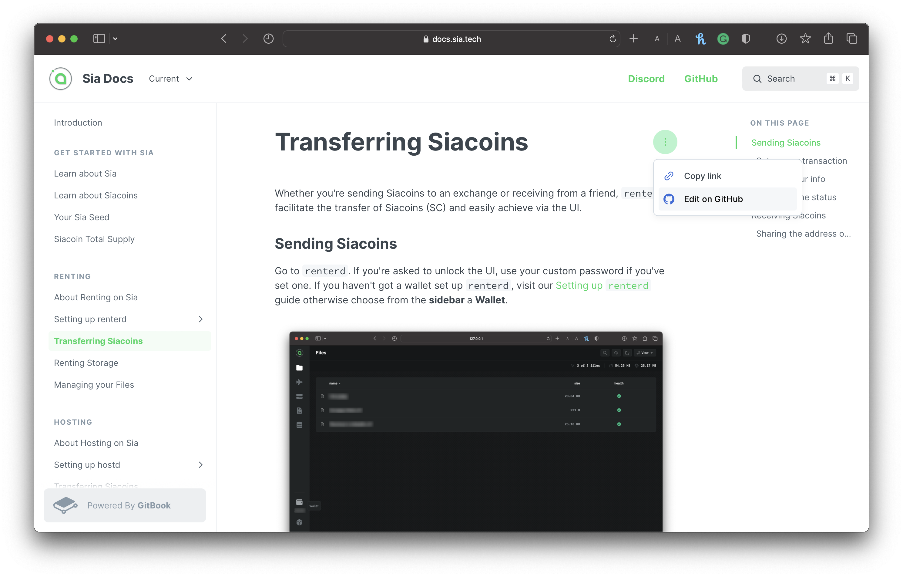

# Introduction

## Welcome to the Sia Docs!

The Sia Docs is your gateway to the remarkable world of decentralized cloud storage. Whether you're a tech-savvy enthusiast or want to explore the potential of the decentralization of cloud storage and data security, you've come to the right place!

Our documentation aims to provide a comprehensive source of information and serve as a beacon of knowledge for anyone interested in embracing the power of decentralized cloud storage.

The information in these docs has been taken from a number of sources, primarily the previous Sia Support Center and community-driven sites like the [Sia Wiki](https://web.archive.org/web/20180921135627/https://siawiki.tech/index), [SiaStats](https://siastats.info), and [SiaSetup](https://siasetup.info), and we aim to educate our community with what Sia has to offer!

## Submitting your edits

Keeping our documentation current is a substantial undertaking, and with GitBook, we've opened the door for community members to contribute ideas actively. Whether you want to suggest edits to existing content or create entirely new articles, you can do so.&#x20;


All submissions undergo a review and approval process by a member of the team, which means your commit won't be merged immediately.



You must have a GitHub account to submit an edit proposal. If you haven't already, please log in or create a GitHub account before you proceed.


1. To edit and submit a proposal via GitBook, click the **Page actions** (ellipsis) in the upper right corner of any page and click **Edit on GitHub**.

<figure><figcaption>
Selecting the page actions, and edit on Github
</figcaption></figure>

After clicking **Edit on GitHub**, you'll be taken directly to the corresponding page on GitHub.

2. Next, click **Edit the file** (pencil icon) to edit the markdown file.

<figure><figcaption>
Editing the markdown file via Github
</figcaption></figure>


Toggle the **Preview** button to see how the markdown will be formatted on the GitBook documentation.&#x20;


3. Once you make your changes/additions to the markdown, click the **Commit Changes** button in the top right corner. Remember to do the following:
   * Select the **Create a new branch for the commit, and start a pull request** option.
   * Add a reasonable title for this commit change(s) in the commit message textbox.
   * In the extended description section, provide A brief description of the changes/additions made in this commit. If possible, give any links to resources that help you decide to contribute.

<figure><figcaption>
Committing changes and edits via Github
</figcaption></figure>

4. Once you're satisfied, click **Commit Changes** to submit your proposal&#x20;


## Further assistance

If you can't find your answer here in our documentation, join the `#help` channel in the [Sia Discord](https://discord.com/invite/sia), where a vast community loves helping users with their issues.

You can also [send us an email.](mailto:hello@sia.tech) We'll respond as soon as we can.


