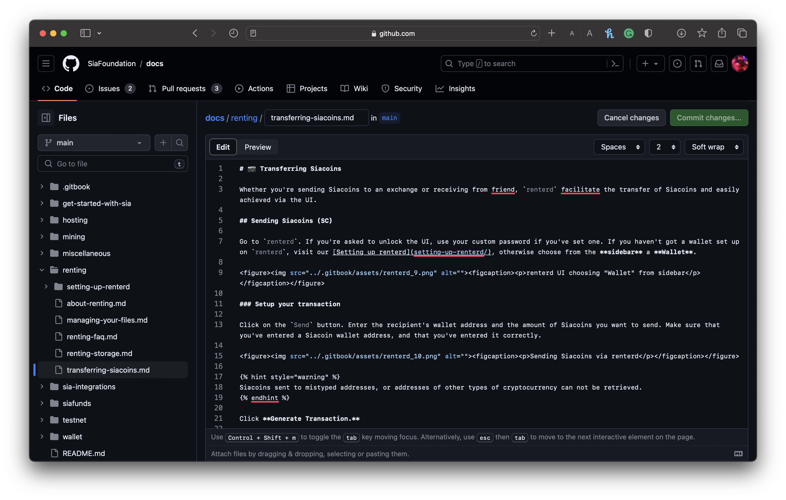
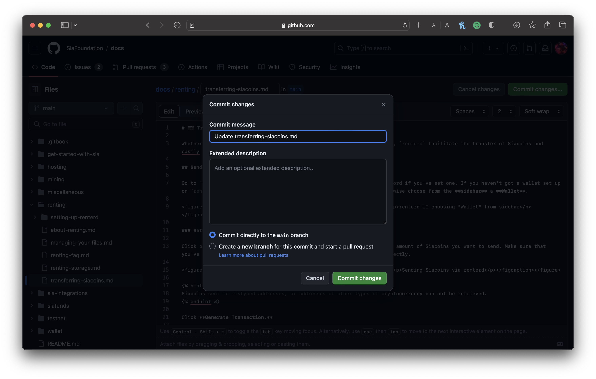

Sia is decentralized, peer-to-peer cloud storage with no central provider and no gatekeepers. Files are encrypted on your own device before upload, so no storage provider can read your data, and you hold the keys. The network is developed by a non-profit and runs on open-source software.

Whether you're a developer building on Sia or a user storing your own data, these docs cover how to use the network.

# Where to start

* **Store your data** — the simplest way to start is the [Sia Storage app with a free Sia Storage account](renting/using-sia-storage.md) (50 GB). For how it works, see [About Storing Your Data](renting/about-renting.md).
* **Provide storage and earn Siacoin** — set up [`hostd`](hosting/about-hosting-on-sia.md).
* **Hold and manage Siacoin** — use [`walletd`](wallet/wallet-overview.md).
* **Build an application on Sia** — see the [Sia Developer Portal](https://devs.sia.storage).
* **Not sure which software you need?** — [Which Sia software do I need?](get-started-with-sia/sia-software-overview.md)

# Get Involved

## Contribute to Docs

We welcome community contributions to the docs—whether suggesting edits or adding new articles.

1. To submit edits via GitHub, click dropdown in the top-right corner and select **Edit on GitHub**. You’ll be taken directly to the corresponding page on GitHub.

2. Next, click **Edit the file** to edit the markdown file.


You can toggle the **Preview** button to see how the markdown will be formatted.


3. After editing the markdown, click Commit Changes (top right) and:
- Choose **Create a new branch for the commit, and start a pull request**.
- Add a clear commit title.
- Briefly describe your changes in the extended description, including relevant links if applicable.

4. Once you're satisfied, click **Commit Changes** to submit your edits.


You’ve submitted your edits via GitHub. Your edits will be reviewed by The Sia Foundation.


## Contribute to Sia

Our core team of engineers at The Sia Foundation works according to three principles: **Systems Creativity**, **Technical Integrity**, and **Personal Agency**. As a fully open-source project, we've had many individuals contribute to the core code and to apps built on top of the network.

Check out our [GitHub](https://github.com/SiaFoundation) to follow along or contribute code.

## Join our Community

Join our [Discord](https://discord.com/invite/sia) for developers, users, and anyone curious about decentralized cloud storage, privacy, and security. It's where you can find support and updates. Want to contribute? Head to `#contributors` to say hi, ask questions, or share your Sia-related code or app.


**Need Assistance?**

Join the `#help` channel on our [Discord](https://discord.com/invite/sia), where the community can help.

You can also [email us](mailto:hello@sia.tech), and we’ll get back to you as soon as possible.

