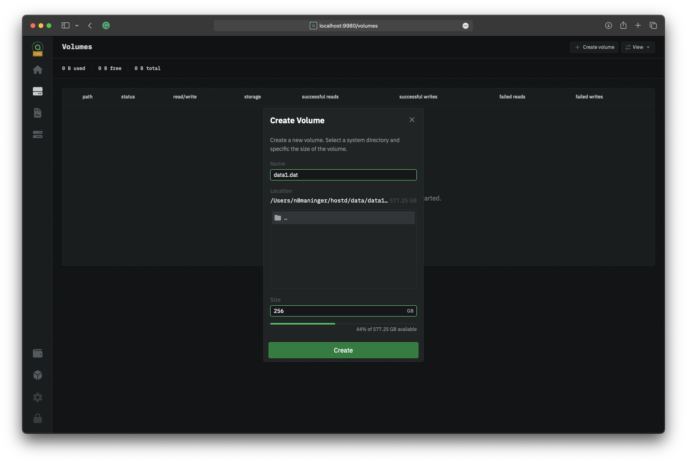
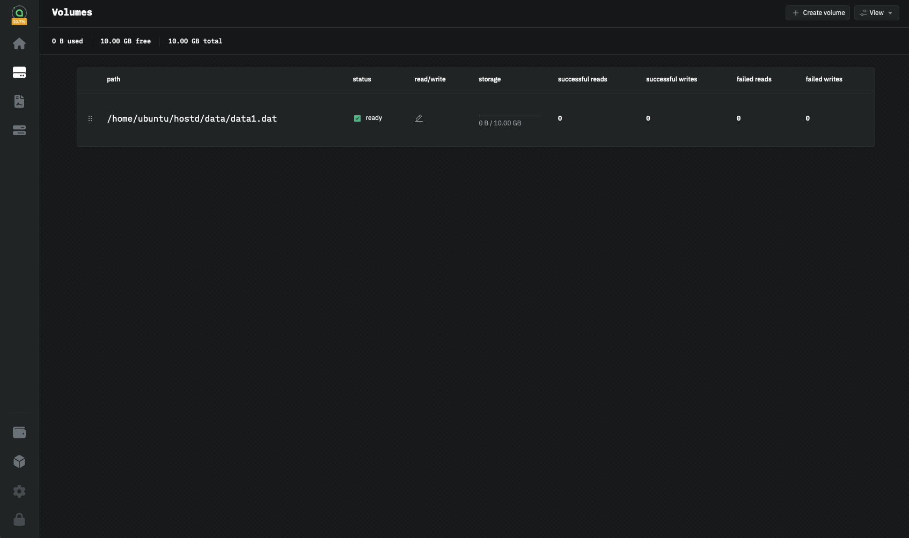

# 🚧 Adding Storage

## Add storage

A "volume" is a location on disk where `hostd` will store uploaded data. A volume can be anywhere, including network drives and external drives. You can create multiple volumes to combine storage from multiple drives. To add a volume:

1. Click the "Volume" icon in the sidebar
2. Click the "Create Volume" button to add your first storage volume.

<figure><figcaption>
hostd create volume
</figcaption></figure>

1. Enter a name for the volume. We recommend something simple, like "hostdata.dat"
2. Use the built-in browser to select a folder to store the volume file.
3. Enter a maximum size for the volume. This is the maximum amount of data that can be stored in the volume.
4. Click "Create" to add the volume to \`hostd\`

After clicking "Create," the volume will be displayed in the volumes list. Depending on the size of the volume and the filesystem, it may take a while to fully provision the new volume. The progress will be displayed in the UI.

<figure><figcaption>
hostd volume list
</figcaption></figure>

###
