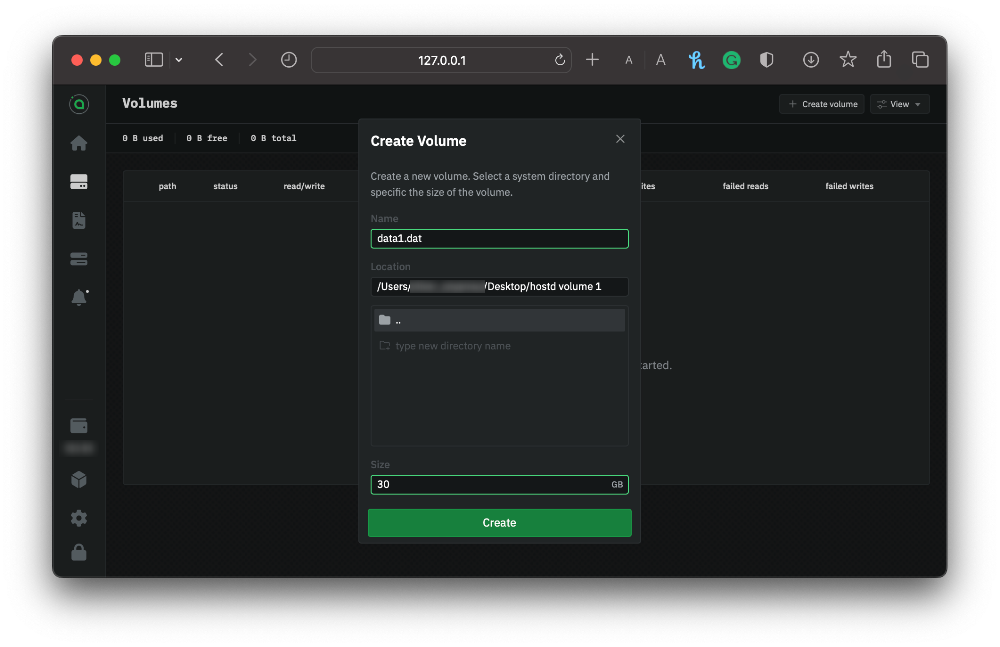

---
layout:
  title:
    visible: true
  description:
    visible: true
  tableOfContents:
    visible: true
  outline:
    visible: true
  pagination:
    visible: true
---

# Adding Storage

When providing storage on Sia, you must allocate a location on your disk that `hostd` will store any uploaded data from renters. This is referred to as **volume**.

**Volume** can be located anywhere on the local or external drives, and you can create multiple volumes to combine storage from multiple drives.

## Creating volume

Go to `hostd`. If you're asked to unlock the UI, use your custom password if you've set one. If you haven't got a wallet set up `hostd`, visit our [Setting up `hostd`](setting-up-hostd/) guide; otherwise, choose from the sidebar **Volume**.

Click on the **Create Volume** button in the top right-hand corner.

1. Enter a name for the volume. We recommend something simple, like _hostdata1.dat_ or _data1.dat._
2. Now select a folder to store the volume file.
3. Lastly, enter a maximum size for the volume. This is the maximum amount of data stored in the volume.

<figure><figcaption>
Creating volume on hostd
</figcaption></figure>

4. Click **Create** to add the volume to `hostd`.

### Checking the status

After clicking **Create**, the volume will be displayed in the volumes list. Depending on the size of the volume and the filesystem, it may take a while to provision the new volume fully. The progress will be displayed in the UI.

<figure><figcaption>
hostd Volume list
</figcaption></figure>
