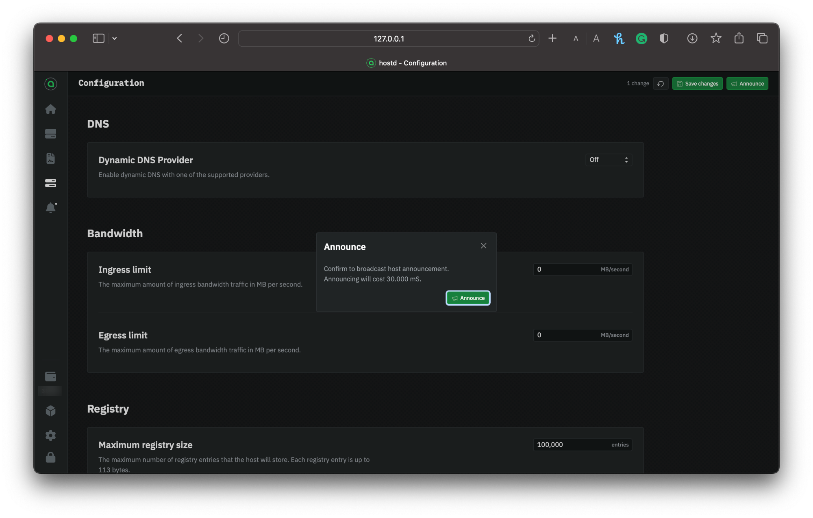
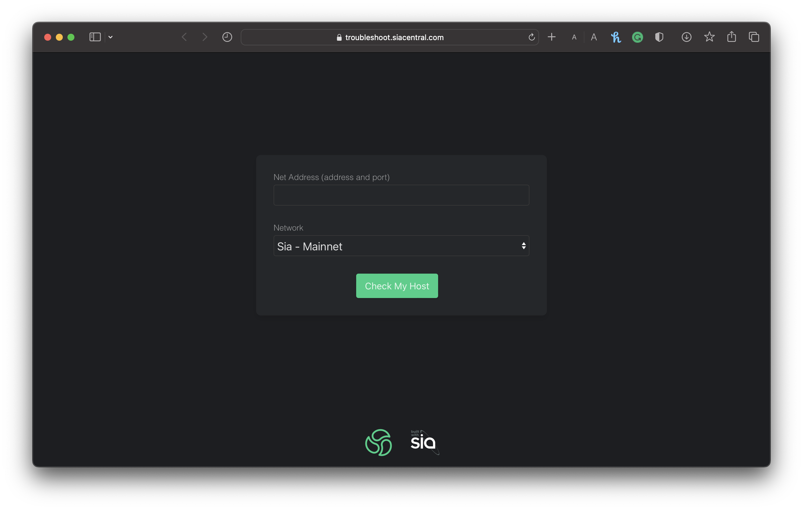

---
layout:
  title:
    visible: true
  description:
    visible: true
  tableOfContents:
    visible: true
  outline:
    visible: true
  pagination:
    visible: true
---

# Announcing your Storage Node

Now that your storage node has been configured and finished syncing, you can announce your node to the network.

Announcing your storage node serves as the bridge between your fully prepared node and potential renters seeking storage solutions. This process publishes information about your storage node, including its network address and public key, onto the blockchain, allowing renters to discover your node and establish contracts.


An announcement transaction incurs a small fee in Siacoins (SC), which will be deducted from your wallet. Ensure your `hostd` wallet is funded by checking out [Transferring Siacoins](transferring-siacoins.md).


Go to `hostd`. If you're asked to unlock the UI, use your custom password if you've set one. If you haven't got a wallet set up `hostd`, visit our [Setting up `hostd`](setting-up-hostd/) guide; otherwise, choose from the sidebar **Configuration**.

Click on the **Announce** button in the top right-hand corner.

<figure><figcaption>
Confirming the announcement of your storage node
</figcaption></figure>

Finally, check the announcement fee and click **Announce** in the dialog to confirm.


Congratulation! Your storage node has been successfully announced to the network and is now ready to be discovered by renters and establish contracts.


## Check your storage node's status

Once the announcement is confirmed, you can check if your storage node is visible on the network by going [here](https://troubleshoot.siacentral.com).

<figure><figcaption>
SiaCentral Troubleshooter
</figcaption></figure>

Enter your storage nodes's network address and click **Check Host**. This tool will connect to your storage node and notify you of any issues.
