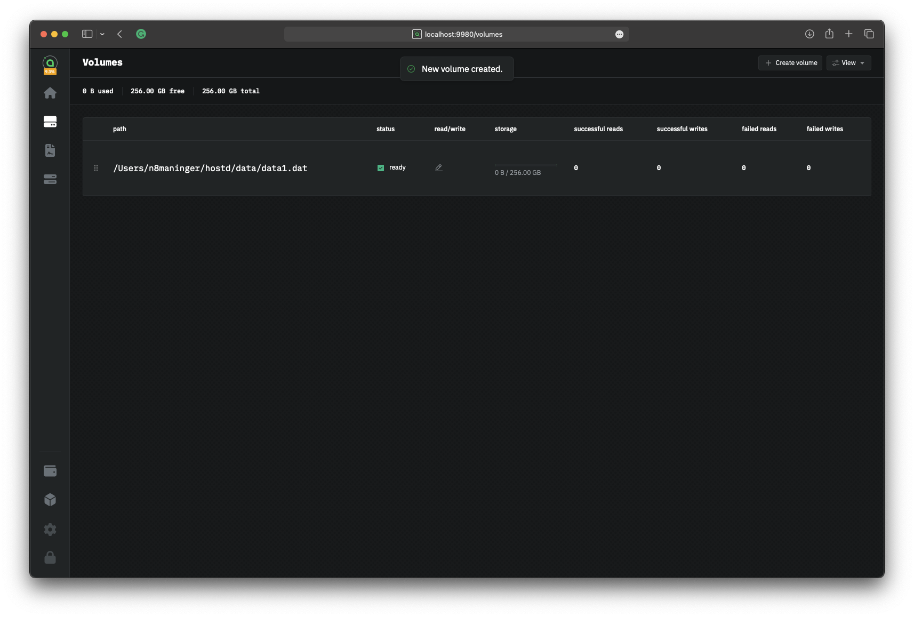

# 🚧 Configuring your Host

## Configure the host

Now that you have a volume, you can configure your host. First, navigate to the "Configuration" page in the sidebar. This page contains all of the pricing and settings available to hosts.

<figure><figcaption>
hostd configuration page
</figcaption></figure>

### Accepting contracts

The first setting to configure is the "Accepting Contracts" setting. This setting determines whether your host will accept new contracts. Most hosts will always have this toggled on. However, if you want to exit the network you can toggle this off to stop accepting new contracts. You will still be required to fulfill any existing contracts before fully shutting down your host.

### Address

The next setting to configure is your host's net address. This is the address that is published to the blockchain and used by renters to connect to your host. Some users use their public IP address, but we recommend setting up a domain. You can use a free service like DuckDNS or No-IP or purchase a custom domain from a registrar.

Whichever method you choose, enter your address in the "Net Address" field followed by your host's RHP2 port, which defaults to `:9982`. For example, if your IP address is `199.111.78.80` you would enter `199.111.78.80:9982`. If your domain is `example.com`, you would enter `example.com:9982`.

<figure><figcaption>
Configure netaddress
</figcaption></figure>

#### Setup using Dynamic DNS

* [Cloudflare](dynamic-dns/cloudflare-advanced.md)
* [DuckDNS](dynamic-dns/duckdns.md)
* [No-IP](broken-reference)

#### Setup using public IP

To find your public IP address click the following link: [https://icanhazip.com](https://icanhazip.com). It will display your public IP address. Copy this address to your clipboard.

### Pricing

On the Sia network, hosts set their prices for storage and bandwidth. The prices you select will determine how much you earn from hosting.


When setting prices, remember you are competing with other hosts. If your prices are too high, renters will choose other hosts. If your prices are too low, you will not earn enough to cover your costs.


We've put together some recommendations for pricing below. These are just recommendations, you can set your prices to whatever you want and change your prices at any time. Hosts will need to experiment with different prices to find the right balance between earnings and utilization.

* **Storage price:** the amount of Siacoins you charge per TB per month of storage. We recommend around $1 USD per TB per month to start.
* **Collateral:** the amount of Siacoins you lock per TB per month of storage. This should always be set to 2x your storage price. For example, if your storage price is 100 SC/TB/mo, you should set your collateral to 200 SC/TB/mo.
* **Ingress price:** the amount of Siacoins you charge per TB of data uploaded to your host. We recommend setting this low to encourage renters to upload data. Between $0.00 and $0.05 USD per TB.
* **Egress price:** the amount of Siacoins you charge per TB of data downloaded from your host. We recommend setting this higher to increase your earnings, above $5 USD per TB is a good starting point.
* **Maximum collateral:** the maximum amount of Siacoins you will lock into a single contract for collateral. This setting is important to limit your risk per contract. A good starting point is However, if you refuse to lock enough collateral for the data a renter wants to store, they will choose another host. Therefore, we recommend setting this around 10x your collateral price. For example, if your collateral price is 200 SC/TB/mo, you should set your maximum collateral to 2000 SC/TB/mo.

We recommend leaving other settings, such as "Contract price", "Base RPC price", "Sector access price," and "Price table validity" at their default values. They are primarily for advanced users.

Once you are happy with your prices, click the "Save Changes" button in the top right corner of the page.

###
