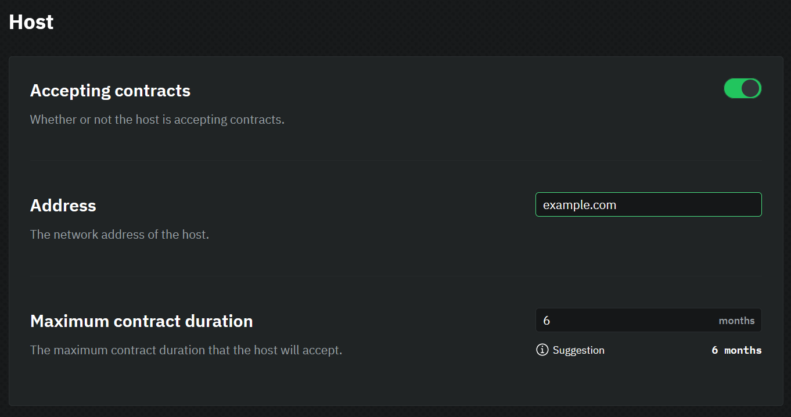
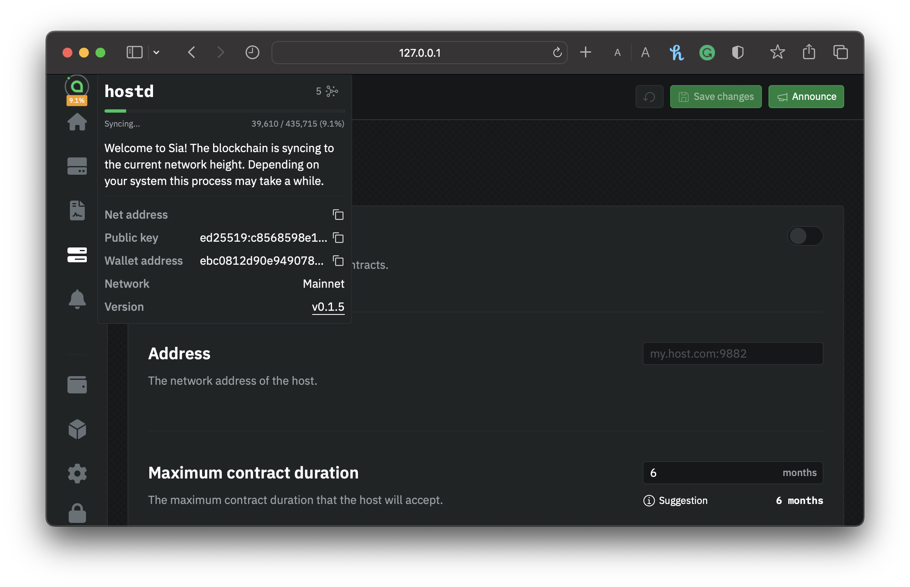

---
layout:
  title:
    visible: true
  description:
    visible: true
  tableOfContents:
    visible: true
  outline:
    visible: true
  pagination:
    visible: true
---

# Storage Node Configuration

Setting up your storage node on Sia also involves configuring essential parameters such as storage, bandwidth, and other critical variables. These configurations are vital to maintaining your storage node's health, ensuring it can effectively provide storage services to renters, and determining how much you earn from providing storage on the network.

Go to `hostd`. If you're asked to unlock the UI, use your custom password if you've set one. If you haven't got a wallet set up `hostd`, visit our [Setting up `hostd`](../setting-up-hostd/) guide; otherwise, choose from the sidebar **Configuration**.

### Port Forwarding

`hostd` needs a stable internet connection and open network access in order to store and retrieve data on the Sia network. You will also need to forward the following ports so `hostd` can properly communicate with the network and renters.

 * 9981/TCP (Sia Consensus)
 * 9984/TCP (RHP4 - SiaMux)
 * 9984/UDP (RHP4 - QUIC)

### Accepting contracts

The **Accepting Contracts** setting determines whether your storage node will accept new contracts. Most storage node's will always have this toggled on. However, if you want to exit the network, you can toggle this off to stop accepting new contracts. You must still fulfill any existing contracts before entirely shutting down your storage node.

### Address

Setting your storage node's network **Address** is essential because it's published to the blockchain and used by renters to connect to your node. Some users use their public IP address, but we recommend setting up a domain.


You have several options for setting up Dynamic DNS. We recommend utilizing straightforward, no-cost services like [DuckDNS](dynamic-dns/duckdns.md) or [Cloudflare](dynamic-dns/cloudflare-advanced.md). Additionally, you can choose to purchase a custom domain from a registrar.

Alternatively, you can set up a public IP address by clicking [here](https://icanhazip.com), which will display the public IP address that you can then copy to your clipboard.


For example:

* If your IP address is `199.111.78.80` you would enter `199.111.78.80`.
* If your domain is `example.com`, you would enter `example.com`.


In the **DNS** section of the `hostd` configuration page, remember also to enable your chosen Dynamic DNS Provider if you opted for this option.


## Pricing

The prices you select will determine how much you earn from providing storage.

When setting your prices, you are in direct competition with other storage providers on the network. Should your prices be excessively high, renters may opt for alternative storage providers. Conversely, if your prices are exceedingly low, you may not generate sufficient earnings to offset your operational expenses.

Storage providers are encouraged to explore various pricing options and adjust as needed to achieve the optimal balance between earnings and utilization. Nevertheless, we have provided the pricing recommendations table below for guidance.


Please be aware that these recommendations are only suggestions, and you can modify your pricing anytime.


| Variables                                    | Description                                                                               | Recommended Value                                |
| -------------------------------------------- | ----------------------------------------------------------------------------------------- | ------------------------------------------------ |
| Storage price                                | The amount of Siacoins you charge per TB per month of storage.                            | **$1 USD per TB per month**                      |
| Egress price                                 | The amount of Siacoins you charge per TB of data downloaded from your storage node.               | **>$5.00 USD per TB**                            |
| Ingress price                                | The amount of Siacoins you charge per TB of data uploaded to your storage node                    | **Between $0.00 - $0.05 USD per TB**             |
| Collateral Multiplier                        | The amount of Siacoins you lock per TB per month of storage                               | **2**                                            |
| [Maximum collateral](#user-content-fn-1)[^1] | The maximum amount of Siacoins you will lock into a single contract for collateral.       | **(Storage Price \* Collateral Multiple) \* 10** |
| Contract price                               | The base price to form or renew a contract with your storage node.                                 | **0.2 SC**                                       |
| Base RPC price                               | The price to execute an RPC. Its added to any additional costs from the RPC.              | **1 SC/Million**                                 |
| Sector access price                          | The base price to read a sector from a disk. It's added to any other costs from your storage node. | **1 SC/Million**                                 |
| Price table validity                         | The length of time a renter's registered price table remains valid.                       | **30 Minutes**                                   |

Click the **Save Changes** button in the top right corner of the page.

## Waiting for sync

Now that you have configured your storage node, you must wait for your node to finish syncing the blockchain. You can check the sync progress by mousing over the Sia logo at the top of the sidebar.

<figure><figcaption>
Checking the status of hostd syncing to the blockchain
</figcaption></figure>


Blockchain syncing can take several hours or even days, depending on your hardware and internet connection. Make sure to have a stable internet connection to ensure your changes are made to your storage node.


[^1]: <mark style="color:red;">It's important to set this to limit the risk per contract</mark>
