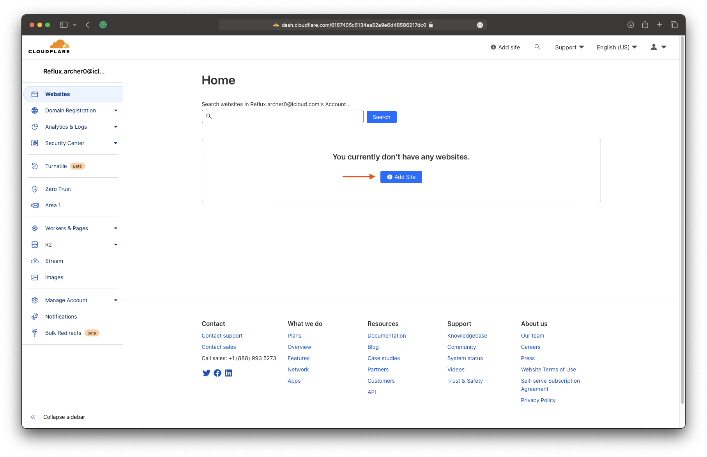
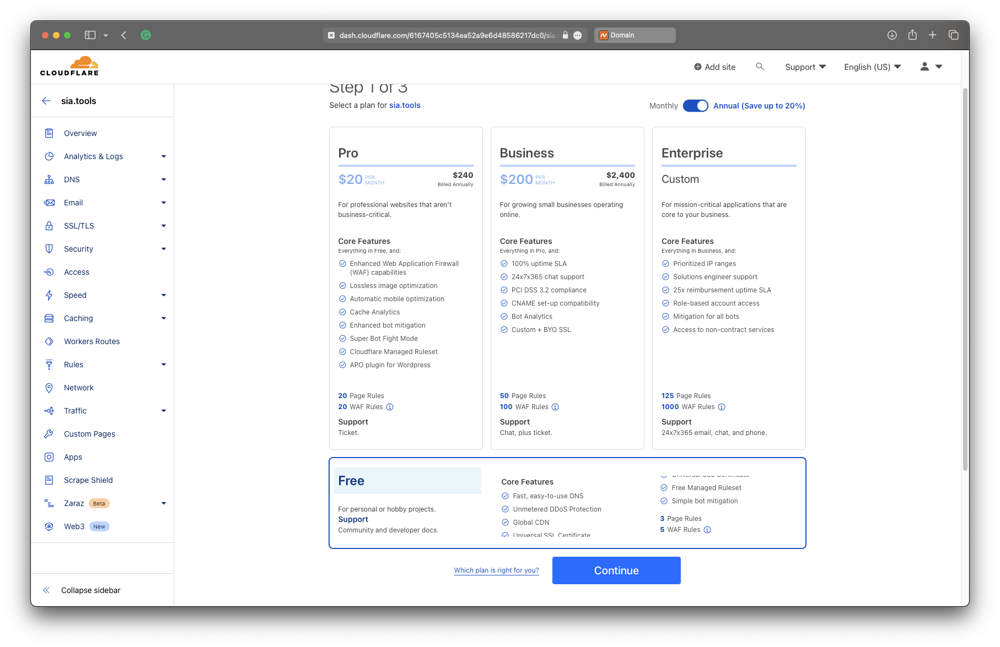
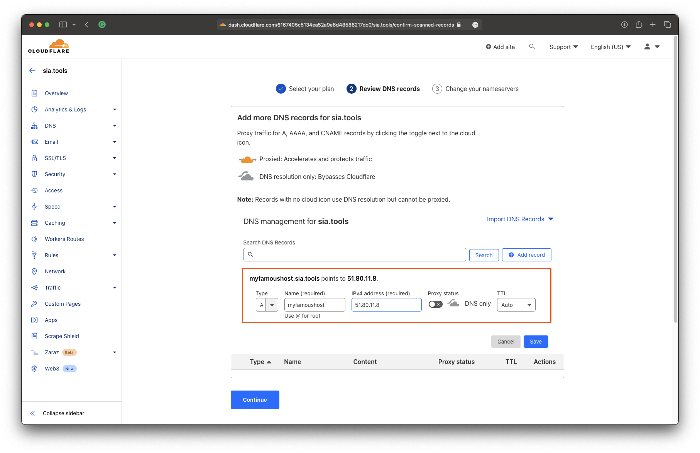
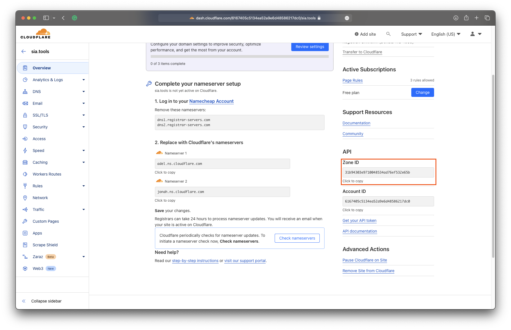
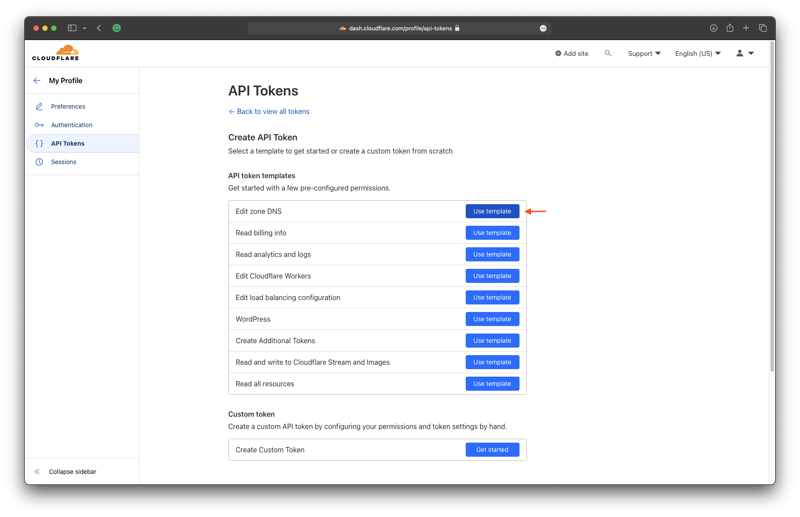
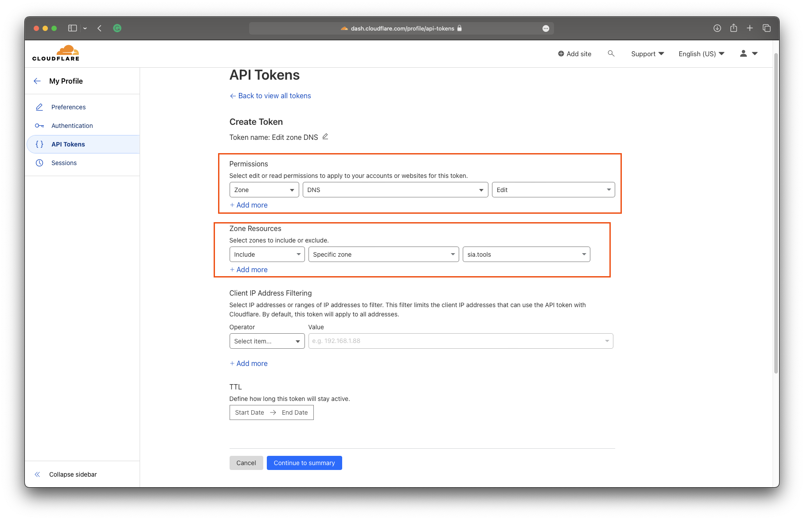
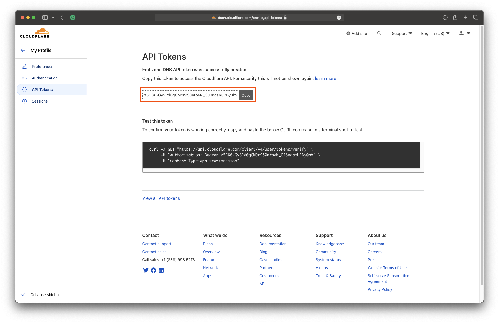
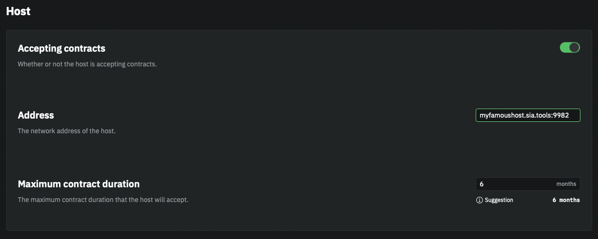
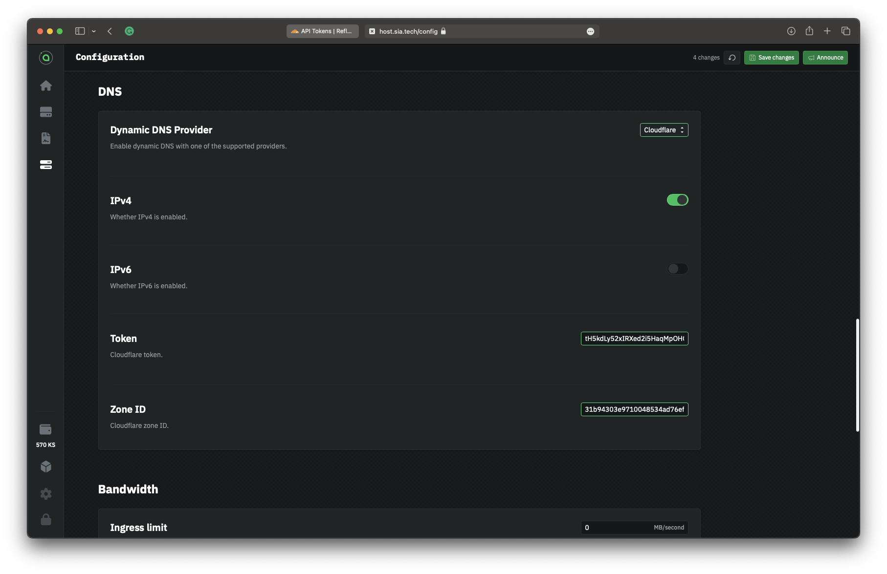
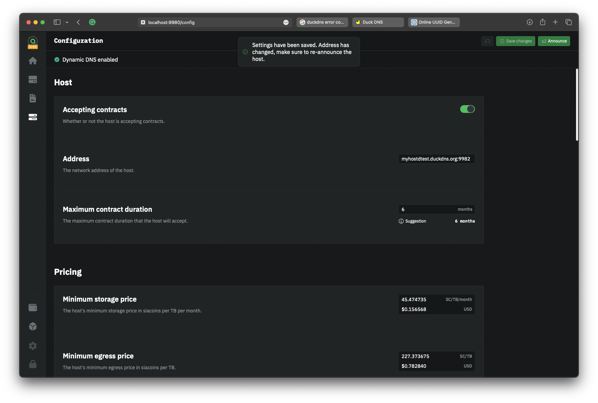

# Cloudflare (Advanced)

Cloudflare DNS is a globally distributed, fast, secure, and free Domain Name System (DNS) service that offers top-level domain resolution with robust security features and increased site performance. This guide will walk you through setting up Cloudflare for DDNS in `hostd`.

## Things you'll need

* A registered domain name (Cloudflare, NameCheap, GoDaddy, Google Domains)
* Basic familiarity with DNS
* A running `hostd` node
* A Cloudflare account


This guide assumes that you already have a domain registered and can change its nameservers to Cloudflare.


## Add your domain to Cloudflare

Once you've logged into Cloudflare, it's time to add your domain. If your domain is already added, skip to the next step. The site may look slightly different if your account already has a domain. To start the process, click the "Add Site" button.

<figure><figcaption>
Cloudflare Dashboard
</figcaption></figure>

When adding the site, you will be asked which plan you would like. At the very bottom, select the Free plan since we only need DNS.

<figure><figcaption>
Select Free plan
</figcaption></figure>

Add DNS records for your storage node. We will be using `myfamoushost.sia.tools` for this guide.

1. For IPv4, add an "A" record.
2. For IPv6, add an "AAAA" record. 
3. Toggle "Proxy" off. Sia uses a custom TCP protocol that cannot be proxied by Cloudflare.
4. Click "Save"


To get your current public IP go to [https://icanhazip.com](https://icanhazip.com/).


<figure><figcaption>
Add a new record
</figcaption></figure>

Follow the remaining steps on Cloudflare's website to change your domain's nameservers to Cloudflare. Wait until the nameserver change is confirmed and the site is active in Cloudflare.

## Get your Zone ID

On the website Dashboard in the right-hand column is your domain's "Zone ID." Copy the Zone ID for later.

<figure><figcaption>
Cloudflare Zone ID
</figcaption></figure>

## Create an API token

Next, we need to create an API token for Cloudflare. An API token allows `hostd` to access your Cloudflare DNS without needing your email or password.

1. Click the account icon in the top right corner of the page.
2. Click "My Profile" in the dropdown.
3. Click "API Tokens" in the sidebar on the left
4. Click "Create Token"

<figure><figcaption>
Cloudflare "Create Token" button
</figcaption></figure>

We will now create a token with only write access to the zone we created. In the API token templates click "Use Template" next to "Edit zone DNS."

<figure><figcaption>
Cloudflare token template
</figcaption></figure>

Under "Permissions," make sure that the token has the "Edit" permission on the DNS. Under "Zone Resources," make sure to "Include" the "Specific Zone" and select the domain we just added. Since you likely have a dynamic IP, leave "Client IP Address Filtering" blank. TTL is optional, but you will need to remember to create a new token, or your DDNS will break.

<figure><figcaption>
Cloudflare token permissions
</figcaption></figure>

Once you have set the permissions, click "Continue to summary." On the summary screen, double-check that the token has DNS Edit access to the Zone we just added and click "Create". The token will be displayed on your screen. Copy the token now. Once you leave the page, it will not be shown again.

<figure><figcaption>
A new API token
</figcaption></figure>

## Configure hostd

It's finally time to configure `hostd` and enable DDNS.

1. Access the `hostd` UI, `http://localhost:9980` by default
2. Click the "Configuration" icon in the sidebar
3. Change the "Address" field to the domain name you set up. (e.g. `myfamoushost.sia.tools:9982`)

<figure><figcaption></figcaption></figure>

1. Scroll to the "DNS" section
2. Change "Dynamic DNS Provider" to "Cloudflare"
3. Turn on IPv4 and/or IPv6, depending on your setup
4. In the "Token" field copy the API token we created
5. In the "Zone ID" field copy the Zone ID

<figure><figcaption></figcaption></figure>

If you changed the settings correctly, you should see "Dynamic DNS enabled" in the top status bar. You will also need to announce your new net address so renters will be able to connect. `hostd` will now update your Cloudflare DNS record when your IP address changes.

<figure><figcaption></figcaption></figure>
