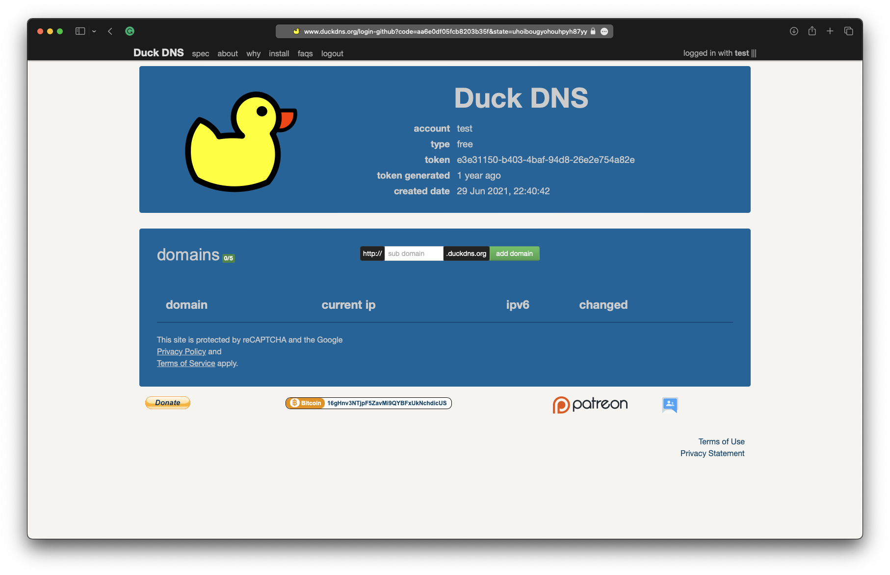
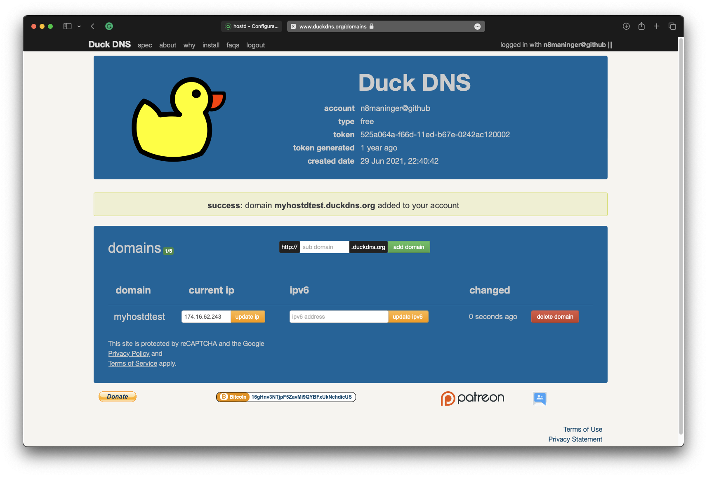
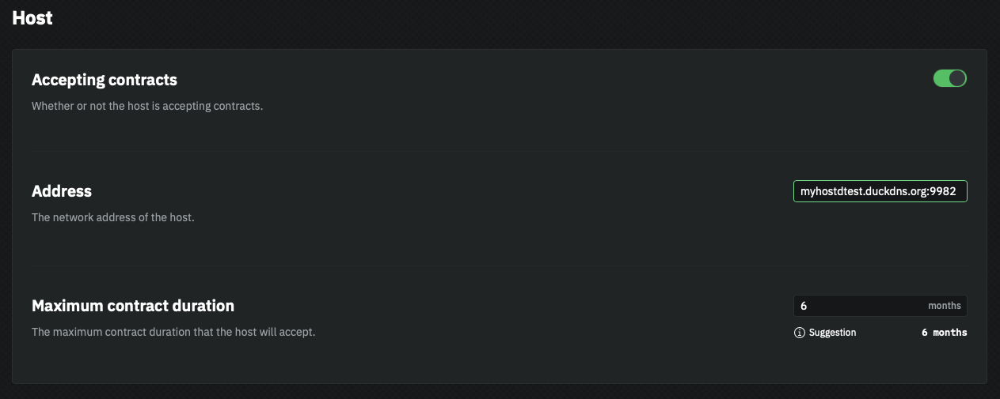
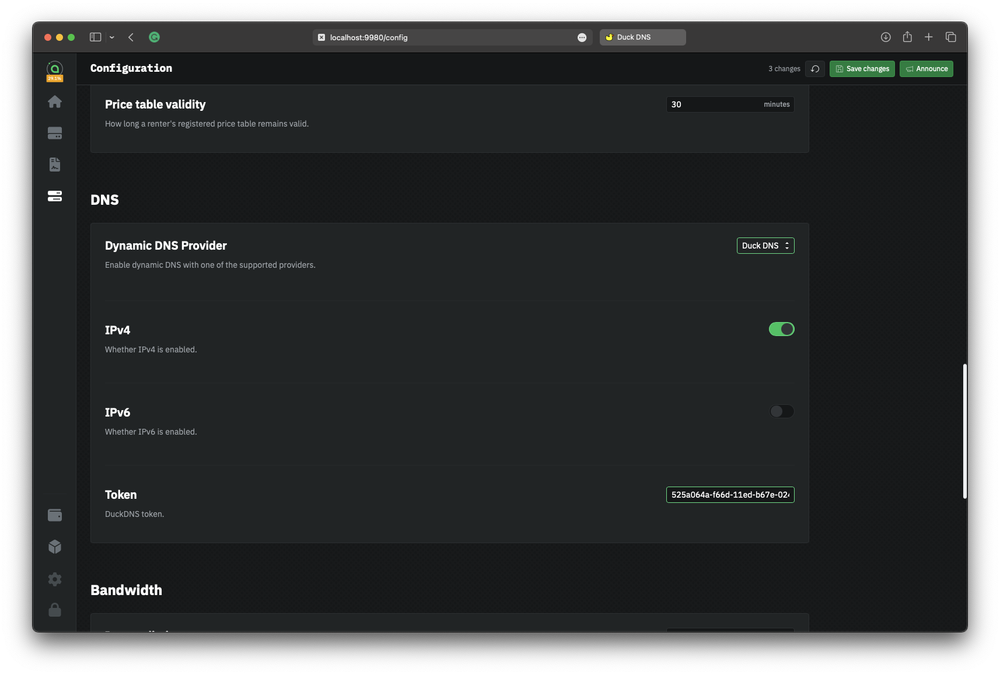

# DuckDNS

DuckDNS is a free and reliable DDNS provider that offers a straightforward solution for associating a dynamic IP address with a domain name. It's important to note that DuckDNS only supports domains in the format of \`\*.duckdns.org\`. In this guide, we will walk you through the process of configuring DDNS in `hostd` using DuckDNS, enabling you to maintain uninterrupted connectivity to your storage provider, even with a dynamic IP address.&#x20;

## Create a DuckDNS domain

First, open a browser and go to [https://duckdns.org](https://duckdns.org). Sign in using one of their supported logins (Twitter, GitHub, Google, etc). You will be taken to the account management page, where you can create a free domain.

<figure><figcaption>
DuckDNS homepage
</figcaption></figure>

1. Think of a unique sub-domain. It should be unique and easy to remember
2. Enter the domain into the textbox
3. Click "add domain"

After adding the domain you will see it appear in the list below.&#x20;

<figure><figcaption>
new domain
</figcaption></figure>

## Configure hostd

Copy the "token" from the DuckDNS account management page.

<figure><figcaption></figcaption></figure>

1. Access the hostd UI, `http://localhost:9980` by default
2. Log in using your password&#x20;
3. Navigate to the "Configuration" page
4. Change the "Address" to your DuckDNS domain (e.g. `myhostdtest.duckdns.org:9982`)

<figure><figcaption></figcaption></figure>

1. Now, scroll down to the "DNS" section
2. Change "Dynamic DNS Provider" to "DuckDNS"
3. Turn on IPv4 and/or IPv6, depending on your setup
4. In the "Token" field, paste the token you copied from the DuckDNS webpage
5. Click "Save changes"

<figure><figcaption>
hostd DuckDNS config
</figcaption></figure>

&#x20;If you changed the settings correctly, you should see "Dynamic DNS enabled" in the top status bar. You will also need to announce your new net address so renters will be able to connect.

<figure><figcaption>
DDNS is active
</figcaption></figure>

`hostd` will now automatically update your DuckDNS domain when your IP address changes.
