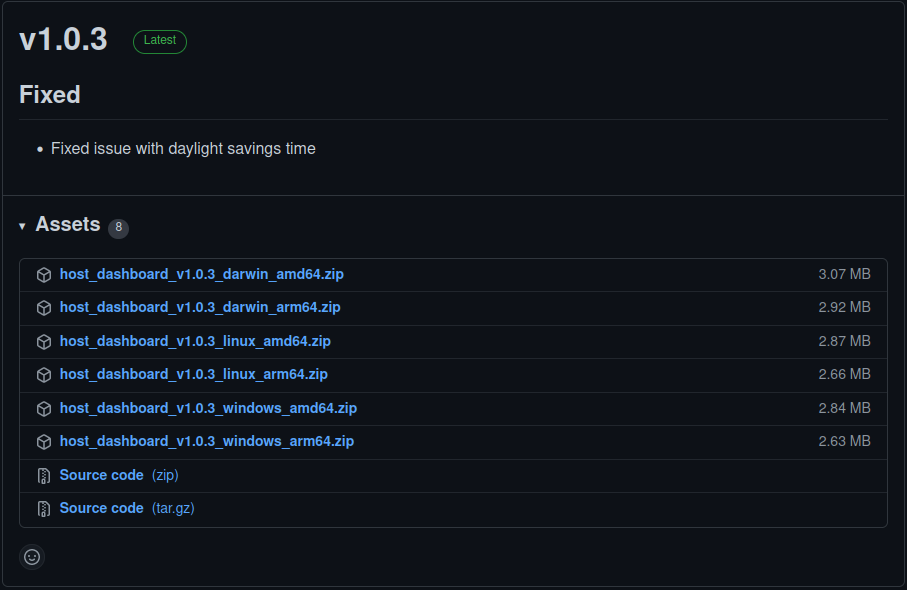

# Dashboard

## Download Dashboard

Go to [https://github.com/siacentral/sia-host-dashboard/releases](https://github.com/siacentral/sia-host-dashboard/releases) and find the latest version of Dashboard for your system.



## Install Dashboard

### Linux Command Line

#### Download and Extract the Dashboard

Once you have located the latest version of Dashboard for your system, use `wget` to download it.

```
cd ~
wget https://github.com/siacentral/sia-host-dashboard/releases/download/v1.0.3/host_dashboard_v1.0.3_linux_amd64.zip
```

Once downloaded extract the Dashboard binary and move it to `/usr/local/bin`

```
unzip host_dashboard_v1.0.3_linux_amd64.zip
sudo mv dashboard /usr/local/bin/
```


#### Create a new system service

To ensure that the Dashboard starts on boot, you will need to create a new system service. To do so create a service script.

```
sudo nano /etc/systemd/system/sia-dashboard.service
```

Once the editor loads add the following.

```
[Unit]
Description=Sia Dashboard Daemon
After=network.target

[Service]
User=root
Type=simple
ExecStart=/usr/local/bin/dashboard
Restart=always
RestartSec=60

[Install]
WantedBy=multi-user.target
Alias=sia-dashboard.service
```

Save the file to disk using `ctrl+o`

Exit the text editor using `ctrl+x`


Start the service.

```
sudo systemctl start sia-dashboard.service
```


Congratulations, you have finished setting up the Sia Central Dashboard. To view the Dashboard, navigate to [http://localhost:8884](http://localhost:8884)
