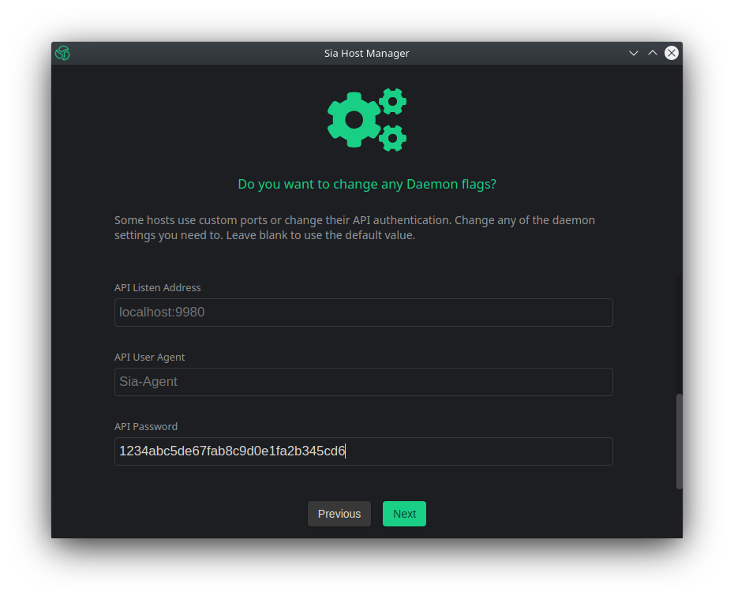

# Sia Central: Host Manager

## Installation

### Step 1: Download Host Manager


_This guide assumes you already have your host set up and the Sia daemon is running. If you have not done this already,_ [_do so now_](../../)_._


To download the latest version of Host Manager visit the [official website](https://siacentral.com/host-manager/) and click the "Download Now" button.


From the list download the version best suited for your operating system.


### Step 2: Configure Host Manager


_Are you wanting to use the Host Manager from a remote device? Follow the_ [_Remote Management_ ](install.md#remote-managment)_guide instead._


Launch Host Manager. Once loaded click "Get Started".


Next you will be asked if you would like to link Host Manager to a SiaUI. Select "No Thanks".


Next you will be asked to specify a path to your Sia data. If you prefer to specify your own location you can do so now, or use the default location by leaving it blank. Click "Next" when ready.


Once the Host Manager has finished connecting to your wallet. You will then be prompted to add funds. If you have not yet funded your wallet, you can do so now. Click "Done" when ready.


Congratulations, you have now successfully configured your Host Manager. Once Host Manager is fully synced, you will be ready to manage your host.


## Remote Management

### Step 1: Retrieve your hosts `apipassword`

In order to configure the Host Manager properly, you will need your hosts API password.

The API password is stored in a file named `apipassword` and can be found under the `.sia` folder of your hosts root directory.

```
$ ssh user@siahost
user@siahost's password:
user@siahost:~$ cd .sia
user@siahost:~$ cat apipassword
1234abc5de67fab8c9d0e1fa2b345cd6
logout
```

Make sure to write down this password, you will need it later on.

### Step 3: Create `ssh` tunnel to host API port

Next you will need to establish a `ssh` tunnel to the API Port of your Sia Host machine.

```
$ ssh -f user@siahost -L 9980:localhost:9980 -N
```

### Step 4: Configure remote connection

Launch Host Manager. Once loaded make sure "Show Advanced" has been selected and click "Get Started".


Next you will be asked if you would like to link Host Manager to a SiaUI. Select "No Thanks".


Next you will be asked to specify a path to your Sia data. Leave the input blank and click "Next".


Next you will be prompted to configure your Daemon settings. If your host was installed using the default ports you can leave everything blank and skip to your "API Password" at the bottom of the list. Enter the API password you retrieved during Step 2 and click "Next".



Congratulations, you have now successfully connected Host Manager to your host.


