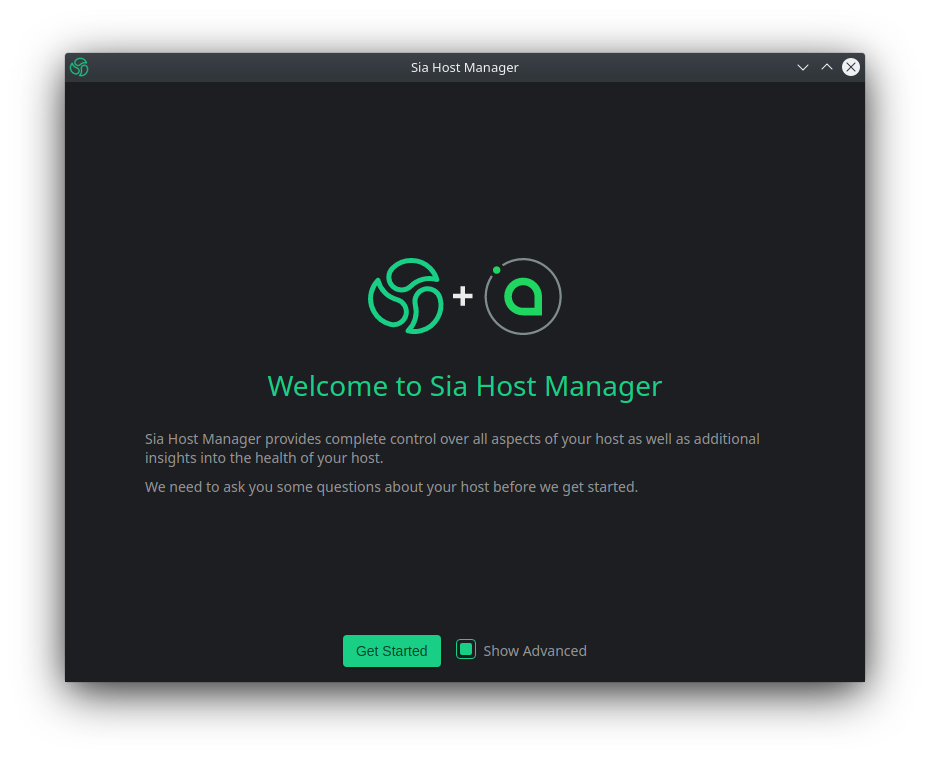

# Remote Management

## Step 1: Retrieve your hosts api-password

In order to configure the Host Manager properly, you will need your hosts API password.

The API password is stored in a file named `apipassword` and can be found under the `.sia` folder of your hosts root directory.

```
$ ssh user@siahost
user@siahost's password:
user@siahost:~$ cd .sia
user@siahost:~$ cat apipassword
1234abc5de67fab8c9d0e1fa2b345cd6
logout
```

Make sure to write down this password, you will need it later on.

## Step 3: Create SSH tunnel to host API port

Next you will need to establish a SSH tunnel to the API Port of your Sia Host machine.

```
$ ssh -f user@siahost -L 9980:localhost:9980 -N
```

## Step 4: Configure remote connection

Launch Host Manager. Once loaded make sure "Show Advanced" has been selected and click "Get Started".



Next you will be asked if you would like to link Host Manager to a SiaUI. Select "No Thanks".


Next you will be asked to specify a path to your Sia data. Leave the input blank and click "Next".

.png>)

Next you will be prompted to configure your Daemon settings. If your host was installed using the default ports you can leave everything blank and skip to your "API Password" at the bottom of the list. Enter the API password you retrieved during Step 2 and click "Next".


Congratulations, you have now successfully connected Host Manager to your host.


