# Windows


hostd is still in development and considered unstable.


This guide will walk you through setting up a new `hostd` node on Windows. For this guide, we are using Windows 11, but the steps should also work with Windows 10. At the end of this guide, you should have a working `hostd` node on the Sia network and be ready to accept contracts from renters.&#x20;

## Things you'll need

Below are the minimum requirements for hosting on Sia. If you do not meet these requirements you may not receive contracts from renters or risk losing Siacoins as a penalty. Hosting is a commitment that requires some technical knowledge and a stable setup.

* Windows 10 or 11
* A quad-core CPU
* 8GB of RAM
* An SSD with a minimum of 64GB of free space.
* Additional storage space to rent out
* A stable internet connection

## Getting hostd

Download the latest version of `hostd` for your operating system and platform from the official website: [https://sia.tech/software/hostd](https://sia.tech/software/hostd).

For this guide, we will download the Windows version and unzip the `hostd` binary to `C:\hostd`


Windows Defender may flag \``` hostd` `` as a virus. This is a false positive. You can add an exception to Windows Defender (read more here: [https://go.dev/doc/faq#virus](https://go.dev/doc/faq#virus))


<figure>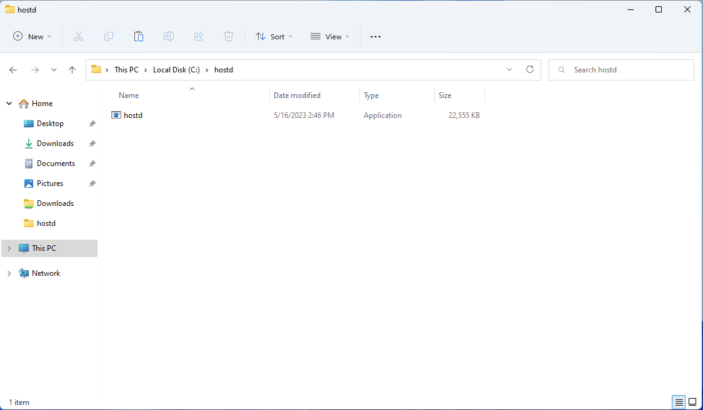<figcaption><p>hostd in the Windows file explorer</p></figcaption></figure>

## Creating a wallet

`hostd` uses BIP-39 12-word recovery phrases. It does not support legacy 28/29-word `siad` seeds. If you already have a 12-word seed, skip this step.

1. Open Explorer and browse to the folder where you unzipped `hostd.exe` (in our case `C:\hostd`)
2. Hold the SHIFT key and right-click in the folder, then click `Open command window here`

<figure>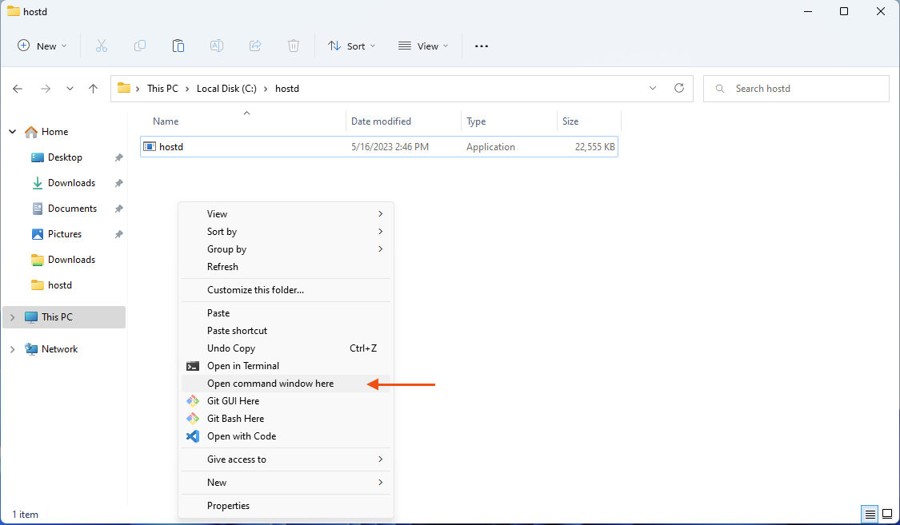<figcaption><p>Open command window on Windows</p></figcaption></figure>

In the command prompt, run the following command to create a new wallet:

```
hostd.exe seed
```

<figure>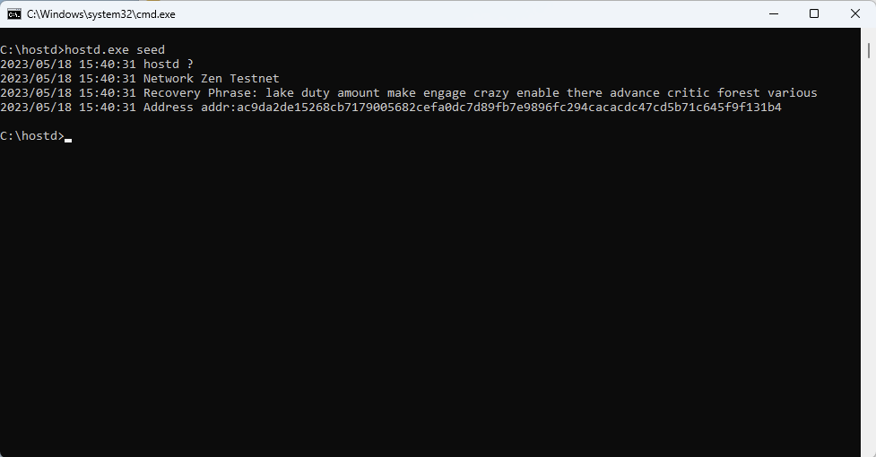<figcaption><p>Generate a new recovery phrase</p></figcaption></figure>

After pressing enter, a new 12-word recovery phrase will be generated. Please write down this phrase and keep it in a safe place. You will need this phrase to recover your wallet. If you lose this phrase, you will lose access to your wallet and funds. You will also see the wallet's funding address. You can send Siacoin to this address to fund your host.

## Running hostd

In the same command prompt window you used to generate your recovery phrase, run the following command to start `hostd:`

```
hostd.exe
```

You will be asked to input a password and a wallet recovery phrase. The password is used to unlock the `hostd` UI, it should be something secure and easy to remember. The recovery phrase is the 12-word phrase you generated in the previous step. Type it carefully, with one space between each word, or copy it from the previous step. These values are not stored anywhere; you will need to reenter them every time you start `hostd`.

<figure>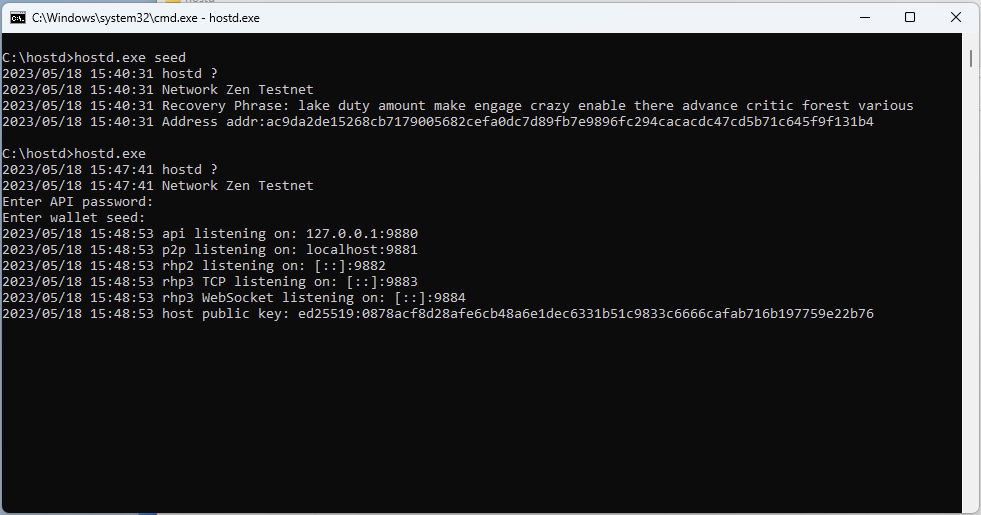<figcaption><p>hostd startup message</p></figcaption></figure>

After entering your password and recovery phrase, `hostd` will start. You can now access the `hostd` UI by opening a browser and going to `http://localhost:9980`. Enter your password to unlock `hostd`.


You must leave the command prompt window open while `hostd` is running. If you close the command prompt window, `hostd` will stop.


<figure><figcaption><p>hostd login</p></figcaption></figure>

## Send Siacoin to your wallet

Before you can start hosting, you must send Siacoin to your wallet. Hosts must lock Siacoin as collateral to ensure they are financially incentivized to store data. Hosts also need Siacoin to submit storage proofs to the blockchain. Therefore, it is essential to always keep your wallet funded with Siacoin. If your wallet runs out of Siacoin, your host cannot submit storage proofs and you will lose collateral.

To send Siacoin to your `hostd` wallet, you must get the wallet's address. This can be found on the "Wallet" page of the `hostd` UI.


It is okay if your wallet is not synced at this point. You can still send funds to your wallet. However, they will not be available until the wallet is fully synced.


We recommend around $50 USD worth of Siacoin to start hosting. Hosts are constantly locking collateral; you may need more or less depending on how much data you store.

1. Navigate to the "Wallet" page by clicking the "Wallet" icon in the sidebar
2. Click the "Receive" button in the top right corner of the page
3. Copy your wallet address by clicking the "Copy" button or scan the QR code with your phone

<figure>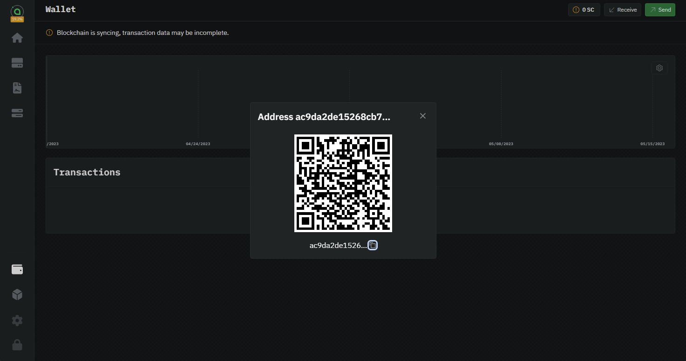<figcaption><p>hostd wallet address</p></figcaption></figure>

## Add storage

A "volume" is a location on disk where `hostd` will store uploaded data. A volume can be anywhere, including network drives and external drives. You can create multiple volumes to combine storage from multiple drives. To add a volume:

1. Click the "Volume" icon in the sidebar
2. Click the "Create Volume" button to add your first storage volume.

<figure>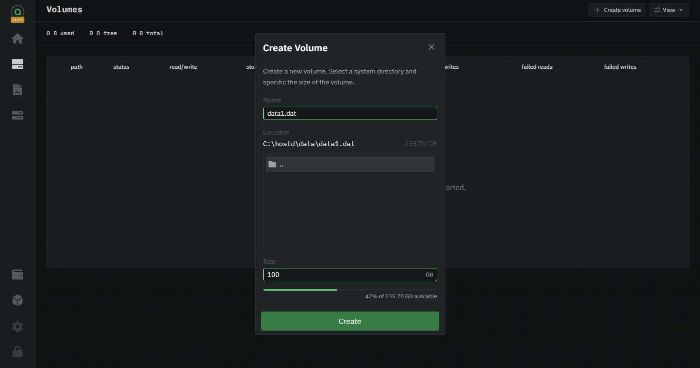<figcaption><p>hostd add volume</p></figcaption></figure>

1. Enter a name for the volume. We recommend something simple, like "hostdata.dat"
2. Use the built-in browser to select a folder to store the volume file.
3. Enter a maximum size for the volume. This is the maximum amount of data that can be stored in the volume.
4. Click "Create" to add the volume to \`hostd\`

After clicking "Create," the volume will be displayed in the volumes list. Depending on the size of the volume and the filesystem, it may take a while to fully provision the new volume. The progress will be displayed in the UI.

<figure><figcaption><p>hostd volume list</p></figcaption></figure>

## Configure the host

Now that you have a volume, you can configure your host. First, navigate to the "Configuration" page in the sidebar. This page contains all of the pricing and settings available to hosts.

<figure>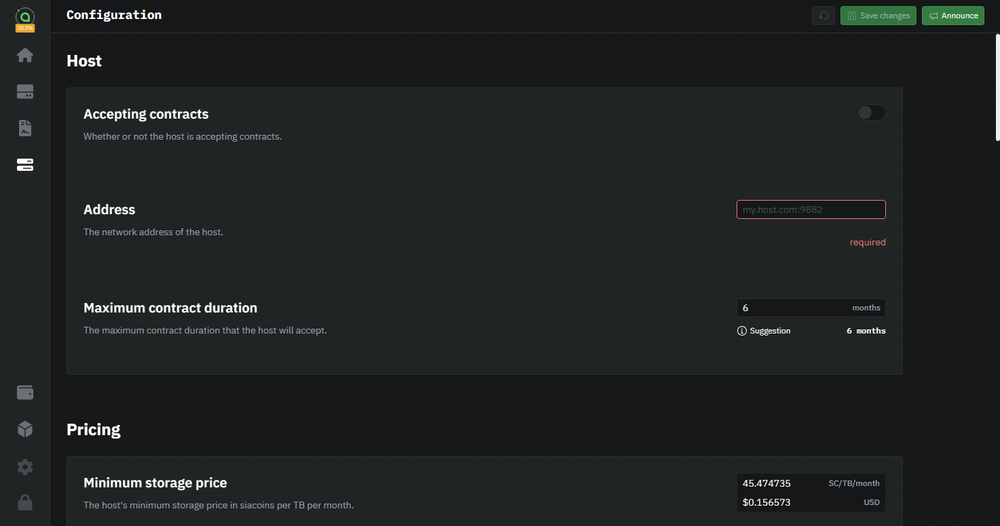<figcaption><p>hostd configuration page</p></figcaption></figure>

### Accepting contracts

The first setting to configure is the "Accepting Contracts" setting. This setting determines whether your host will accept new contracts. Most hosts will always have this toggled on. However, if you want to exit the network you can toggle this off to stop accepting new contracts. You will still be required to fulfill any existing contracts before fully shutting down your host.

### Address

The next setting to configure is your host's net address. This is the address that is published to the blockchain and used by renters to connect to your host. Some users use their public IP address, but we recommend setting up a domain. You can use a free service like DuckDNS or No-IP or purchase a custom domain from a registrar.

Whichever method you choose, enter your address in the "Net Address" field followed by your host's RHP2 port, which defaults to `:9982`. For example, if your IP address is `199.111.78.80` you would enter `199.111.78.80:9982`. If your domain is `example.com`, you would enter `example.com:9982`.

<figure>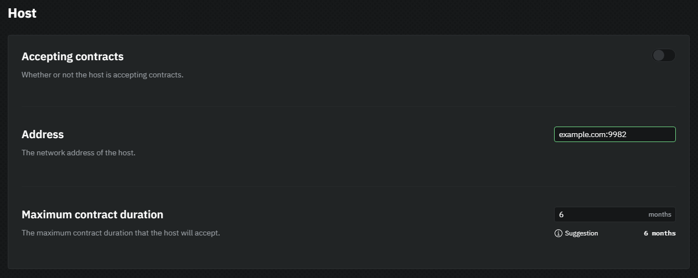<figcaption><p>Configure netaddress</p></figcaption></figure>

#### Setup using Dynamic DNS

* Cloudflare (TODO)
* DuckDNS (TODO)

#### Setup using public IP

To find your public IP address click the following link: https://icanhazip.com. It will display your public IP address. Copy this address to your clipboard.

### Pricing

On the Sia network, hosts set their prices for storage and bandwidth. The prices you select will determine how much you earn from hosting.


When setting prices, remember you are competing with other hosts. If your prices are too high, renters will choose other hosts. If your prices are too low, you will not earn enough to cover your costs.


We've put together some recommendations for pricing below. These are just recommendations, you can set your prices to whatever you want and change your prices at any time. Hosts will need to experiment with different prices to find the right balance between earnings and utilization.

* **Storage price:** the amount of Siacoins you charge per TB per month of storage. We recommend around $1 USD per TB per month to start.
* **Collateral:** the amount of Siacoins you lock per TB per month of storage. This should always be set to 2x your storage price. For example, if your storage price is 100 SC/TB/mo, you should set your collateral to 200 SC/TB/mo.
* **Ingress price:** the amount of Siacoins you charge per TB of data uploaded to your host. We recommend setting this low to encourage renters to upload data. Between $0.00 and $0.05 USD per TB.
* **Egress price:** the amount of Siacoins you charge per TB of data downloaded from your host. We recommend setting this higher to increase your earnings, above $5 USD per TB is a good starting point.
* **Maximum collateral:** the maximum amount of Siacoins you will lock into a single contract for collateral. This setting is important to limit your risk per contract. A good starting point is However, if you refuse to lock enough collateral for the data a renter wants to store, they will choose another host. Therefore, we recommend setting this around 10x your collateral price. For example, if your collateral price is 200 SC/TB/mo, you should set your maximum collateral to 2000 SC/TB/mo.

We recommend leaving other settings, such as "Contract price", "Base RPC price", "Sector access price," and "Price table validity" at their default values. They are primarily for advanced users.

Once you are happy with your prices, click the "Save Changes" button in the top right corner of the page.

## Port forwarding

If you have a firewall or router you will need to forward/open TCP ports 9981-9983. How to do so is outside of the scope of this guide, there are tutorials available for most routers/firewalls available on Google.

## Waiting for sync

Now that you have configured your host, you must wait for your host to finish syncing the blockchain. This can take several hours or even days depending on your hardware and internet connection. You can check the progress of the sync by mousing over the "Sia" logo at the top of the sidebar.

<figure>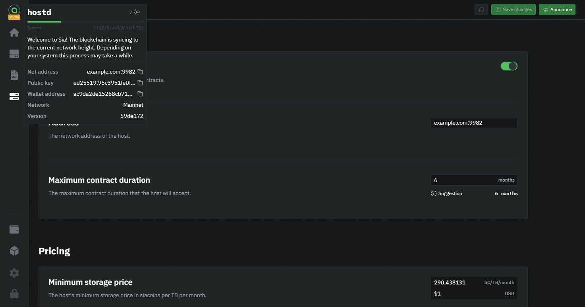<figcaption><p>check sync status</p></figcaption></figure>

## Announce your host

Now that your host has finished syncing, you can announce your host to the network. This will publish your host's net address and public key to the blockchain so renters can connect to your host and form contracts. The announcement transaction costs a small amount of Siacoins, which will be deducted from your wallet.

To announce your host:

1. Click the "Configuration" icon in the sidebar
2. Click the "Announce" button in the top right corner of the page
3. Click "Announce" in the dialog to confirm

<figure>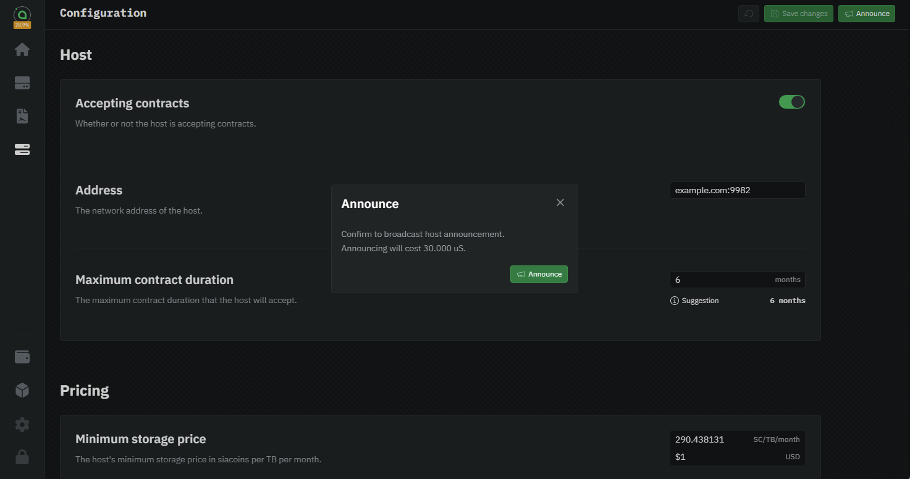<figcaption><p>announce your host</p></figcaption></figure>

After announcing, an "Unconfirmed" transaction will appear on the "Wallet" page. Once it is confirmed, your host will be visible on the network and renters will be able to form contracts with your host.

<figure>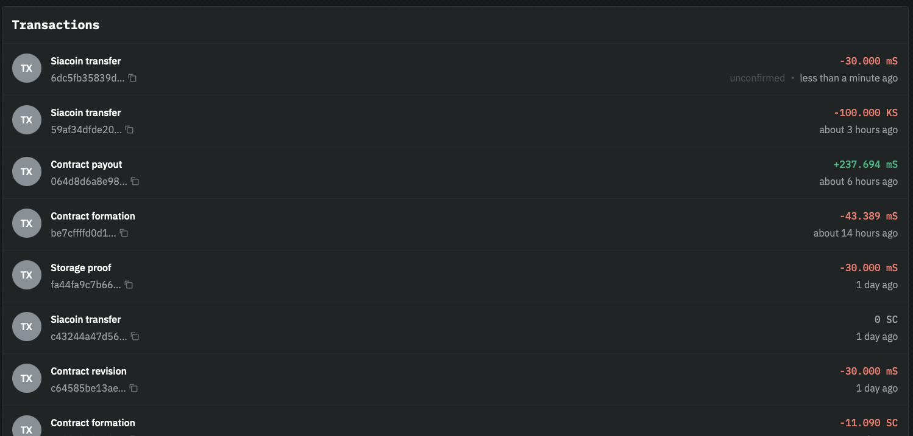<figcaption><p>unconfirmed announcement transaction</p></figcaption></figure>

## Check your host's status

Once the announcement is confirmed you can check if your host is visible on the network by going to https://troubleshoot.siacentral.com. Enter your host's net address and click "Check Host". This tool will connect to your host and notify you of any issues.

## Updating

It is very important to keep your host up to date. New versions of hostd are released regularly and contain bug fixes and performance improvements.

To update:

1. Download the latest version of hostd from https://sia.tech/software/hostd
2. Stop `hostd` in your command line by pressing `Ctrl+C`
3. Replace `hostd.exe` with the new version
4. Restart `hostd` in your command line
