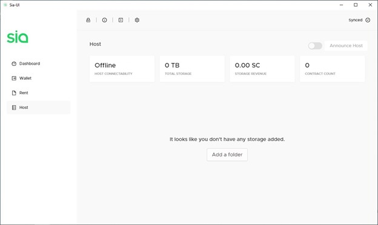
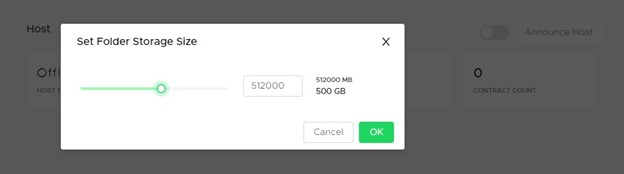
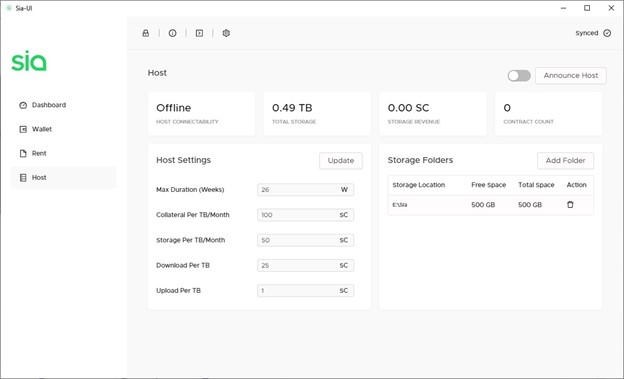
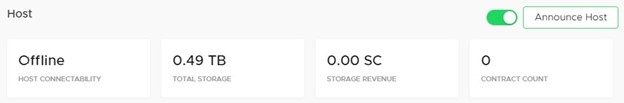

# SiaUI

### Step 1: Download and Install the SiaUI

Download and install the [**SiaUI**](../../your-sia-wallet/wallet-setup/sia-ui/how-to-download-and-install-sia-ui.md#find\_the\_right\_download\_for\_you) for your system.

### Step 2: Create your wallet

Once installed create a new wallet and allow it to sync to the blockchain. If you already have a existing wallet that you would like to use, you may do so by typing in your seed phrase.

_**Note:** On a SSD syncing to the blockchain can take a day or more. Therefore it is not recommended to install Sia on a HDD as syncing will take much longer._

### Step 3: Configure your host

Once you have the SiaUI installed, open Sia and click on the **Host** tab on the left. This is where you can configure your host settings. The first thing you do is tell Sia where your storage folder is. This is a location on the storage device you want to use for hosting.

Click **Add a folder**, then select a location. You can choose a drive (like D:\\) to use an entire empty drive or partition, or you can pick a specific folder on a drive. Sia will create one large file in the location you select that allocates the amount of storage you choose.

Tell Sia how much space you want to allocate to hosting, in megabytes. Entering a value lower than 32 GB will provide a warning since as a host you're graded on having a lot of available storage. Set at least 4 TB if you can. You can type in a value if you want to set a value higher than what the slider allows.

Here are some quick values you can use to get started:

* 10240 is 10 GB
* 51200 is 50 GB
* 102400 is 100 GB
* 1024000 is 1 TB
* 4096000 is 4 TB
* 10240000 is 10 TB
* 102400000 is 100 TB

### Step 4: Host Settings



Measured in weeks, Max Duration determines the longest contract you'll accept. The default length during contract creation for renters is 13 weeks, so don't go lower than that or you risk not forming many contracts.



Collateral is the amount of Siacoins you're willing to lose if you end up not fulfilling your end of the contract, which is to store the renter's data for the contract length while being online.

Putting up more collateral improves trust by showing you're willing to lose more money than another host. Setting this amount at 2-3 times your storage price is a good idea to maximize your host score while not losing too much money if your host does indeed go down.



The biggest factor in your host score, this number is how many Siacoins you are charging for 1 TB each month. The less you charge, the more positively it affects your host score. The more you charge, the more money you make. Find your balance between profitability and competitive pricing.



This is how much you charge renters for downloading data from your host.

Users who frequently download data might use a lot of bandwidth, and you can charge accordingly.



This is how much you charge renters for uploading data to your host.

This is similar to download bandwidth. You pay for your bandwidth from your ISP, so you can pass that cost on to your renters.



This is the cost of creating a contract with your host.

This can only be changed in siac, or using the Terminal in Sia-UI with the command `host config mincontractprice <value>SC,` or;

`host config mincontractprice 0.3SC`



### Step 5: Announce your host

Click the slider at the top of the Host window next to the Announce Host button so it appears green. This will turn on your host for accepting new storage contracts from renters. Then, unless you used DDNS in a previous step, click **Announce Host** to the Sia network so that renters can find you.

#### If you signed up for a DDNS service

You need to announce your host using your DDNS hostname in order for it to work. You can also announce a specific IP address. Click on the **Terminal** `>` icon at the top of the Sia-UI window, and type:

`host announce [ddns hostname or ip]:9982`

substituting \[_ddns hostname or ip_] with your unique DDNS hostname that you received from your DDNS service or the IP you want to announce. Make sure to include `:9982` afterward and without a space, as this specifies which port renters can contact you through and is the default for Sia.


Announcing your host is a transaction that will appear in your Transaction list in your wallet.


Read on for some additional important things to take care of to get the most out of your host.

### Step 6: Retire


_Before retiring your host, you will first need to stop accepting contract and allow any current contracts to expire. Once all your remaining contracts have expired, you can then shut down your host without any loss of data or collateral._


To stop accepting contracts, simply turn off the announce button at the top right of the Sia-UI hosting page.

