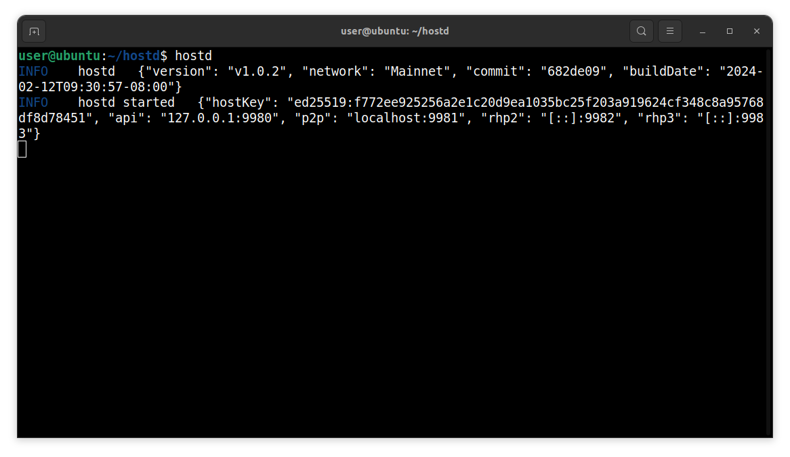
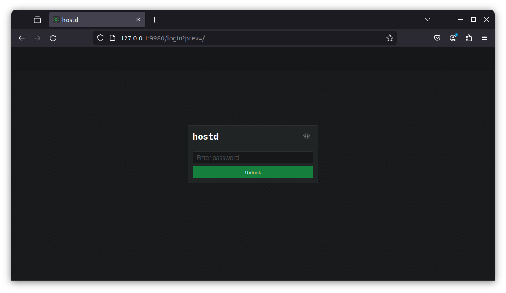

# Linux

This guide will walk you through setting up `hostd` on Linux. At the end of this guide, you should have the following:

* Installed Sia `hostd` software
* Functional `hostd` Node
* Created a `hostd` wallet

## Pre-requisites

* **Network Access:** `hostd` interacts with the Sia network, so you need a stable internet connection and open network access to connect to the Sia blockchain.
* **Operating System Compatibility:** Ensure your Linux version is compatible with the `hostd` software. To do this, run  `uname -m` in your Terminal Emulator.

  * **x86\_64** - `Linux AMD64`
  * **aarch64** - `Linux ARM64`
* **System Updates:** Ensure that your Linux is up to date with the latest system updates, as these updates can contain important security fixes and improvements.

* **Hardware Requirements:** Your machine must meet the minimum requirements for hosting on Sia. Not meeting these requirements may result in not receiving contracts from renters or risk losing Siacoins as a penalty. Hosting on Sia is a commitment that requires some technical knowledge and a stable setup such as:

  * A Linux distro (Ubuntu, Debian, Fedora, Arch, etc)
  * A quad-core CPU
  * 8GB of RAM
  * An SSD with at least 128GB of free space.
  * Additional storage space to rent out

## Install `hostd`

Download the latest version of `hostd` for your operating system from the [official website](https://sia.tech/software/hostd). For this guide, we'll be downloading the Linux version of `hostd`.

1. Open a terminal and download the latest version of `hostd` for your operating system.

    
    
    ```console
    wget https://sia.tech/downloads/latest/hostd_linux_amd64.zip
    ```
    

    
    ```console
    wget https://sia.tech/downloads/latest/hostd_linux_arm64.zip
    ```
    
    

2. Now that we have downloaded `hostd`, we can unzip and extract the `hostd` binary to our `/usr/local/bin` directory

    
    
    ```console
    unzip -j hostd_linux_amd64.zip hostd &&\
    sudo mv -t /usr/local/bin hostd &&\
    rm -rf hostd_linux_amd64.zip
    ```
    

    
    ```console
    unzip -j hostd_linux_amd64.zip hostd &&\
    sudo mv -t /usr/local/bin hostd &&\
    rm -rf hostd_linux_arm64.zip
    ```
    
    

3. Create a new folder called `hostd`. This will hold all the runtime files `hostd` generates and uses.

    ```console
    mkdir /path/to/hostd/folder
    ```

## Configuring `hostd`


`hostd` uses BIP-39 12-word recovery phrases. It does not support legacy 28/29-word `siad` seeds.


1. Before running the `hostd` configuration wizard, make sure to `cd` into the `hostd` runtime folder you created in the last section.

    ```console
    cd /path/to/hostd/folder
    ```

2. Next run the `hostd` configuration wizard. This will generate a `hostd.yml` file that is used by `hostd` on start up.

    ```console
    hostd config
    ```

## Start `hostd`

1. Once you have completed the configuration wizard, you can now start `hostd`.

    ```console
    hostd
    ```

    

## Accessing the UI

For users with a desktop environment, you can open a browser to `http://localhost:9980` to access the `hostd` UI.

If you do not have a desktop environment:

1. Find your server's LAN IP using `ip addr`, `ifconfig`, etc.
2. Switch to another computer in your LAN and open the browser
3. Type your LAN IP followed by `:9980` in the address bar (e.g. `http://192.168.1.50:9980`)



## Updating

It is very important to keep your host up to date. New versions of `hostd` are released regularly and contain bug fixes and performance improvements.

To update:


1. Stop `hostd`.
2. Download the latest version of `hostd`.
    
    
    ```console
    wget https://sia.tech/downloads/latest/hostd_linux_amd64.zip
    ```
    

    
    ```console
    wget https://sia.tech/downloads/latest/hostd_linux_arm64.zip
    ```
    
    

3. Unzip and replace `hostd` with the new version.
    
    
    ```console
    unzip -j hostd_linux_amd64.zip hostd &&\
    sudo mv -t /usr/local/bin hostd &&\
    rm -rf hostd_linux_amd64.zip
    ```
    

    
    ```console
    unzip -j hostd_linux_amd64.zip hostd &&\
    sudo mv -t /usr/local/bin hostd &&\
    rm -rf hostd_linux_arm64.zip
    ```
    
    

4. Start `hostd`.
    ```console
    hostd
    ```


Congratulations, you have successfully updated your version of `hostd`!

