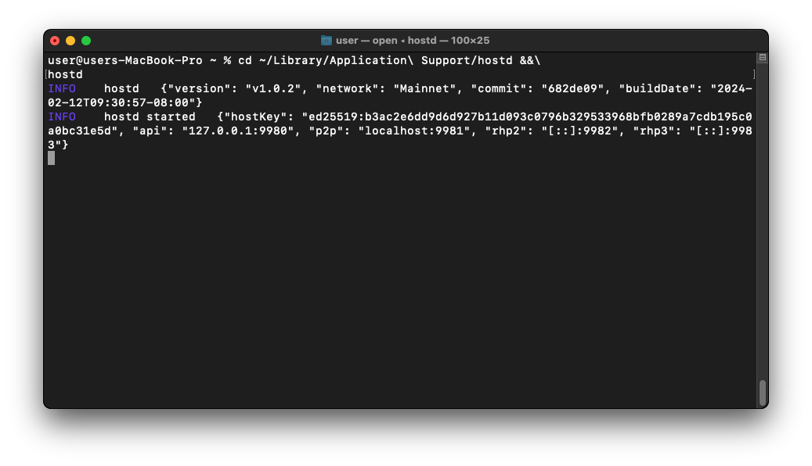

# macOS

This guide will walk you through setting up `hostd` on macOS. At the end of this guide, you should have the following:

* Installed Sia `hostd` software
* Created a `hostd` wallet

---

## Pre-requisites

To ensure you will not run into any issues with running `hostd` it is recommended your system meets the following requirements:

* **Network Access:** `hostd` needs a stable internet connection and open network access in order to store and retrieve data on the Sia network.

* **Operating System Compatibility:** `hostd` is supported on the following macOS versions:
	- macOS 12: Monterey (Star)
	- macOS 13: Ventura (Rome)
	- macOS 14: Sonoma (Sunburst)

* **System Updates:** Ensure that your macOS version is up to date with the latest system updates, these updates can contain important security fixes and improvements.

* **Hardware Requirements:** A stable setup that meets the following specifications is recommended. Not meeting these requirements may result in preventing slabs from uploading and can lead to a loss of data.
  - A dual-core CPU
  - 8GB of RAM
  - An SSD with at least 128GB of free space.

## Installing `hostd`

Press `CMD + Space` to open Spotlight search and open a `terminal`.


Once the Terminal loads, download and install `hostd` to your home folder.


Before you install `hostd`, you will need to install [Homebrew](https://brew.sh).


Next use `brew` to install `hostd`:

```console
brew install siafoundation/sia/hostd
```


To confirm `hostd` has been installed, run the following:
```console
hostd version
```


## Configuring `hostd`

Now that you have `hostd` installed, you will need to create a seed phrase and admin password. To launch the built-in configuration wizard, run the following:

```console
mkdir ~/Library/Application\ Support/hostd
cd ~/Library/Application\ Support/hostd
hostd config
```

When the configuration wizard loads, you will be asked to verify the location of your data directory. If you would like to change this, you can do so now. Otherwise type `no` to keep the default.


Next you will be asked to enter a seed phrase. If you already have one that you would like to use, you can enter it now. Otherwise you can type `seed` to generate a new one. For this guide we will generate a new seed.


Next you will be prompted to enter a admin password. This is used to unlock the `hostd` web UI.


Finally you will be asked if you want to configure advanced settings for `hostd`. Type `no` and hit enter to exit the configuration wizard.


## Running `hostd`

Now that you have `hostd` successfully installed and configured it is time to run it. Use the following command to start `hostd`:

```console
cd ~/Library/Application\ Support/hostd
hostd
```



Once `hostd` has successfully started, the web UI should automatically open in your web browser.


If the `hostd` web UI does not open. You can access it by open your browser and going to [http://localhost:9980](http://localhost:9980/).




Congratulations, you have successfully set up `hostd`.


## Upgrading `hostd`

It is essential to keep your host up to date. New versions of `hostd` are released regularly and contain bug fixes and performance improvements.

**To upgrade:**

```console
brew upgrade siafoundation/sia/hostd
```


You can confirm you have upgrade to the latest version using `hostd version`.



Congratulations, you have successfully updated your version of `hostd`!
