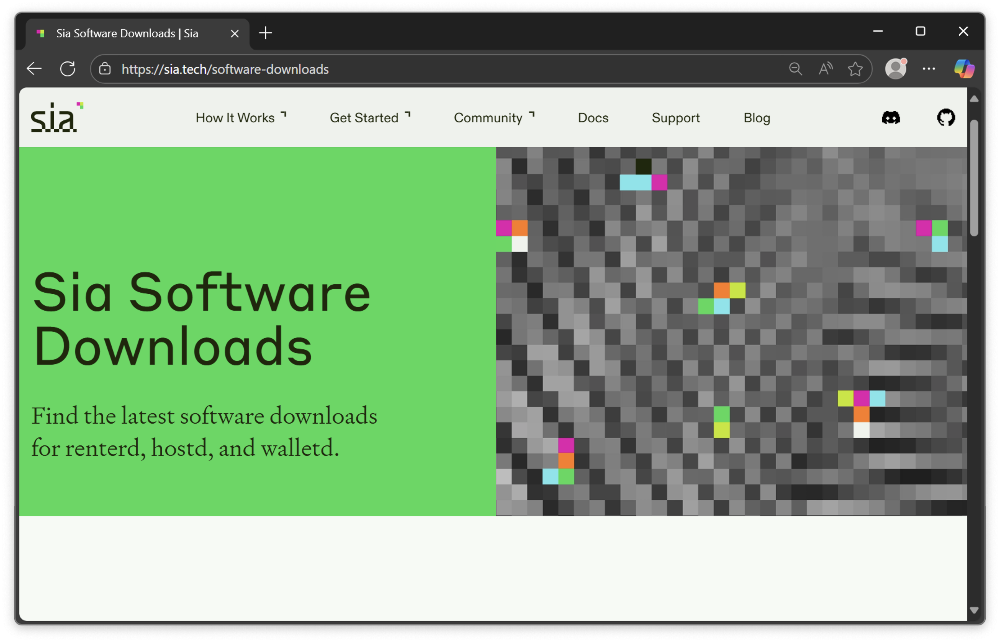
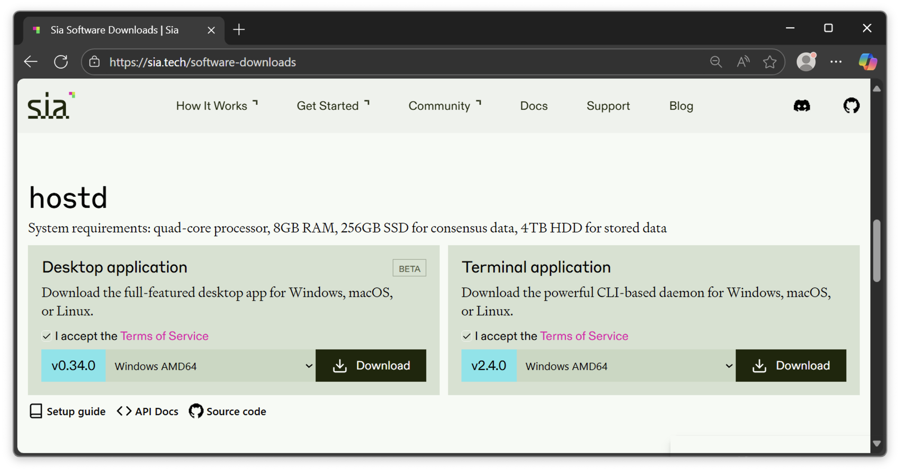
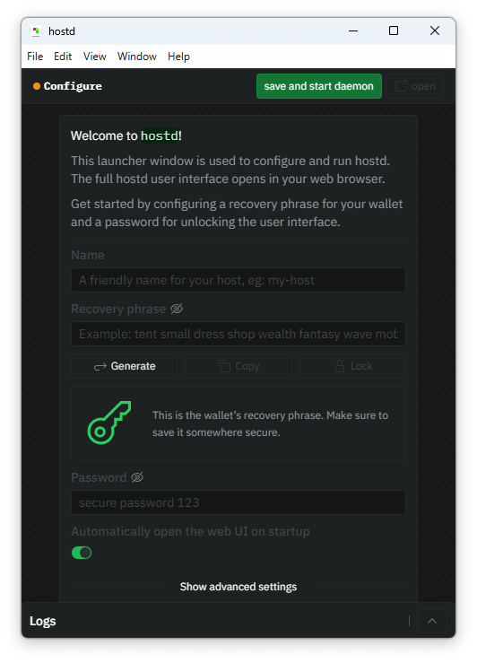
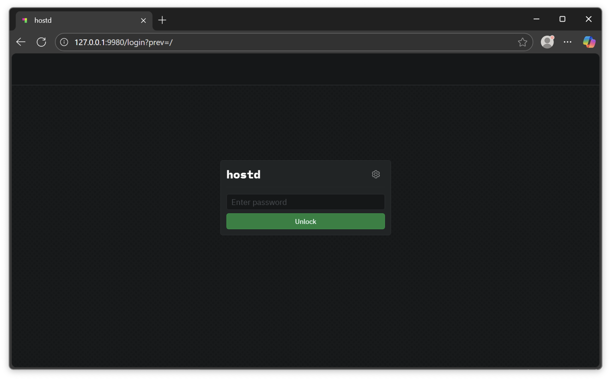
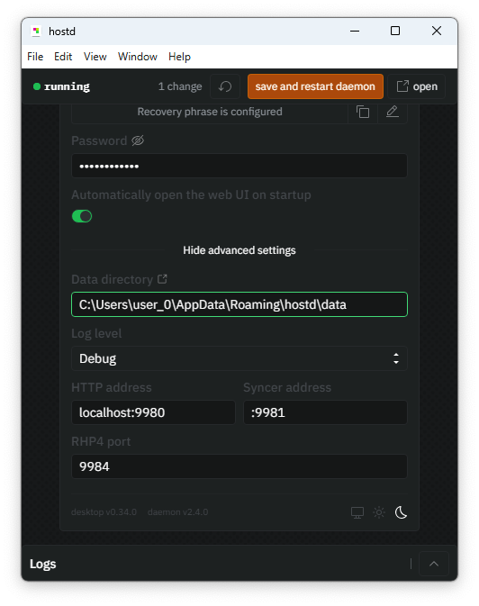
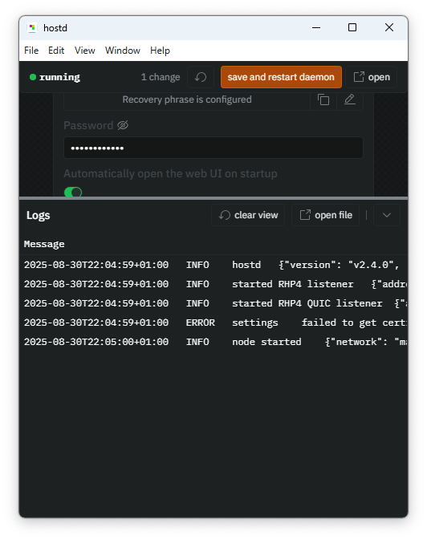

# Windows Desktop App: `hostd`

The `hostd` desktop app provides a user-friendly web UI to start providing storage on the Sia network. By the end of this guide, you will have:

* Installed the `hostd` desktop application.
* Created a `hostd` wallet

## Pre-requisites

To run `hostd` on Windows, your system should meet the following specifications:

* **Network Access:** `hostd` requires a stable internet connection and open network access to store and retrieve data on the Sia network.

* **Hardware Requirements:** A stable setup that meets the following specifications is recommended. Not meeting these requirements may result in preventing slabs from uploading and can lead to a loss of data.
  - A quad-core CPU
  - 8GB of RAM
  - 256 GB SSD for `hostd`
    - 10 GB per 1 TB hosted for database storage
  - At least 4TB of HDD storage for renter data

## Download

1. Go to [Sia Software Downloads](https://sia.tech/software-downloads). Here you can find the latest software downloads for all our daemons.

2. From the dropdown menu, select **Windows AMD64**.


Before proceeding with downloading, please read our [Terms of Service](https://sia.tech/terms-of-service). Once you have reviewed and are satisfied, check the box to agree.


3. Click **Download** to get the latest `hostd` version for your operating system.

## Run

After downloading the `hostd` desktop application:

1. **Install the app:** Double-click the installer (e.g., `hostd.<version>.Setup.exe`) and follow the prompts. The app installs to the default location.

2. **Launch the app:** After installation, you can delete the installer, and launch `hostd` from the Start Menu like any other program.

3. **Initial setup *(first-time users only)*:** On first launch, the Welcome to `hostd` window will guide you to do the following:

- Name your storage provider.
- Generate a recovery phrase (which you can copy and lock).
- Set a password to access web UI.

4. **Access the Web UI *(first-time users only)*:** Click **save and start daemon**. It will open automatically, or if not, you can access it at http://localhost:9980 while `hostd` runs in the background.


When you first run `hostd`, Windows Security may ask to allow public and private network access. This is normal - select **Allow** so `hostd` can communicate properly through the firewall.



**Success!** `hostd` is now running on your Windows system, and you’re ready to start providing storage on the Sia network.


## Configure

You can customize `hostd` through the desktop app, which provides full control over all available settings.

On **Windows**, you can access the `hostd` configurations by going to the taskbar, expanding the up arrow to see hidden icons, and double-clicking the `hostd` app. This will open the configuration window and let you customize its behavior.

There are several configurable settings in `hostd`. Below is a breakdown of what each setting does:

| Field | Description |
|------|-------------|
| Recovery Phrase | Your wallet recovery seed |
| Password | Set or update your wallet password |
| Automatically open the Web UI on startup | Enable this to launch the interface when `hostd` starts |
| Data Directory | Where `hostd` stores its data and config files |
| Log Level | Amount of detail in logs |
| HTTP Address | Local address for the Web UI |
| Syncer Address | Peer address `hostd` uses to sync the blockchain and find other peers |
| RHP4 port | Listening port for incoming storage traffic |


Always **save and restart daemon** after making configuration changes to ensure they are applied.


You can monitor your node’s activity and track changes by checking the logs. These provide detailed information about the system, network connections, API endpoints, S3 interface, and autopilot operations, helping you understand what your node is doing at any given time.

## Update

`hostd` updates regularly with bug fixes, performance improvements, and new features. Updating your node ensures stability and compatibility with the Sia network. 

On Windows, the app downloads updates automatically and notifies you when they’re ready. Simply restart the app to run the latest version. 


You can always check for the version of the software at the bottom of the app interface.

