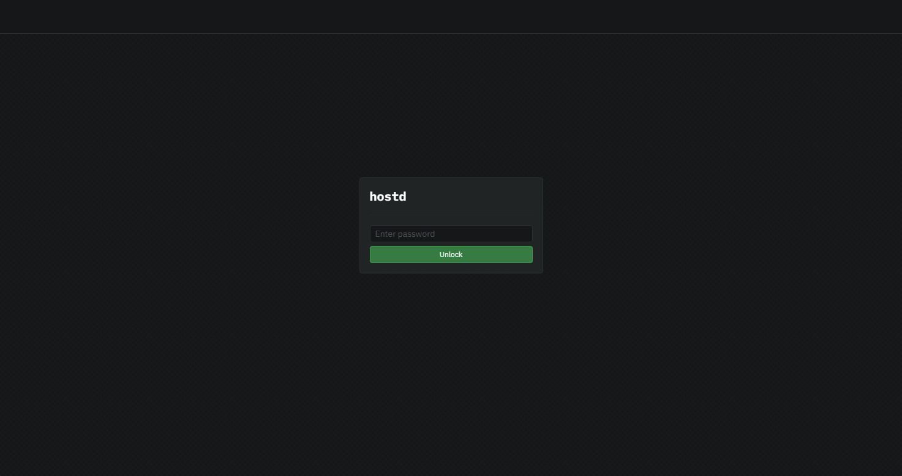

# 🔧 Linux

This guide will walk you through setting up `hostd` on Linux. At the end of this guide, you should have the following:

* Installed Sia `hostd` software
* Functional `hostd` Node
* Created a `hostd` wallet

## Pre-requisites

* **Network Access:** `hostd` interacts with the Sia network, so you need a stable internet connection and open network access to connect to the Sia blockchain.
* **Operating System Compatibility:** Ensure your Linux version is compatible with the `hostd` software. Check [releases](../../miscellaneous/releases.md) supported Linux versions.
* **System Updates:** Ensure that your Linux is up to date with the latest system updates, as these updates can contain important security fixes and improvements.



Your machine must meet the minimum requirements for hosting on Sia. Not meeting these requirements may result in not receiving contracts from renters or risk losing Siacoins as a penalty. Hosting on Sia is a commitment that requires some technical knowledge and a stable setup such as:

* A Linux distro with `systemd` (Ubuntu, Debian, Fedora, Arch, etc)
* A quad-core CPU
* 8GB of RAM
* An SSD with at least 100GB of free space.
* Additional storage space to rent out


## Getting `hostd`


Remember to check which version to download to ensure it works correctly with your operating system. To do this, run  `uname -m` in your Terminal Emulator.

* **x86\_64** - `Linux AMD64`
* **aarch64** - `Linux ARM64`


1. Download the latest version of `hostd` for your operating system from the [official website](https://sia.tech/software/hostd). For this guide, we'll be downloading the Linux version of `hostd`.
```
wget https://github.com/SiaFoundation/hostd/releases/download/v0.2.0/hostd_linux_amd64.zip
```

If you are installing `hostd` on a Raspberry Pi or other ARM64 architecture, make sure to use the latest `hostd_linux_arm64.zip` binary.


2. Now that we have downloaded `hostd`, it's recommended to unzip the `hostd` binary to `/usr/local/bin`. Right-click the unzip file, select **Open Terminal Here** to open your Terminal Emulator, and run the following commands:

```
unzip hostd_linux_amd64.zip
sudo mv -t /usr/local/bin hostd
rm -rf hostd_linux_amd64.zip 
```

## Creating a wallet

`hostd` uses BIP-39 12-word recovery phrases. It does not support legacy 28/29-word `siad` seeds. If you already have a 12-word seed, skip this step. Run the following command to generate a new wallet recovery phrase:

```
hostd seed
```

After pressing enter, a new 12-word recovery phrase will be generated. Please write down this phrase and keep it in a safe place. You will need this phrase to recover your wallet. If you lose this phrase, you will lose access to your wallet and funds. You will also see the wallet's funding address. You can send Siacoin to this address to fund your host.

```
hostd 5a7489b
Network Mainnet
Recovery Phrase: poet never rifle awake lunar during ocean eight dial gospel crazy response
Address addr:333d10486632f11c4c5b907c2e45d31478522dec525649712697404b4253e92ea5a84227187d
```

## Setting up a systemd service

Now that you have a recovery phrase, we will create a new system user and `systemd` service to securely run `hostd` on startup.

First, we will create a new system user with `useradd` and disable the creation of a home directory. This is a security precaution which will isolate `hostd` from any unauthorized access to our system. We will then use `usermod` to lock the account and prevent anyone from logging in under the account.

```
sudo useradd -M hostd
sudo usermod -L hostd
```

Now we will create a new folder under `/var/lib/` titled `hostd` and give our new system and set the approriate permissions. This folder will be utilized specifically to store data related to the `hostd` software. Open the Terminal Emulator and run the following commands:

```
sudo mkdir /var/lib/hostd
sudo chown hostd:hostd /var/lib/hostd
sudo chmod o-rwx /var/lib/hostd
```

Next, create a file name `hostd.yml` file under `/var/lib/hostd/`

```
sudo nano /var/lib/hostd/hostd.yml
```

Now, modify the file to add your wallet seed and API password. The recovery phrase is the 12-word phrase you generated in the previous step. Type it carefully, with one space between each word, or copy it from the previous step. The password is used to unlock the `hostd` UI; it should be something secure and easy to remember.


The port `9980` is `hostd`'s default operating port and should not need to be changed unless you require a custom configuration for your network.




```
recoveryPhrase: your seed phrase goes here
http:
  address: :9980
  password: your_password
```



```
recoveryPhrase: your seed phrase goes here
http:
  address: :9880
  password: your_password
```



Once you have added your recovery phrase and password save the file with `ctrl+s` and exit with `ctrl+x`.

Next, we'll create a new system service to run `hostd` on startup:

```
sudo nano /etc/systemd/system/hostd.service
```

Once the editor loads, copy and paste the following into it.

```bash
[Unit]
Description=hostd
After=network.target

[Service]
Type=simple
ExecStart=/usr/local/bin/hostd -http :9980
WorkingDirectory=/var/lib/hostd
Restart=always
RestartSec=15
User=hostd

[Install]
WantedBy=multi-user.target
Alias=hostd.service
```

You can now save the file with `ctrl+s` and exit with `ctrl+x`.


If you are planning on using the zen testnet, make sure to change the `-http` flag to port `:9880`


## Running `hostd`

Now it is time to start the service

```
sudo systemctl enable hostd
sudo systemctl start hostd
```

Your `hostd` service should now be running. You can check the status of the service by running the following command:

```
sudo systemctl status hostd
```

If the service was set up correctly it should say "active (running)."

### Accessing the UI

For users with a desktop environment, you can open a browser to `http://localhost:9980` to access the `hostd` UI.

If you do not have a desktop environment:

1. Find your server's LAN IP using `ip addr`, `ifconfig`, etc.
2. Switch to another computer in your LAN and open the browser
3. Type your LAN IP followed by `:9980` in the address bar (e.g. `http://192.168.1.50:9980`)

<figure><figcaption><p>hostd login</p></figcaption></figure>

## Updating

It is very important to keep your host up to date. New versions of `hostd` are released regularly and contain bug fixes and performance improvements.

To update:

1. Download the latest version of `hostd` from the [official website](https://sia.tech/software/hostd).
2. Stop the `hostd` service with `Crtl+C`.
3. Unzip and replace `hostd` with the new version.
4. Restart `hostd`.
