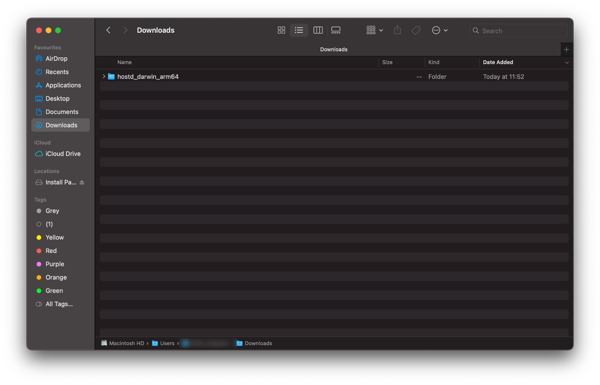
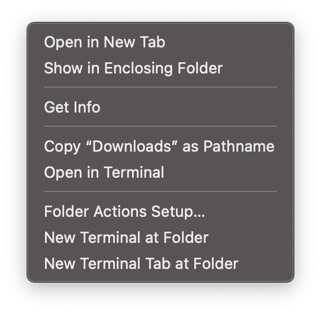
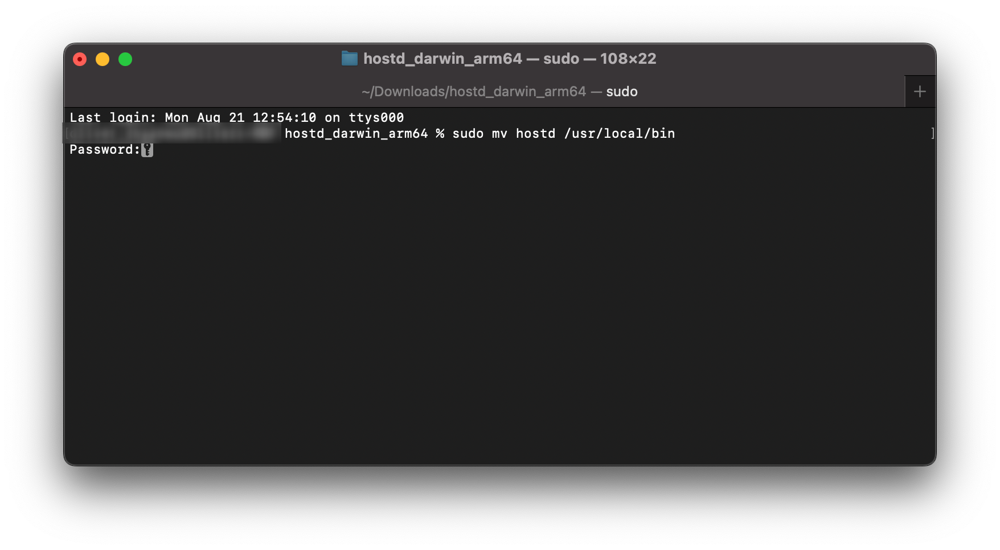
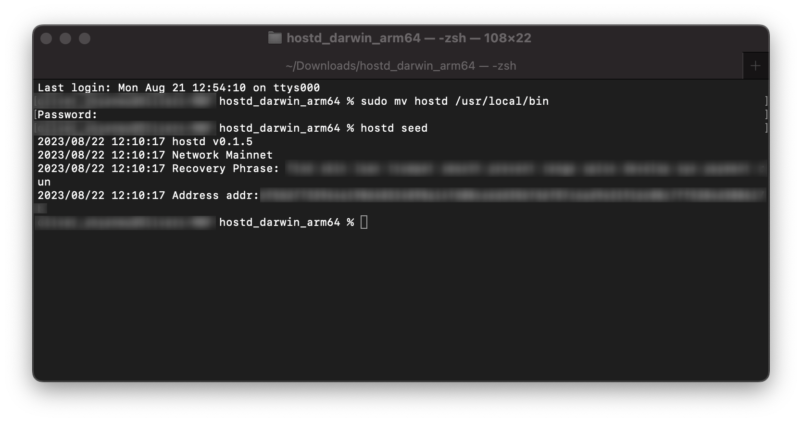
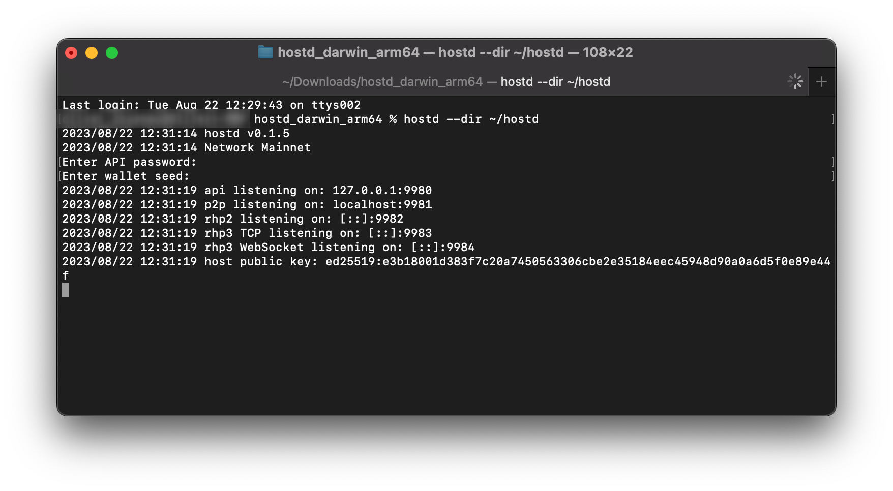
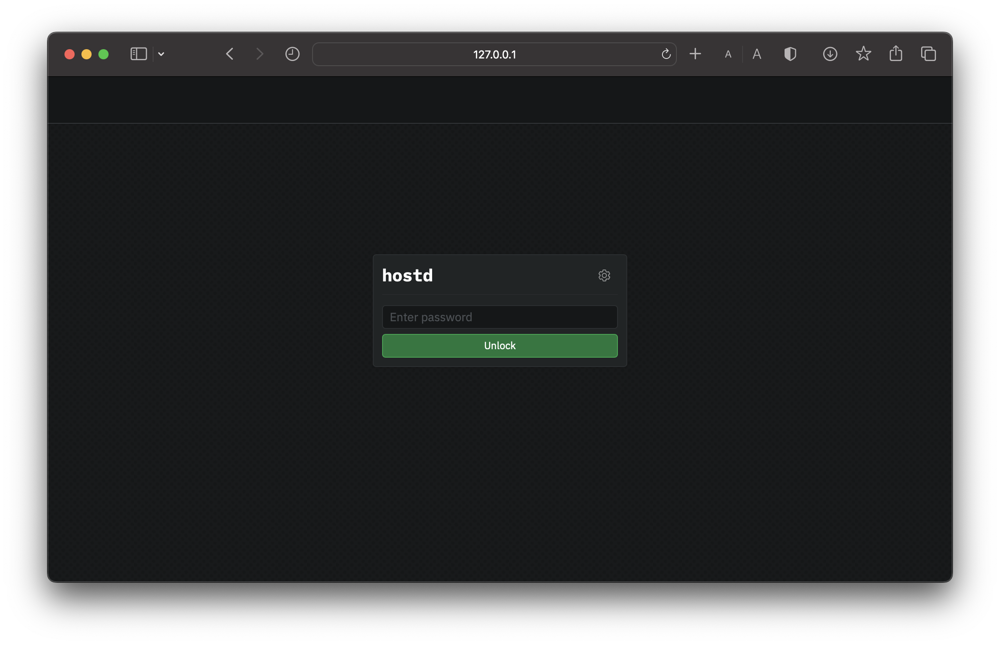

# macOS

This guide will walk you through setting up `hostd` on macOS. At the end of this guide, you should have the following:

* **Installed Sia `hostd` software:** You should have successfully installed the Sia `hostd` software on your macOS system with the appropriate binary.
* **Functional `hostd` Node:** Your hostd node will be fully functional and operational on the Sia network. It will be ready to engage in various network activities, including contract negotiation, storage provision, and transaction handling.
* Created a `hostd` wallet: Created a wallet with a Seed to access and manage your Sia network transactions and store your Siacoins in `hostd`.

## Pre-requisites

* **Network Access:** `hostd` interacts with the Sia network, so you need a stable internet connection and open network access to connect to the Sia blockchain.
* **Operating System Compatibility:** Ensure that your macOS version is compatible with the walletd software. Check [releases](../../miscellaneous/releases.md) supported macOS versions.
* **System Updates:** Ensure that your macOS is up to date with the latest system updates, as these updates can contain important security fixes and improvements.


Your machine must meet the minimum requirements for hosting on Sia. Not meeting these requirements may result in not receiving contracts from renters or risk losing Siacoins as a penalty. Hosting on Sia is a commitment that requires some technical knowledge and a stable setup as such:

* A Mac that supports macOS 12 (Monterey) or 13 (Ventura)
* A quad-core CPU
* 8GB of RAM
* An SSD with at least 100GB of free space.
* Additional storage space to rent out



This guide primarily uses the command line and assumes the user has sudo permissions.&#x20;


## Getting `hostd`

1. Download the latest version of `hostd` for your operating system from the [official website](https://sia.tech/host). For the purpose of this guide, we'll be downloading the macOS version of `hostd` and unzip the binary to `/usr/local/bin`.


Remember to check which version to download to ensure it works correctly with your operating system. To do this click on the Apple icon in the top left corner of your toolbar, then click on “About This Mac.” If the processor/chips says:

* **Intel** - `MacOS AMD64`
* **M1 or M2** - `MacOS ARM64`


<figure><figcaption><p>macOS Download folder</p></figcaption></figure>

2. Now that we have downloaded `hostd`, you may need to unzip it and move it to a more accessible location:
   * Double-click on the downloaded `hostd` zip file to unzip it if it hasn't done so automatically.
   * Click on the newly unzipped directory.
   * Right-click on the path bar at the bottom of the Finder window and click "Open in Terminal".

<figure><figcaption><p>Options after right-clicking </p></figcaption></figure>

3. In the opened terminal window, move the `hostd` binary to `/usr/local/bin` by running the following command and press enter:

```bash
sudo mv hostd /usr/local/bin
```

<figure><figcaption><p>Moving hostd binary</p></figcaption></figure>

You'll be prompted to authorize this action by providing your system password. Type this in and press enter to continue.

4. Finally, for good practice, create a folder on the home drive. This folder will be utilized specifically to store data related to the `hostd` software. It is important to store `hostd`'s metadata on an SSD. You will need at least 80GB of space available. 50GB for the current blockchain and additional space for volume metadata. Run the following command to do so:

```bash
mkdir ~/hostd
```

## Creating a wallet

1. `hostd` uses BIP-39 12-word recovery phrases. If you already have a 12-word seed, skip this step, otherwise run the following command to generate a new wallet recovery phrase:

```bash
hostd seed
```

A new 12-word recovery phrase will be generated, so please copy and store it in a safe place as you will need this phrase to recover your wallet.&#x20;


If you lose this phrase, you will lose access to your wallet and funds. Find out more about [Your Sia Seed](../../get-started-with-sia/the-importance-of-your-seed.md) and why it is important.


You will also see the wallet's funding address. You can send Siacoin to this address to fund your host.

<figure><figcaption><p>Generating a recovery phrase and wallet's funding address</p></figcaption></figure>

## Running `hostd`

1. In the same terminal, run the following command to start `hostd`:

```bash
hostd --dir ~/hostd
```

You will be prompted input both:

* `API password` - This password is chosen by you and can be anything you want it to be. It will be used to unlock the `hostd` UI via your browser, it should be something secure and easy to remember.
* `wallet seed` - The recovery phrase is the 12-word phrase you generated in the previous step. Type it carefully, with one space between each word, or copy it from the previous step.

These values are not stored anywhere; and will be used requested every time you start `hostd`.


You can also set the `HOSTD_SEED` and `HOSTD_API_PASSWORD` environment variables so you do not have to re-enter the values every time. Check out this \<guide> to set this.


2. After entering your desired `API password` and the created `wallet seed`, `hostd` will start.&#x20;

<figure><figcaption><p>Starting hostd</p></figcaption></figure>

Your terminal will produce a range of different values you may not be familiar with, so feel free to check the tabs below to see what each of them is and why they are important:



**p2p (Peer-to-Peer) Component:**

* "p2p" refers to the communication between different nodes or devices without relying on a central server.
* `Listening on 127.0.0.1:9981` means that the application's p2p component is currently set to listen for incoming network connections on the local loopback IP address `127.0.0.1` (also known as `localhost`) and the port `9981`. Localhost refers to the current machine itself.



**api (Application Programming Interface) Component:**

* "api" refers to the application programming interface, which allows different software components to communicate and interact with each other.
* `Listening on 127.0.0.1:9980` indicates that the application's API component is actively waiting for incoming connections on the local loopback IP address `127.0.0.1` and the port `9980.`



**rhp2 (Remote Host Protocol - Version 2) Component:**&#x20;

* "rhp2" stands for Remote Host Protocol - Version 2, which pertains to a communication protocol between remote hosts without the necessity of a central server.&#x20;
* Being configured to listen on `127.0.0.1:9982` signifies that the application's rhp2 component is presently configured to accept incoming network connections on the local loopback IP address `127.0.0.1` (also recognized as `localhost`) and the port `9982.`



**rhp3 TCP (Remote Host Protocol - Version 3) over TCP:**&#x20;

* "rhp3 TCP" denotes the utilization of Remote Host Protocol - Version 3 over the Transmission Control Protocol (TCP). This protocol allows for remote hosts to communicate without relying on a centralized server.&#x20;
* Listening on `127.0.0.1:9983` through TCP implies that the application's rhp3 component is actively awaiting incoming connections on the local loopback IP address `127.0.0.1` and the port `9983` using the TCP protocol.



**rhp3 WebSocket (Remote Host Protocol - Version 3) over WebSocket**:&#x20;

* "rhp3 WebSocket" represents the implementation of Remote Host Protocol - Version 3 over the WebSocket communication protocol. This setup facilitates communication between remote hosts, eliminating the need for a central server.&#x20;
* Operating on `127.0.0.1:9984` via WebSocket designates that the application's rhp3 component is actively ready to accept incoming connections on the local loopback IP address `127.0.0.1` and the port `9984` using the WebSocket protocol.



3. You can now access the `hostd` UI by opening a browser and going to `http://localhost:9980`.&#x20;


Remember to leave the terminal window open while `hostd` is running. If you close the command prompt window, `hostd`will stop.


<figure><figcaption><p>walletd Login UI</p></figcaption></figure>

Enter your `API password` you created in the in the previous step to unlock `hostd`.


Congratulations on successfully setting up `hostd` and taking a significant step towards contributing your excess storage space to the Sia network.


## Updating

It is very important to keep your host up to date. New versions of hostd are released regularly and contain bug fixes and performance improvements.

To update:

1. Download the latest version of hostd from [https://sia.tech/software/hostd](https://sia.tech/software/hostd)
2. Stop the `hostd` service with the command `sudo systemctl stop hostd`
3. Unzip and replace `hostd` in `/usr/local/bin` with the new version
4. Restart `hostd` with `sudo systemctl start hostd`
