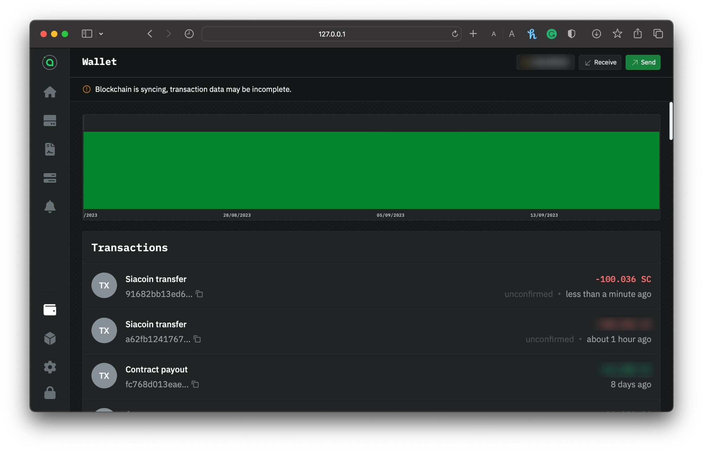
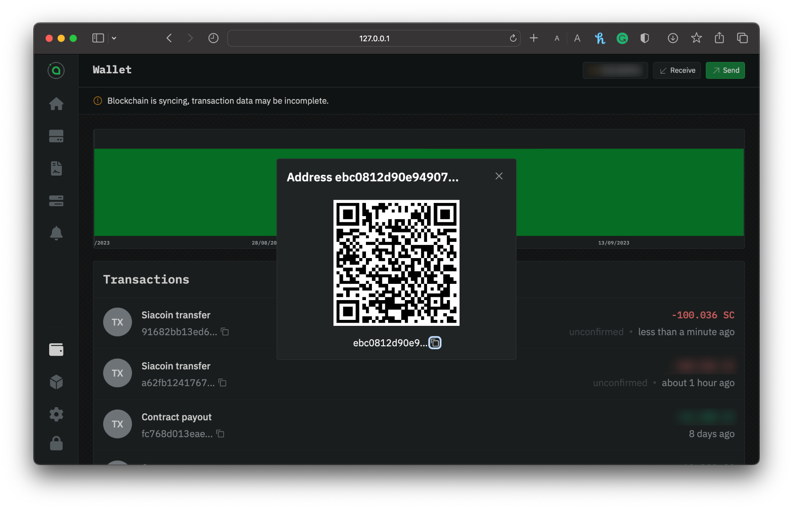

# Transferring Siacoins

Whether you're sending Siacoins to an exchange or receiving from a friend, `hostd` facilitates the transfer of Siacoins (SC). You can check the transaction status, easily achieved via the UI.

## Sending Siacoins

Go to `hostd`. If you're asked to unlock the UI, use your custom password if you've set one. If you haven't got a wallet set up `hostd`, visit our [Setting up `hostd`](setup-guides/) guide; otherwise, choose from the sidebar **Wallet**.

### Setup your transaction

Click on the `Send` button. Enter the recipient's wallet address and the amount of Siacoins you want to send. Make sure that you've entered a Siacoin wallet address and that you've entered it correctly.

<figure><figcaption>
Sending Siacoins via hostd
</figcaption></figure>


Siacoins sent to mistyped addresses or addresses of other types of cryptocurrency can not be retrieved.


Click **Generate Transaction.**

### Confirm your info

Next, you need to confirm everything. You'll have a chance to double-check the currency, amount, and recipient address. The window will also show you estimated network fees.

<figure><figcaption>
Confirming your transaction
</figcaption></figure>

Click **Setup** to change something. If it's all good, click B**roadcast transaction**.

<figure><figcaption>
Confirmation of a successful transaction broadcasted
</figcaption></figure>

You'll immediately get a confirmation that your transaction has been successfully broadcasted.

### Checking the status

By looking at the transactions in the **Wallet** section of the UI. It's normal to 'Unconfirmed' at the latest transaction, which means the transaction is on its way but hasn't yet appeared in a block.

<figure><figcaption>
hostd wallet transaction list
</figcaption></figure>


It might take a minute or two to appear in the wallet's transactions list.


Once it's in a block, you can check the status and see a new transaction type of **siacoin transfer**.

## Receiving Siacoins

Before you can start hosting, you must have Siacoins (SC) in your `hostd` wallet for the following:

* Locking Siacoin as collateral to ensure they are financially incentivized to store data.&#x20;
* You are submitting storage proofs to the blockchain. If your wallet runs out of Siacoin, your host cannot submit storage proofs, and you will lose collateral.


We recommend around **$50 worth of Siacoin** to start hosting. Hosts are constantly locking collateral; you may need more or less depending on how much data you store, you may need more or less.



You can still transfer funds to your wallet, but please note that they won't be accessible until the wallet is completely synced.


Go to `hostd`. If you're asked to unlock the UI, use your custom password if you've set one. If you haven't got a wallet set up `hostd`, visit our [Setting up `hostd`](setup-guides/)and choose from the **sidebar** a **Wallet**.

### Sharing the address or QR

Copy and paste your address manually, or use the **Copy** button to the right to ensure you get the full address without any extra spaces, and provide this address to whomever you're receiving the funds from.

You can also receive Siacoins by sharing your QR code for others to scan.

<figure><figcaption>
Getting the address and QR of your hostd wallet
</figcaption></figure>

The transaction can check the transaction status by going to your **Dashboard** and selecting the wallet you made the transaction with. It's normal to see **Unknown** at the top of the list of transactions; it means the transaction is on its way but hasn't yet appeared in a block.


The transaction might take a minute or two to appear in the wallet's transactions list.


Once it's in a block, you can check the status and see a new transaction type of **siacoin transfer**.
