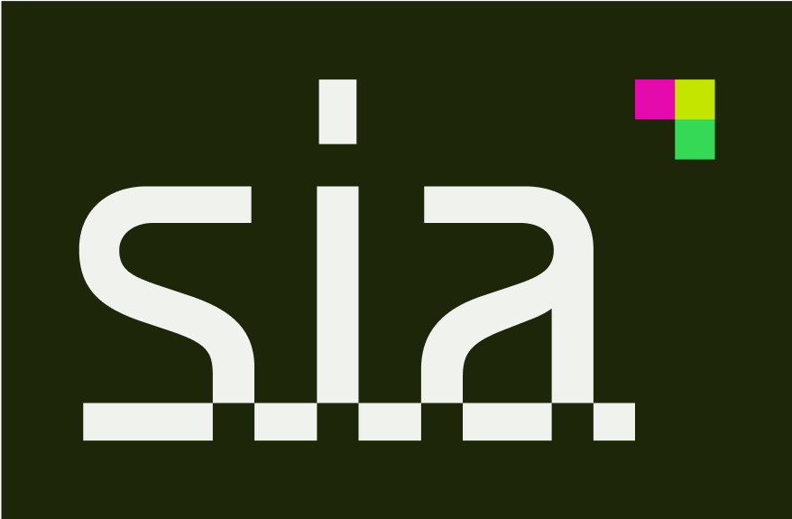

---
layout:
  title:
    visible: true
  description:
    visible: true
  tableOfContents:
    visible: true
  outline:
    visible: true
  pagination:
    visible: true
---

# Brand Guidelines

Third-party projects constitute an integral part of the Sia ecosystem. They broaden the range of applications on Sia and enhance the network through solutions that are not actively being developed by our team.

We aim for users to discern between core and non-core projects for several reasons:

* Non-core projects often involve some level of centralization, which is entirely acceptable. Users benefit from having choices, and centralization allows for the implementation of features that are more accessible to achieve compared to those on Sia's core infrastructure.
* There's the potential for confusion where users might mistake your project for something created by the core team. We want to ensure that users know where to go for help.
* Acknowledge your dedication to your project; we desire to give it the recognition it deserves, allowing it to stand out prominently.

These Sia brand guidelines will assist those developing their project by ensuring clarity, consistency, and distinction between other projects and core Sia offerings.

## Logo and Branding Usage

The Sia Foundation exclusively owns the Sia trademark in the United States and prohibits the direct use of the Sia logo or wordmark in any third-party project. Do not copy, modify, or style the Sia logo or wordmark in a way that could cause confusion or misrepresentation.

<figure><figcaption>
Sia Wordmark Logo
</figcaption></figure>

<figure><figcaption>
Sia Shorthand Logo
</figcaption></figure>

### Referencing Sia in Content

You may use the name **“Sia”** in plain text when accurately referring to the project in articles, reviews, presentations, or other informational materials.  
- Do not alter, recreate, or style the official Sia logo.  
- Do not imply any official endorsement or partnership unless you have prior written permission from the Sia Foundation.

### Branding Your Own Project

You may **not** use the name **“Sia”** or the official logo in your project’s name, branding, or marketing in a way that could cause confusion or suggest affiliation.  
- Develop your own distinct name, logo, and branding.  
- Avoid names that are similar to “Sia” or that incorporate it as part of the name.  
- Sia's trademark name is pronounced _"sigh-uh,"_ not _"see-ya."_  
- Do not use the name **"Sia"** in your project without explicit written approval from the Sia Foundation.


We're eagerly anticipating what you'll create! If you have any questions regarding our Sia branding guidelines, please don't hesitate to reach out via [email](mailto:hello@sia.tech) or [Discord](https://sia.tech/discord).

