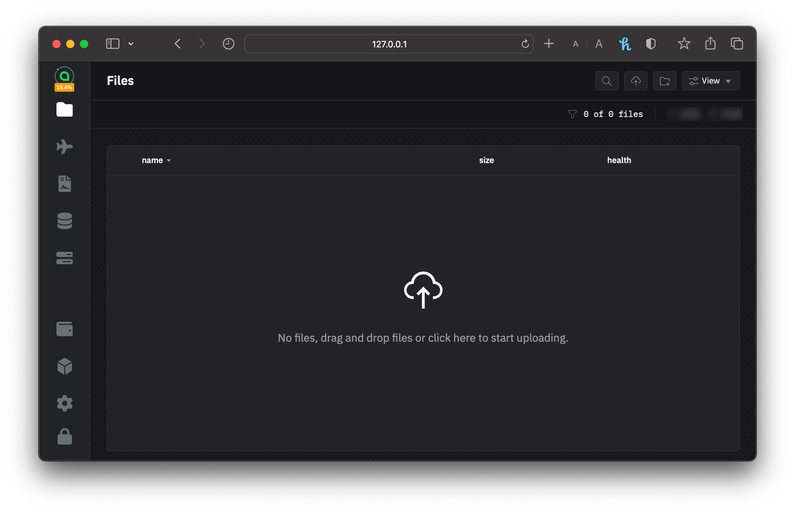

# Renting Storage

Uploading files on `renterd` is remarkably straightforward, making it accessible even to those new to the Sia network. With just a few simple steps, you can securely store your files and data on Sia's decentralized cloud storage platform, where a network of hosts ensures the redundancy and reliability of your files. `renterd` provides an intuitive interface for effortlessly transferring your files to the Sia network.&#x20;

## Before you begin...

* **Install `renterd`**: Make sure you have the latest version of `renterd` installed on your machine.&#x20;
* **Create a Wallet**: If you haven't already, create a Sia wallet to store your Siacoins.
* **Fund Your Wallet**: Transfer Siacoins (SC) to your Sia wallet from an exchange or another source. You'll need these coins to pay for storage.

## Uploading your files in renterd


Uploading files and data using `renterd` is a very straightforward process, assuming you have completed all the steps of the `renterd` setup guide. Visit the [renterd](setting-up-renterd/) guides to ensure everything is set up correctly before proceeding.


1. Access the `rentered` UI from your local host address. Enter your `API password` you created to unlock `renterd`.

<figure><figcaption>
renterd Login UI
</figcaption></figure>

2. Drag-and-drop files or in the top right corner, click the "Upload Files" button to begin uploading files. It's that simple!

<figure><figcaption>
File upload UI
</figcaption></figure>

Once you've chosen the file(s) to upload, it will be classed as active upload, give it a few seconds.


Congratulations on successfully uploading your file(s) using `renterd`! Your data is now securely stored on the Sia network, benefiting from the reliability and resilience of decentralized storage.


## File processing&#x20;

When you begin to upload a file to Sia, it undergoes processing on your local machine to ensure optimal redundancy and security within the network. Initially, the file is divided into manageable chunks. Subsequently, each chunk undergoes a procedure that generates 30 distinct pieces, each of which is encrypted before being dispatched to separate hosts. It's worth noting that only 10 out of the 30 pieces are required for reconstructing a chunk, and no single host ever has access to more than one piece.

This arrangement ensures that, for each section of your original file, up to 20 hosts could become disconnected from the network, yet your data would remain safe and secure.


For the more technical readers, here is what happens behind the scenes:

* Files are chunked into 40MB chunks (if a file is smaller, it is padded to 40MB so that data looks identical as it moves across networks)
* Each chunk is then erasure-coded using [Reed-Solomon](https://en.wikipedia.org/wiki/Reed%E2%80%93Solomon\_error\_correction) encoding. After processing, each chunk has 30 unique 4MB pieces associated with it.
* Each piece is then encrypted using [ChaCha20](https://en.wikipedia.org/wiki/ChaCha20-Poly1305) and uploaded to a distinct host.&#x20;
* As Reed-Solomon encoding is done with 10 data shards and 20 parity shards, any 10 pieces are sufficient for rebuilding the file.

