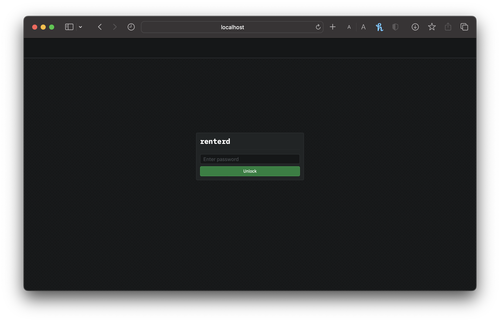
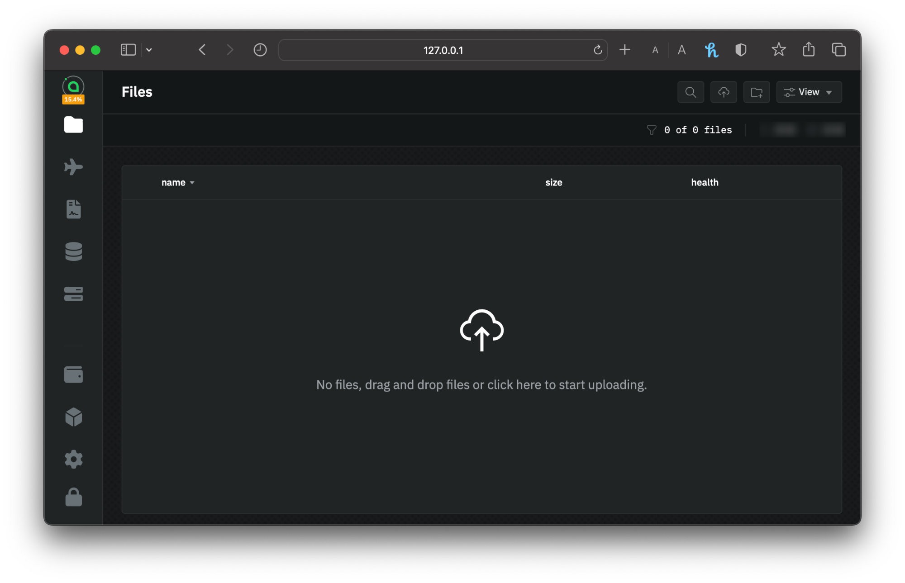

---
layout:
  title:
    visible: true
  description:
    visible: true
  tableOfContents:
    visible: true
  outline:
    visible: true
  pagination:
    visible: true
---

# Storing Your Data


**`renterd` is no longer the preferred way to store data on Sia.** For most users, [Sia Storage](https://sia.storage) (50 GB free, nothing to run) or a self-hosted [`indexd`](../setting-up-indexd/) is a better starting point. `renterd` still works, and these guides remain for existing users.


This guide walks you through uploading files with `renterd`. Your files are stored on Sia's decentralized storage network, where data is spread across a network of hosts for redundancy.

## Before you begin...

* **Install `renterd`**: Make sure you have the latest version of `renterd` installed on your machine.
* **Create a Wallet**: If you haven't already, create a Sia wallet to store your Siacoins.
* **Fund Your Wallet**: Transfer Siacoins (SC) to your Sia wallet from an exchange or another source. You'll need these coins to pay for storage.

## Uploading your files in renterd


Uploading files with `renterd` assumes you have completed all the steps of the `renterd` setup guide. Visit the [renterd](../setting-up-renterd/) guides to ensure everything is set up correctly before proceeding.


1. Access the `rentered` UI from your local host address. Enter your `API password` you created to unlock `renterd`.

<figure><figcaption>
renterd Login UI
</figcaption></figure>

2. Drag-and-drop files, or click the Upload Files button in the top right corner to begin uploading files.

<figure><figcaption>
File upload UI
</figcaption></figure>

Once you've chosen the file(s) to upload, it will be classed as active upload; give it a few seconds.


You have uploaded your file(s) using `renterd`. Your data is now stored on the Sia network.


## File processing

When you upload a file to Sia, it is processed on your local machine before being sent to the network. The file is divided into chunks. Each chunk is then split into 30 distinct pieces, each encrypted before being sent to a separate host. Only 10 of the 30 pieces are required to reconstruct a chunk, and no single host holds more than one piece.

This means up to 20 hosts can become disconnected from the network for each section of your original file, and your data remains recoverable.


For the more technical readers, here is what happens behind the scenes:

* Files are chunked into 40MB chunks (if a file is smaller, it is padded to 40MB so that data looks identical as it moves across networks)
* Each chunk is then erasure-coded using [Reed-Solomon](https://en.wikipedia.org/wiki/Reed%E2%80%93Solomon\_error\_correction) encoding. After processing, each chunk has 30 unique 4MB pieces.
* Each piece is then encrypted using [ChaCha20](https://en.wikipedia.org/wiki/ChaCha20-Poly1305) and uploaded to a distinct host.
* As Reed-Solomon encoding is done with 10 data and 20 parity shards, 10 pieces are sufficient for rebuilding the file.

