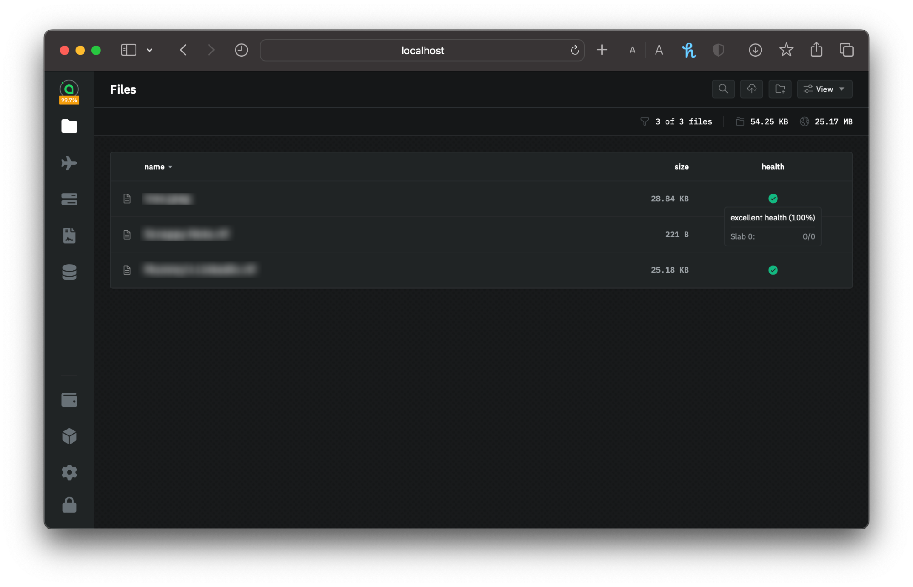
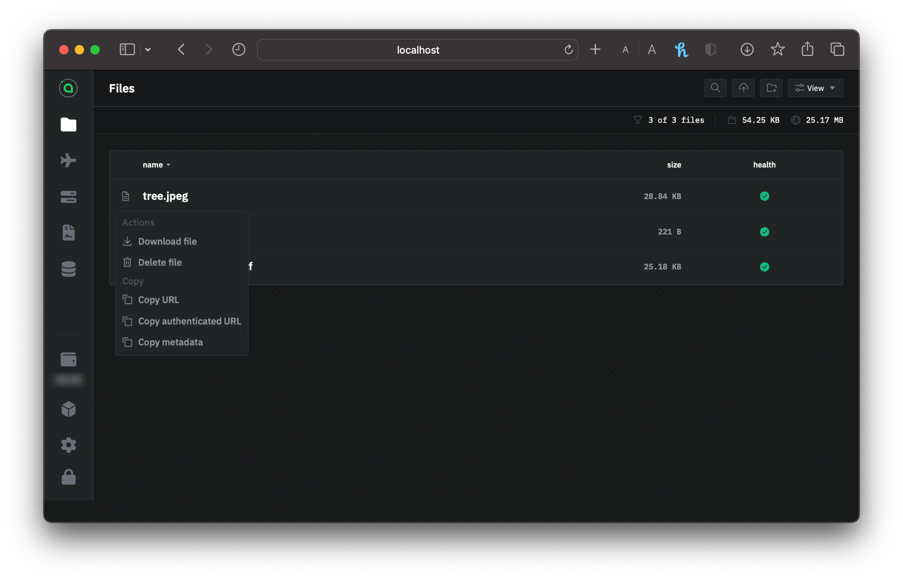

---
layout:
  title:
    visible: true
  description:
    visible: true
  tableOfContents:
    visible: true
  outline:
    visible: true
  pagination:
    visible: true
---

# Managing your Files

## Maintaining your Data

To ensure the constant availability of your data, you should perform a few crucial tasks periodically.


`renterd` **MUST** be running with your wallet unlocked for any actions to occur; therefore, it is advisable to open it at least once a month and let it run overnight to perform various essential housekeeping tasks.

If you upload files and subsequently neglect to reopen `renterd`, your allowance and contracts will eventually expire, leading to the immediate deletion of your files once your contracts become invalid.


### **Refreshing your allowance**

About six weeks after your contracts are created, your allowance attempts to refill itself. `renterd` will never spend more than your allowance, so it needs to be refilled to facilitate contract renewals and downloads through the rest of the contract period.


The allowance will refill automatically when you open `renterd`.


### **Renewing your contracts**

Your storage contracts will renew automatically at the end of the contract period. By default, Sia will attempt to renew your contract within about one month of the contract expiration date.

If you started renting at the beginning of January, your 3-month contracts would expire around the end of March. Sia would attempt to renew contracts around the beginning of March.


Your contracts renew automatically when you open `renterd`.


### **Boosting file health**

In `renterd` your files' health is quantified as a percentage, representing the number of available shards that comprise each file. Ideally, it would help if you strive for a perfect health rating of 100%, indicating that all 30 file shards are securely distributed among various hosts.

<figure><figcaption>
File health check in renterd
</figcaption></figure>

`renterd` incorporates an intelligent redundancy system that swiftly replicates any missing shards onto a new host in case one becomes unavailable during its next active check.

Health assessments can only be conducted if `renterd` when it's actively running. To ensure the ongoing integrity of your data, it's advisable to periodically launch and operate Sia, allowing it to refresh the health status of your files and sustain their redundancy at optimal levels.

## Downloading

Downloading files occurs directly within the app as well. A small download icon accompanies each file in your list. Downloading necessitates Siacoins because you are billed for the bandwidth consumed.

<figure><figcaption>
Downloading files in renterd
</figcaption></figure>
