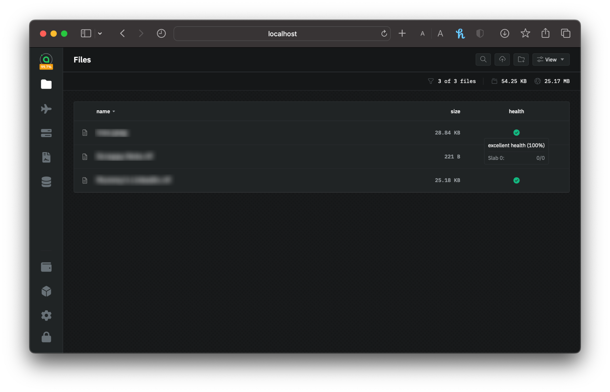
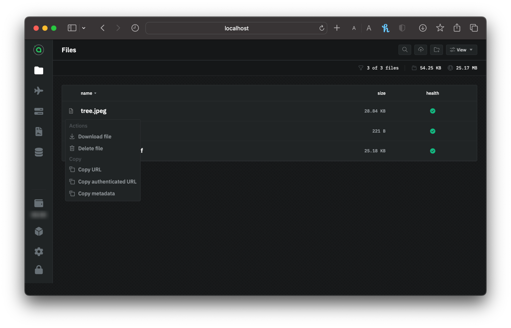

---
layout:
  title:
    visible: true
  description:
    visible: true
  tableOfContents:
    visible: true
  outline:
    visible: true
  pagination:
    visible: true
---

# Managing your Files


**`renterd` is no longer the preferred way to store data on Sia.** For most users, [Sia Storage](https://sia.storage) (50 GB free, nothing to run) or a self-hosted [`indexd`](../setting-up-indexd/) is a better starting point. `renterd` still works, and these guides remain for existing users.


## Maintaining your Data

To keep your data available, you should perform a few tasks periodically.


`renterd` **MUST** be running with your wallet unlocked for any actions to occur; therefore, it is advisable to open it at least once a month and let it run overnight to perform various essential housekeeping tasks.

If you upload files and subsequently neglect to reopen `renterd`, your allowance and contracts will eventually expire, leading to the immediate deletion of your files once your contracts become invalid.


### **Refreshing your allowance**

About six weeks after your contracts are created, your allowance attempts to refill itself. `renterd` will never spend more than your allowance, so it needs to be refilled to facilitate contract renewals and downloads through the rest of the contract period.


The allowance will refill automatically when you open `renterd`.


### **Renewing your contracts**

Your storage contracts will renew automatically at the end of the contract period. By default, Sia will attempt to renew your contract within about one month of the contract expiration date.

If you started renting at the beginning of January, your 3-month contracts would expire around the end of March. Sia would attempt to renew contracts around the beginning of March.


Your contracts renew automatically when you open `renterd`.


### **Boosting file health**

In `renterd` your files' health is shown as a percentage, representing the number of available shards that make up each file. A health of 100% indicates that all 30 file shards are distributed among hosts.

<figure><figcaption>
File health check in renterd
</figcaption></figure>

`renterd` automatically replicates any missing shards onto a new host if one becomes unavailable during its next health check.

Health checks only run while `renterd` is running. To maintain your data, periodically launch and run `renterd` so it can refresh the health status of your files and restore their redundancy.

## Downloading

Downloading files occurs directly within the app as well. A small download icon accompanies each file in your list. Downloading necessitates Siacoins because you are billed for the bandwidth consumed.

<figure><figcaption>
Downloading files in renterd
</figcaption></figure>
