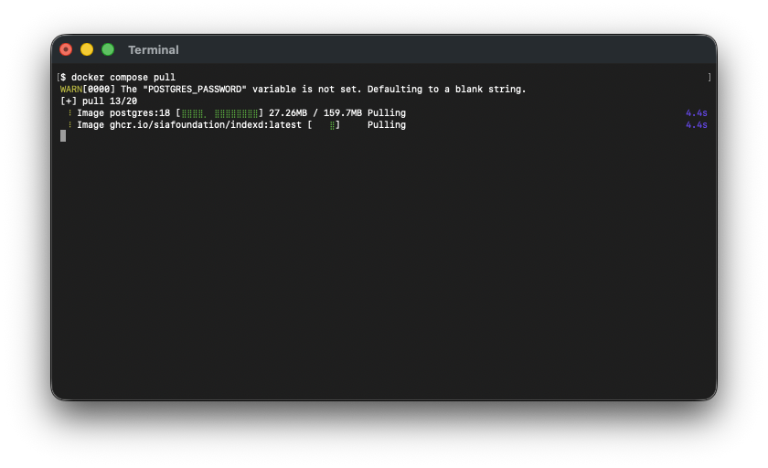
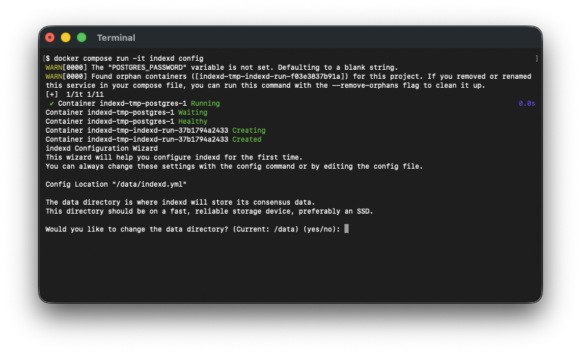
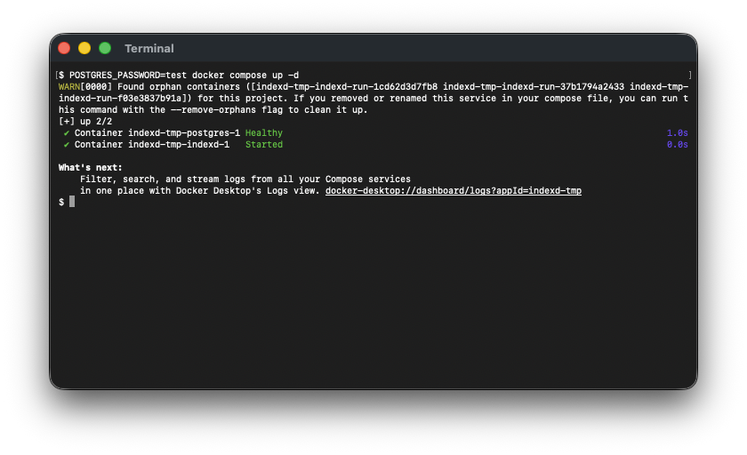
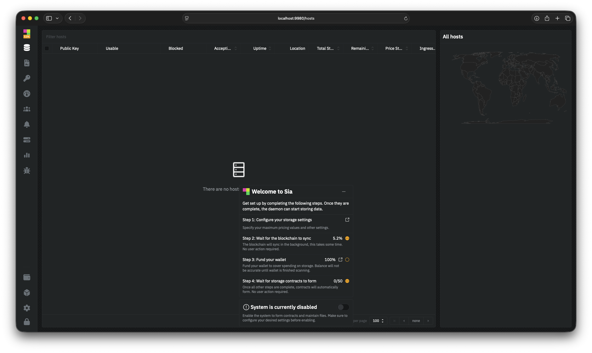

# Docker Compose

This guide will walk you through setting up `indexd` using Docker Compose. Because `indexd` requires a PostgreSQL database, this is the **recommended** way to self-host: Docker Compose runs `indexd` and PostgreSQL together, so you don't have to install or manage a database separately.


If you just want to store files, you don't need to run `indexd` at all — [Sia Storage](https://sia.storage) gives you 50 GB free with nothing to run.


---

## Pre-requisites

* **Software Requirements:** Before installing `indexd`, you will need to install [Docker](https://www.docker.com/get-started/).

* **Hardware Requirements:** A stable setup that meets the following specifications is recommended.
  - A quad-core CPU
  - 8GB of RAM
  - 256 GB SSD for `indexd` and its PostgreSQL database

* **Network Access:** `indexd` interacts with the Sia network, so you need a stable internet connection and open network access to connect to the Sia blockchain.


PostgreSQL is provided automatically by the Compose file below, so you do **not** need to install it yourself for this method.


## Create the compose file

Create a new file named `docker-compose.yml`. You can use the following as a template. The `postgres` service stores the `indexd` index, and the `indexd-data` volume holds the consensus data and config file.

```yml
services:
  postgres:
    image: postgres:18
    restart: unless-stopped
    shm_size: 128mb
    environment:
      POSTGRES_USER: indexd
      POSTGRES_PASSWORD: ${POSTGRES_PASSWORD}
      POSTGRES_DB: indexd
    volumes:
      - postgres:/var/lib/postgresql
    healthcheck:
      test: ["CMD-SHELL", "pg_isready -U $${POSTGRES_USER} -d $${POSTGRES_DB}"]
      interval: 5s
      timeout: 5s
      retries: 10
      start_period: 10s

  indexd:
    depends_on:
      postgres:
        condition: service_healthy
    image: ghcr.io/siafoundation/indexd:latest
    restart: unless-stopped
    ports:
      - 127.0.0.1:9980:9980/tcp # admin UI and API (kept local)
      - 9981:9981/tcp # public syncer
      - 9982:9982/tcp # application API (use an HTTPS reverse proxy for internet access)
    volumes:
      - indexd-data:/data

volumes:
  indexd-data:
  postgres:
```


Keep port `9980`, which serves the admin UI and API, bound to `127.0.0.1`. Port `9981` should be publicly reachable by the Sia network. The application API on port `9982` must be reachable by your applications; use an HTTPS reverse proxy rather than exposing it directly to the internet.


## Set the database password

Create a file named `.env` in the same directory as your `docker-compose.yml` and set a password for the PostgreSQL database:

```sh
POSTGRES_PASSWORD=your-secure-database-password
```

You will enter this same password during the `indexd` configuration step so the indexer can connect to the database.

## Getting the `indexd` image

To get the latest `indexd` image run the following command:
```console
docker compose pull
```



## Generate a recovery phrase

`indexd` uses a wallet to pay for storage contracts. If you don't already have a recovery phrase, generate one:

```console
docker compose run --rm indexd seed
```


Write your recovery phrase down and store it somewhere safe. It controls the wallet that funds your contracts and cannot be recovered if lost.


## Configuring `indexd`

Now launch the interactive configuration wizard:

```console
docker compose run --rm -it indexd config
```

The wizard will ask you for:

* Your **wallet recovery phrase** (use the one you generated above).
* An **admin password** used to unlock the `indexd` admin UI.
* A **database password** — enter the same value you set in `.env`.
* An **application API advertise URL** — the exact base URL applications will use to reach this indexer, described below.

When asked whether to configure **advanced settings**, answer `yes` and set the database connection so `indexd` can reach the PostgreSQL container:

| Setting | Value |
|---------|-------|
| Database address | `postgres:5432` |
| Database user | `indexd` |
| Database name | `indexd` |
| SSL mode | `disable` |



### Choose the application API advertise URL

The advertise URL is not the address `indexd` listens on. It is the external base URL that an application uses to reach the application API. `indexd` puts this URL into the application-approval flow and uses its hostname when verifying signed requests, so an incorrect value can break application authentication even when `indexd` itself is running.

For an indexer reached through an HTTPS reverse proxy, a typical configuration is:

```yml
applicationAPI:
  address: :9982
  advertiseURL: https://indexd.example.com
```

In this example, `indexd` listens on port `9982`, while applications connect to `https://indexd.example.com`. The reverse proxy terminates HTTPS and forwards requests to port `9982`.

The advertise URL must:

* Include the scheme, such as `https://`.
* Use the public hostname and port, if a non-standard port is required, that applications can actually reach.
* Use `https://` when a reverse proxy provides HTTPS, even if the proxy connects to `indexd` over HTTP.
* Be the same base URL entered in the application.
* Omit a trailing slash and API endpoint paths such as `/api` or `/auth/connect`.

Do not use `0.0.0.0`, a Docker service name, or another internal address. Use `localhost` or `127.0.0.1` only when the application runs on the same machine as `indexd`; on a phone or another computer, `localhost` refers to that device instead of the indexer.


The admin UI URL is not the advertise URL. Port `9980` serves the private admin API; applications connect to the application API on port `9982` or its HTTPS reverse-proxy URL.


## Running `indexd`

Now that you have `indexd` configured, start the services:

```console
docker compose up -d
```



Once `indexd` has started, you can access the admin UI by opening your browser and going to [http://localhost:9980](http://localhost:9980/).




`indexd` is now set up.


### Verify the advertise URL

From the device or network where the application will run, test the advertise URL you configured:

```console
curl -i https://indexd.example.com/auth/check
```

An unsigned request should reach `indexd` and return `401 Unauthorized` with a message about missing query parameters. A timeout, certificate error, or proxy error means the public URL is not ready.

To correct the URL, run the configuration wizard again, choose to change the existing value, and restart `indexd`:

```console
docker compose run --rm -it indexd config
docker compose restart indexd
```

## Fund your wallet

`indexd` uses a built-in wallet to pay storage providers for the contracts it forms on your behalf, so it needs Siacoin (SC) before it can store any data. After signing in, the **Welcome to Sia** checklist in the admin UI walks you through the remaining setup, including funding your wallet.

Open the **Wallet** section of the UI, copy your receiving address, and send Siacoin to it from an exchange or another wallet. See [Transferring Siacoins](../transferring-siacoins.md) for the full send and receive flow.

Once your wallet shows a confirmed balance, `indexd` can begin forming contracts and storing data.

## Checking the container status

To check the status of the containers run:
```console
docker compose ps
```

## Checking the logs

To check the `indexd` logs run:
```console
docker compose logs indexd
```

## Upgrading `indexd`

New versions of `indexd` are released regularly and contain bug fixes and performance improvements. To upgrade to the newest version, run the following:

```console
docker compose pull && docker compose up -d
```


`indexd` is now updated to the latest version.


## Next steps

Configure [backups and recovery](operations.md), then connect an [application](connect-application.md).
