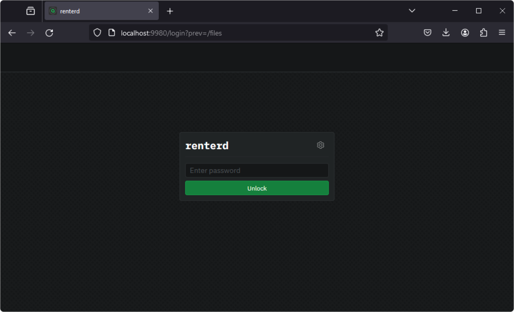

# Docker Compose

This guide will walk you through setting up `renterd` using Docker compose. At the end of this guide, you should have the following:

* Installed Sia `renterd` software
* Created a `renterd` wallet

---

## Pre-requisites

To ensure you will not run into any issues with running `renterd` it is recommended your system meets the following requirements:

* **Hardware Requirements:** A stable setup that meets the following specifications is recommended. Not meeting these requirements may result in preventing slabs from uploading and can lead to a loss of data.
  - A quad-core CPU
  - 8GB of RAM
  - An SSD with at least 256GB of free space.
  
* **Software Requirements:** Before installing `renterd`, you will need to install [Docker](https://www.docker.com/get-started/).

## Create the compose file

Create a new file named `docker-compose.yml`. You can use the following as a template. The `/data` mount is where consensus data is stored and is required.

```yml
services:
  renterd:
    container_name: renterd
    image: ghcr.io/siafoundation/renterd:latest
    restart: unless-stopped
    ports:
      - 127.0.0.1:9980:9980/tcp
    volumes:
      - renterd-data:/data

volumes:
  renterd-data:
```

Be careful with port 9980 as Docker will expose it publicly by default. It is recommended to bind it to 127.0.0.1 to prevent unauthorized access. If you need to expose it to a LAN, ensure the port is not accessible publicly.

## Getting the `renterd` image

To get the latest `renterd` image run the following command:
```
docker compose pull
```

## Configuring `renterd`

Now that you have the latest `renterd` image downloaded, you will need to create a seed phrase and admin password. To launch the built-in configuration wizard, run the following:

```console
docker compose run --rm -it renterd config
```


When the configuration wizard loads, you will be asked to verify the location of your data directory. Type `no` to keep the default.


Next, you will be asked to enter a seed phrase. If you already have one that you would like to use, you can enter it now. Otherwise, you can type `seed` to generate a new one. For the purpose of this guide, we will generate a new seed.


Next, you will be prompted to enter an admin password. This is used to unlock the `renterd` web UI.


Next, you will be prompted to configure s3 settings for `renterd`. This can be configured later on from the web UI if needed. Type `no` and hit enter.


Finally, you will be asked if you want to configure advanced settings for `renterd`. Type `no` and hit enter to exit the configuration wizard.


## Running `renterd`

Now that you have `renterd` successfully installed and configured, it is time to run it. Use the following command to start `renterd`:

```console
docker compose up -d
```


Once `renterd` has successfully started, you can access the web UI by opening your browser and going to [http://localhost:9980](http://localhost:9980/).




Congratulations, you have successfully set up `renterd`.


## Checking the container status

To check the status of the container run:
```
docker ps -a
```

If the container is not running, it will show as `Exited` in the `STATUS` column.


## Checking the logs

To check the container logs run:
```
docker compose logs renterd
```


## Upgrading `renterd`

It is essential to keep your host up to date. New versions of `renterd` are released regularly and contain bug fixes and performance improvements.

To upgrade your `renterd` to the newest version, make sure you have shut down `renterd` and then run the following:

```console
docker compose pull && docker compose up -d
```



Congratulations, you have successfully updated your version of `renterd`!

