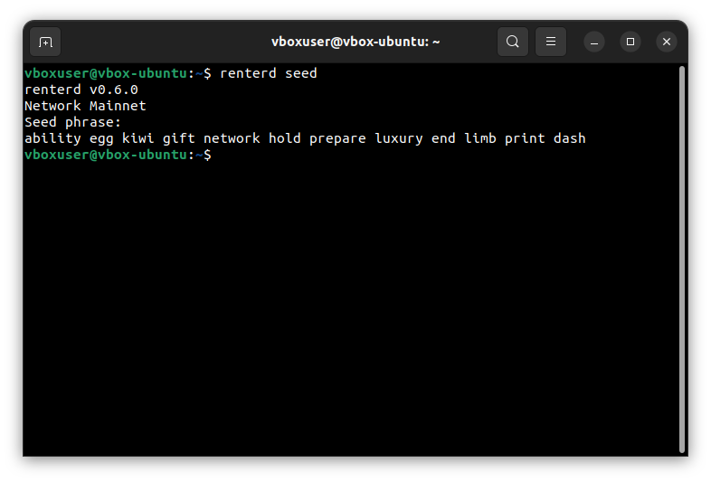
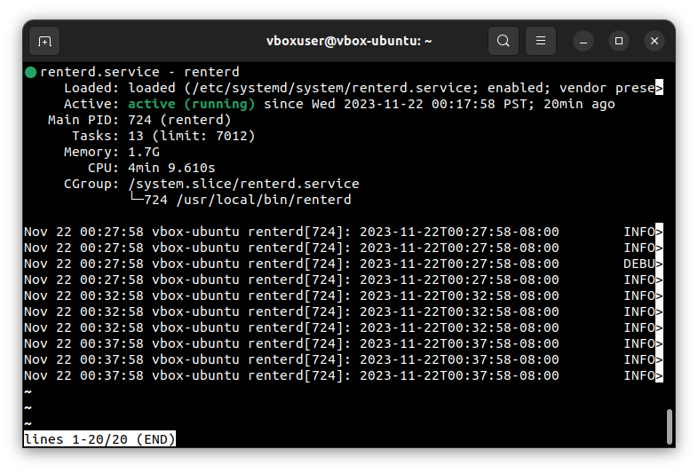
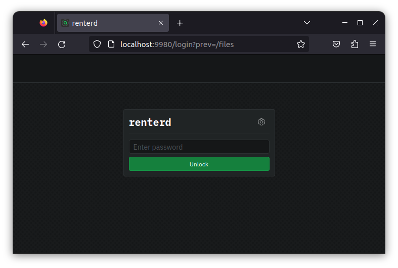

# Linux

This guide will walk you through setting up `renterd` on Linux. At the end of this guide, you should have the following:

* Installed Sia `renterd` software
* Created a `renterd` wallet

## Pre-requisites

* **Network Access:** `renterd` interacts with the Sia network, so you need a stable internet connection and open network access to connect to the Sia blockchain.
* **Operating System Compatibility:** Ensure your Linux version is compatible with the `renterd` software. Check [releases](../../miscellaneous/releases.md) supported by Linux versions.
* **System Updates:** Ensure that your Linux is up to date with the latest system updates, as these updates can contain important security fixes and improvements.


Your machine must meet the minimum requirements for `renterd`. Not meeting these requirements may result in preventing slabs from uploading and can lead to a loss of data. A stable setup that meets the following specifications is recommended.

* A Linux distro with `systemd` (Ubuntu, Debian, Fedora, Arch, etc)
* A dual-core CPU
* 16GB of RAM
* An SSD with at least 128GB of free space.

To be safe, we have set the recommended minimum RAM requirement as 16GB. This is because `renterd` keeps full slabs in memory when uploading. A full slab is 120MB, and a single upload may hold two or three slabs in memory. So while it is possible to run `renterd` with 8GB of RAM, you should only do so if you understand the risks.


## Getting `renterd`


Remember to check which version to download to ensure it works correctly with your operating system. To do this, run  `uname -m` in your Terminal Emulator.

* **x86\_64** - `Linux AMD64`
* **aarch64** - `Linux ARM64`


1. Download the latest version of `renterd` for your operating system from the [official website](https://sia.tech/software/renterd). For this guide, we'll be downloading the Linux version of `renterd`. Open the Terminal Emulator and run the following command:


If you are installing `renterd` on a Raspberry Pi or other ARM64 architecture, or you intend to use the Zen Testnet. Make sure to download the correct binary for your system.




```console
wget https://sia.tech/downloads/latest/renterd_linux_amd64.zip
```



```console
wget https://sia.tech/downloads/latest/renterd_linux_arm64.zip
```



```console
wget https://sia.tech/downloads/latest/renterd_zen_linux_amd64.zip
```



```console
wget https://sia.tech/downloads/latest/renterd_zen_linux_arm64.zip
```



2. Now that we have downloaded `renterd`, we can unzip and extract the `renterd` binary to our `/usr/local/bin` directory.



```console
unzip -j renterd_linux_amd64.zip renterd &&\
sudo mv -t /usr/local/bin renterd &&\
rm -fr renterd_linux_amd64.zip 
```



```console
unzip -j renterd_linux_arm64.zip renterd &&\
sudo mv -t /usr/local/bin renterd &&\
rm -fr renterd_linux_arm64.zip 
```



```console
unzip -j renterd_zen_linux_amd64.zip renterd &&\
sudo mv -t /usr/local/bin renterd &&\
rm -fr renterd_zen_linux_amd64.zip 
```



```console
unzip -j renterd_zen_linux_arm64.zip renterd &&\
sudo mv -t /usr/local/bin renterd &&\
rm -fr renterd_zen_linux_arm64.zip 
```




You'll be prompted to authorize this action by providing your system password. Type this in and press enter to continue.


## Creating a wallet

1. `renterd` uses BIP-39 12-word recovery phrases. If you already have a 12-word seed, skip this step; run the following command to generate a new wallet recovery phrase:

```console
renterd seed
```

A new 12-word recovery phrase will be generated, so please copy and store it in a safe place, as you will need this phrase to recover your wallet.&#x20;


If you lose this phrase, you will lose access to your wallet and funds. Find out more about [Your Sia Seed](../../get-started-with-sia/the-importance-of-your-seed.md) and why it is essential.


<figure><figcaption><p>Generating a recovery phrase</p></figcaption></figure>

## Setting up a systemd service

Now that you have a recovery phrase, we will create a new system user and `systemd` service to securely run `renterd` on startup.

First, we will create a new system user with `useradd` and disable the creation of a home directory. This is a security precaution that will isolate `renterd` from any unauthorized access to our system. We will then use `usermod` to lock the account and prevent anyone from logging in under the account.

```console
sudo useradd -M renterd &&\
sudo usermod -L renterd
```

Now, we will create a new folder under `/var/lib/` titled `renterd` and give it the appropriate permissions. This folder will be utilized specifically to store data related to the `renterd` software. Open the Terminal Emulator and run the following commands:

```console
sudo mkdir /var/lib/renterd &&\
sudo chown renterd:renterd /var/lib/renterd &&\
sudo chmod o-rwx /var/lib/renterd
```

Next, create a file name `renterd.yml` file under `/var/lib/renterd/`

```console
sudo nano /var/lib/renterd/renterd.yml
```

Now, modify the file to add your wallet seed and API password. The recovery phrase is the 12-word phrase you generated in the previous step. Type it carefully, with one space between each word, or copy it from the previous step. The password is used to unlock the `renterd` UI; it should be something secure and easy to remember.


If you are planning to use `renterd`'s built-in S3 API, make sure you enable S3 in your `renterd.yml` file.




```yml
seed: your seed phrase goes here
http:
  password: your_password
autopilot:
  heartbeat: 5m
```



```yml
seed: your seed phrase goes here
http:
  password: your_password
autopilot:
  heartbeat: 5m
s3:
  enabled: true
  disableAuth: false
  address: "localhost:9885"
  keypairsV4:
    your_access_key: your_private_key
```



Once you have added your recovery phrase and password save the file with `ctrl+s` and exit with `ctrl+x`.

Next, we'll create a new system service to run `renterd` on startup:

```console
sudo nano /etc/systemd/system/renterd.service
```

Once the editor loads, copy and paste the following into it.

```toml
[Unit]
Description=renterd
After=network.target

[Service]
Type=simple
ExecStart=/usr/local/bin/renterd
WorkingDirectory=/var/lib/renterd
Restart=always
RestartSec=15
User=renterd

[Install]
WantedBy=multi-user.target
Alias=renterd.service
```

You can now save the file with `ctrl+s` and exit with `ctrl+x`.

## Running `renterd`

Now it is time to start the service

```console
sudo systemctl start renterd
```

Your `renterd` service should now be running. You can check the status of the service by running the following command:

```console
sudo systemctl status renterd
```

If the service was set up correctly, it should say "active (running)."
<figure><figcaption><p>Starting renterd</p></figcaption></figure>

3. You can now access the `renterd` web UI by opening a browser and going to `http://localhost:9980`.


If you are using the Zen Testnet, please note that the `renterd` web UI is accessible at `https://localhost:9880`.


<figure><figcaption><p>renterd Login UI</p></figcaption></figure>

Enter the `API password` you created in the previous step to unlock `renterd`.


Congratulations on successfully setting up `renterd` and taking a significant step towards renting storage space on the Sia network.


## Updating

New versions of `renterd` are released regularly and contain bug fixes and performance improvements.

To update:

1. Download the latest version of `renterd` from the [official website](https://sia.tech/software/renterd).
2. Stop the `renterd` service with `Crtl+C`.
3. Unzip and replace `renterd` with the new version.
4. Restart `renterd`.
