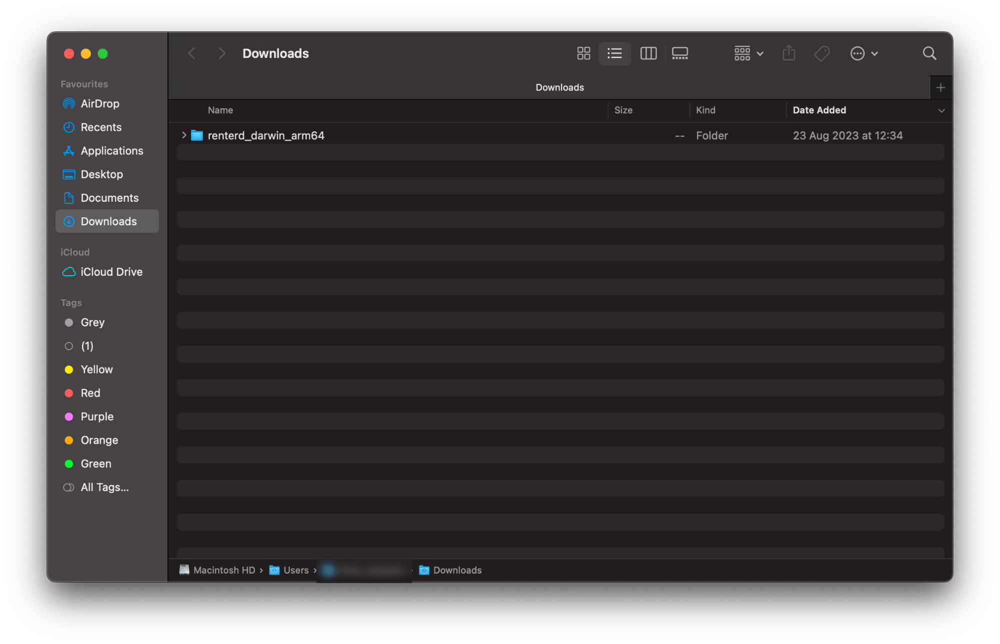
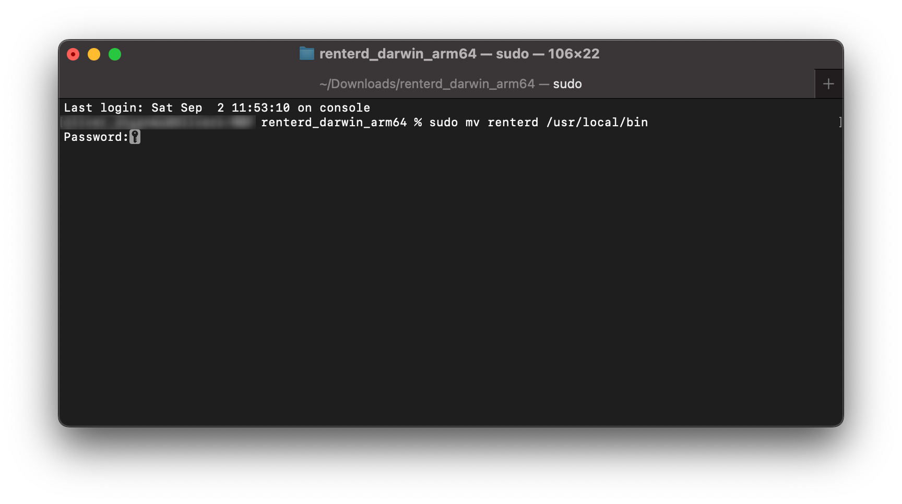
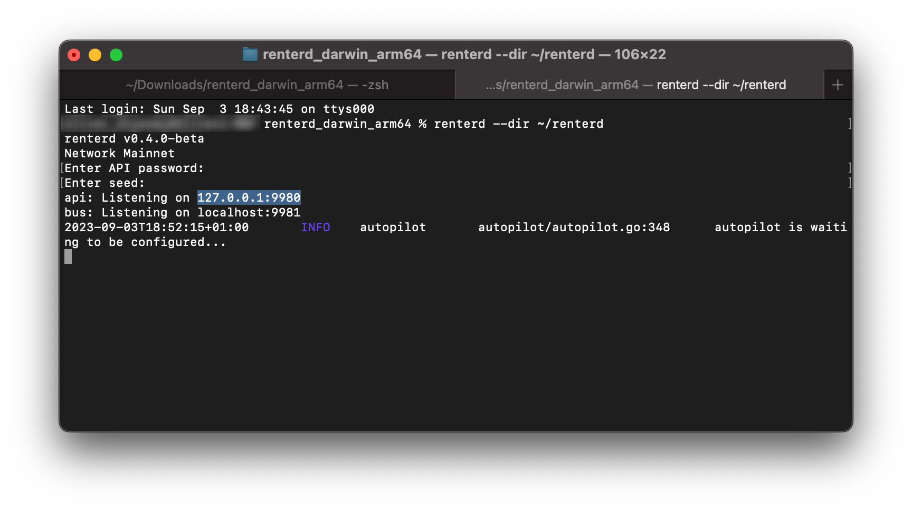

# ✏ Linux

This guide will walk you through setting up `renterd` on Linux. At the end of this guide, you should have the following:

* **Installed Sia `renterd` software:** Successfully installed the Sia `renterd` software on your Linux system with the appropriate binary.
* **Created a `renterd` wallet**: Have created a wallet with a Seed to access and manage your Sia network transactions and store your Siacoins in `renterd`.

## Pre-requisites

* **Network Access:** `renterd` interacts with the Sia network, so you need a stable internet connection and open network access to connect to the Sia blockchain.
* **Operating System Compatibility:** Ensure that your Linux version is compatible with the walletd software. Check [releases](../../miscellaneous/releases.md) supported Linux versions.
* **System Updates:** Ensure that your Linux is up to date with the latest system updates, as these updates can contain important security fixes and improvements.

## Getting `renterd`

1. Download the latest version of `renterd` for your operating system from the [official website](https://sia.tech/software/renterd). For the purpose of this guide, we'll be downloading the Linux version of `renterd` and unzip the binary to `/usr/local/bin`.


Remember to check which version to download to ensure it works correctly with your operating system. To do this click on the Apple icon in the top left corner of your toolbar, then click on “About This Mac.” If the processor/chips says:

* **Intel** - `MacOS AMD64`
* **M1 or M2** - `MacOS ARM64`


<figure><figcaption><p>macOS Download folder</p></figcaption></figure>

2. Now that we have downloaded `renterd`, you may need to unzip it and move it to a more accessible location:
   * Double-click on the downloaded `renterd` zip file to unzip it if it hasn't done so automatically.
   * Click on the newly unzipped directory.
   * Right-click on the path bar at the bottom of the Finder window and click "Open in Terminal".

<figure><figcaption><p>Options after right-clicking</p></figcaption></figure>

3. In the opened terminal window, move the `renterd` binary to `/usr/local/bin` by running the following command and press enter:

```bash
sudo mv renterd /usr/local/bin
```

<figure><figcaption><p>Moving renterd binary</p></figcaption></figure>

You'll be prompted to authorize this action by providing your system password. Type this in and press enter to continue.

4. Finally, for good practice, create a folder on the home drive. This folder will be utilized specifically to store data related to the `renterd` software.

```bash
mkdir ~/renterd
```

## Creating a wallet

1. `renterd` uses BIP-39 12-word recovery phrases. If you already have a 12-word seed, skip this step, otherwise run the following command to generate a new wallet recovery phrase:

```bash
renterd seed
```

A new 12-word recovery phrase will be generated, so please copy and store it in a safe place as you will need this phrase to recover your wallet.&#x20;


If you lose this phrase, you will lose access to your wallet and funds. Find out [more](../../get-started-with-sia/the-importance-of-your-seed.md) about  the importance of your seed.


<figure><figcaption><p>Generating a recovery phrase</p></figcaption></figure>

## Running `renterd`

1. In the same terminal, run the following command to start `hostd`:

```bash
renterd --dir ~/renterd
```

You will be prompted input both:

* `API password` - This password is chosen by you and can be anything you want it to be. It will be used to unlock the `renterd` UI via your browser, it should be something secure and easy to remember.
* `wallet seed` - The recovery phrase is the 12-word phrase you generated in the previous step. Type it carefully, with one space between each word, or copy it from the previous step.

These values are not stored anywhere; and will be used requested every time you start `renterd`.


You can also set the RENTERD`_SEED` and RENTERD`_API_PASSWORD` environment variables so you do not have to re-enter the values every time. Check out this \<article> to set this.


2. After entering your desired `API password` and the created `seed`, `hostd` will start.&#x20;

<figure><figcaption><p>Starting renterd</p></figcaption></figure>

Your terminal will produce a two different values you may not be familiar with, so feel free to check the tabs below to see what each of them are and why they are important:



**api (Application Programming Interface) Component:**

* "api" refers to the application programming interface, which allows different software components to communicate and interact with each other.
* `Listening on 127.0.0.1:9980` indicates that the application's API component is actively waiting for incoming connections on the local loopback IP address `127.0.0.1` and the port `9980`.







3. &#x20;You can now access the `renterd` UI by opening a browser and going to `http://localhost:9980`.&#x20;


Remember to leave the terminal window open while `hostd` is running. If you close the command prompt window, `hostd`will stop.



<figure><figcaption><p>renterd Login UI</p></figcaption></figure>

Enter your `API password` you created in the in the previous step to unlock `renterd`.


Congratulations on successfully setting up `renterd` and taking a significant step towards renting storage space on the Sia network.


## Updating

It is very important to keep your host up to date. New versions of `renterd` are released regularly and contain bug fixes and performance improvements.

To update:

1. Download the latest version of `renterd` from the [official website](https://sia.tech/software/renterd).
2. Stop the `renterd` service with the command `sudo systemctl stop renterd`
3. Unzip and replace `renterd` in `/usr/local/bin` with the new version
4. Restart `renterd` with `sudo systemctl start renterd`
