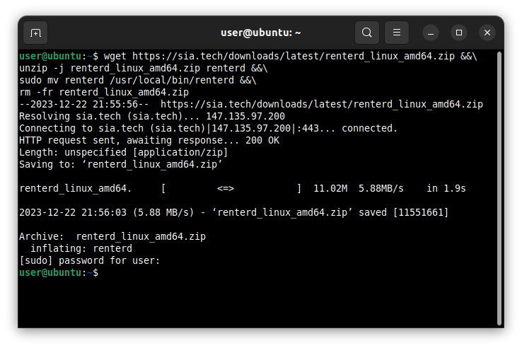
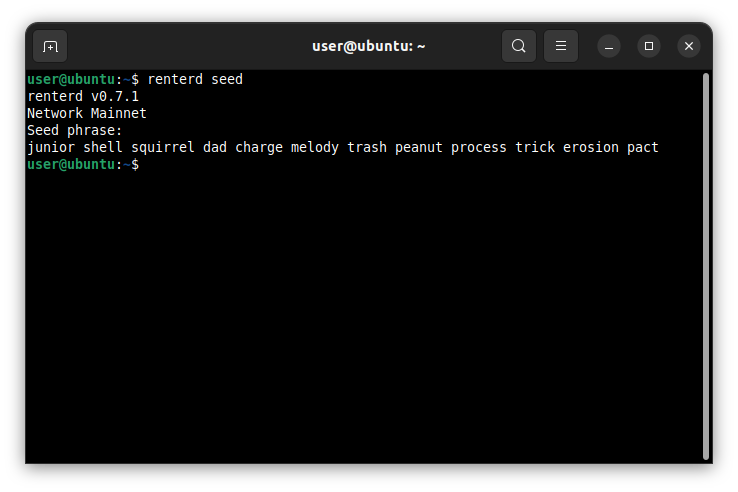
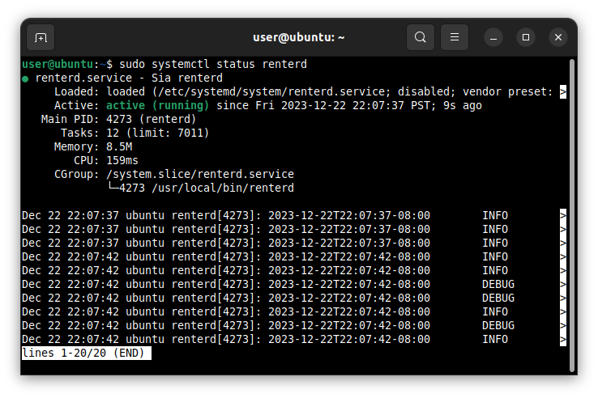
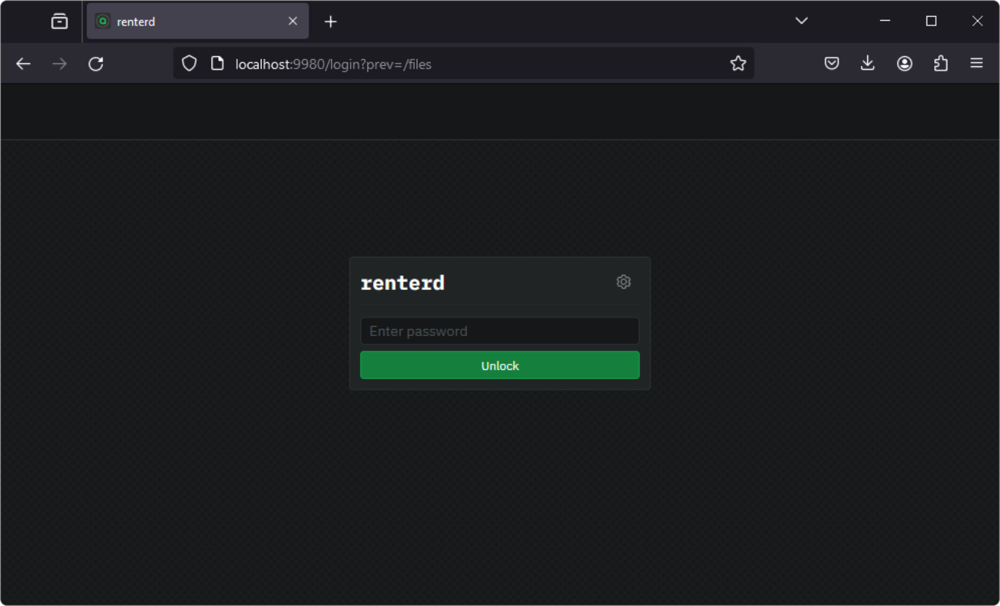
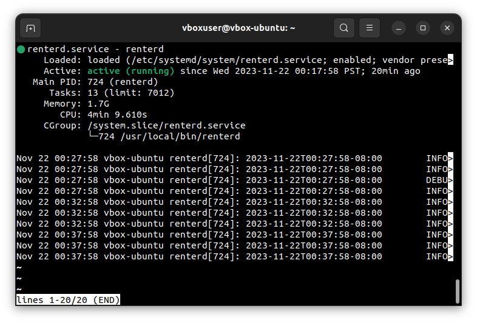

---
layout:
  title:
    visible: true
  description:
    visible: true
  tableOfContents:
    visible: true
  outline:
    visible: true
  pagination:
    visible: true
---

# Linux


**`renterd` is no longer the preferred way to store data on Sia.** For most users, [Sia Storage](https://sia.storage) (50 GB free, nothing to run) or a self-hosted [`indexd`](../../setting-up-indexd/) is a better starting point. `renterd` still works, and these guides remain for existing users.


This guide will walk you through setting up `renterd` on Linux. At the end of this guide, you should have the following:

* Installed Sia `renterd` software
* Created a `renterd` wallet

---

## Pre-requisites

To ensure you will not run into any issues with running `renterd` it is recommended your system meets the following requirements:

* **Operating System Compatibility:** `renterd` is supported on the following Linux versions:
  - Trixie (Debian 13)
  - Bookworm (Debian 12)
  - Bullseye (Debian 11)
  - Plucky (Ubuntu 25.04)
  - Noble (Ubuntu 24.04)
  - Jammy (Ubuntu 22.04)

* **System Updates:** Ensure that your Linux system is up to date with the latest system updates, as these updates can contain important security fixes and improvements.

* **Hardware Requirements:** A stable setup that meets the following specifications is recommended. Not meeting these requirements may result in preventing slabs from uploading and can lead to a loss of data.
  - A quad-core CPU
  - 8GB of RAM
  - 256 GB SSD for `renterd`

* **Network Access:** `renterd` needs a stable internet connection and open network access in order to store and retrieve data on the Sia network.


To ensure proper functionality, we are recommending a minimum of 8 GB RAM. This is because `renterd` will keep full slabs in memory when uploading. A full slab is 120MB, and a single upload may hold two or three slabs in memory. However, it is possible to run `renterd` with less RAM than this, and it may work fine depending on the use case.


---

## Installing `renterd`

Open a Terminal using `Crtl + Alt + T`.


If you cannot open a `Terminal` using the above method, try one of the other methods [listed here](https://www.geeksforgeeks.org/how-to-open-terminal-in-linux/).


Once the Terminal loads, run one of the following commands to download and install the latest version of `renterd` to your `/usr/local/bin` directory.



```console
wget https://sia.tech/downloads/latest/renterd_linux_amd64.zip &&\
unzip -j renterd_linux_amd64.zip renterd &&\
sudo mv renterd /usr/local/bin/renterd &&\
rm -fr renterd_linux_amd64.zip
```



```console
wget https://sia.tech/downloads/latest/renterd_linux_arm64.zip &&\
unzip -j renterd_linux_arm64.zip renterd &&\
sudo mv renterd /usr/local/bin/renterd &&\
rm -fr renterd_linux_arm64.zip
```




You’ll be prompted to authorize this action by providing your system password. You will not see anything when you type this in. Press `Enter` once you have entered your password.




---

## Creating a wallet

`renterd` uses BIP-39 12-word recovery phrases. To generate a new wallet recovery phrase, run the following command:

```console
renterd seed
```


A new 12-word recovery phrase will be generated. Make sure to store it in a safe place, as you will need this phrase to recover your wallet.




---

## Setting up a system user

Now that you have a recovery phrase, we will create a new system user and `systemd` service to run `renterd` securely on startup.

First, we will create a new system user with `useradd` and disable the creation of a home directory. This is a security precaution that will isolate `renterd` from any unauthorized access to our system. We will then use `usermod` to lock the account and prevent anyone from logging in under the account.

```console
sudo useradd -M renterd &&\
sudo usermod -L renterd
```

Now, we will create a new folder under `/var/lib/` titled `renterd` and give it the appropriate permissions. This folder will be utilized specifically to store data related to the `renterd` software. Open the Terminal Emulator and run the following commands:

```console
sudo mkdir /var/lib/renterd &&\
sudo chown renterd:renterd /var/lib/renterd &&\
sudo chmod o-rwx /var/lib/renterd
```

---

## Configure your `renterd.yml` file

To begin, create a file name `renterd.yml` file under `/var/lib/renterd/`

```console
sudo nano /var/lib/renterd/renterd.yml
```

Now, modify the file to add your wallet seed and API password. The recovery phrase is the 12-word phrase you generated in the previous step. Type it carefully, with one space between each word, or copy it from the previous step. The password is used to unlock the `renterd` web UI; it should be something secure and easy to remember.

```yaml
seed: your seed phrase goes here
http:
  password: your_api_password
autopilot:
  heartbeat: 5m
```

Once you have added your recovery phrase and password, save the file with `ctrl+s` and exit with `ctrl+x`.


To use the Zen testnet instead of mainnet, add `network: zen` to your `renterd.yml`. The same `renterd` binary serves both networks, and the web UI stays on port 9980.


---

## Setting up a systemd service

Now we can create a new system service to run `renterd` on startup:

```console
sudo nano /etc/systemd/system/renterd.service
```

Once the editor loads, copy and paste the following into it.

```toml
[Unit]
Description=renterd
After=network.target

[Service]
Type=simple
ExecStart=/usr/local/bin/renterd
WorkingDirectory=/var/lib/renterd
Restart=always
RestartSec=15
User=renterd

[Install]
WantedBy=multi-user.target
Alias=renterd.service
```

You can now save the file with `ctrl+s` and exit with `ctrl+x`.

---

## Running `renterd`

Now it is time to start the service

```console
sudo systemctl start renterd &&\
sudo systemctl enable renterd
```


On newer versions of Linux (Ubuntu 22.04+), `sudo systemctl enable renterd` may not be required as the service will automatically be enabled by default. If you get an error saying the service failed to be enabled due to the file already existing, it is okay to ignore it.


Your `renterd` service should now be running. You can check the status of the service by running the following command:

```console
sudo systemctl status renterd
```

If the service was set up correctly, it should say “active (running).”


If for some reason your `renterd` service will not start, use the command `journalctl -fu renterd` to view the console output for more information.




You can now access the Sia network using the `renterd` web UI by opening a browser and going to [http://localhost:9980](http://localhost:9980/).



Enter the API `password` you created in your `renterd.yml` to unlock the `renterd` web UI.


You have set up `renterd`.


---

## Updating

New versions of `renterd` are released regularly and contain bug fixes and performance improvements.

**To update:**

1. Stop the `renterd` system service.
```console
sudo systemctl stop renterd
```

2. Download and install the latest version of `renterd`.


Make sure to install the correct version for your system. If you are unsure which version you should pick, refer to the [Pre-requisites](#pre-requisites) section of this guide for instructions.




```console
wget https://sia.tech/downloads/latest/renterd_linux_amd64.zip &&\
unzip -j renterd_linux_amd64.zip renterd &&\
sudo mv renterd /usr/local/bin/renterd &&\
rm -fr renterd_linux_amd64.zip
```



```console
wget https://sia.tech/downloads/latest/renterd_linux_arm64.zip &&\
unzip -j renterd_linux_arm64.zip renterd &&\
sudo mv renterd /usr/local/bin/renterd &&\
rm -fr renterd_linux_arm64.zip
```




You'll be prompted to authorize this action by providing your system password. Type this in and press enter to continue.


3. Restart the `renterd` system service.
```console
sudo systemctl start renterd
```

4. Verify the `renterd` service is running correctly.
```console
sudo systemctl status renterd
```


If, for some reason, the `renterd` service will not start, use the command `journalctl -fu renterd` to view the console output for more information.





Your version of `renterd` has been updated.

