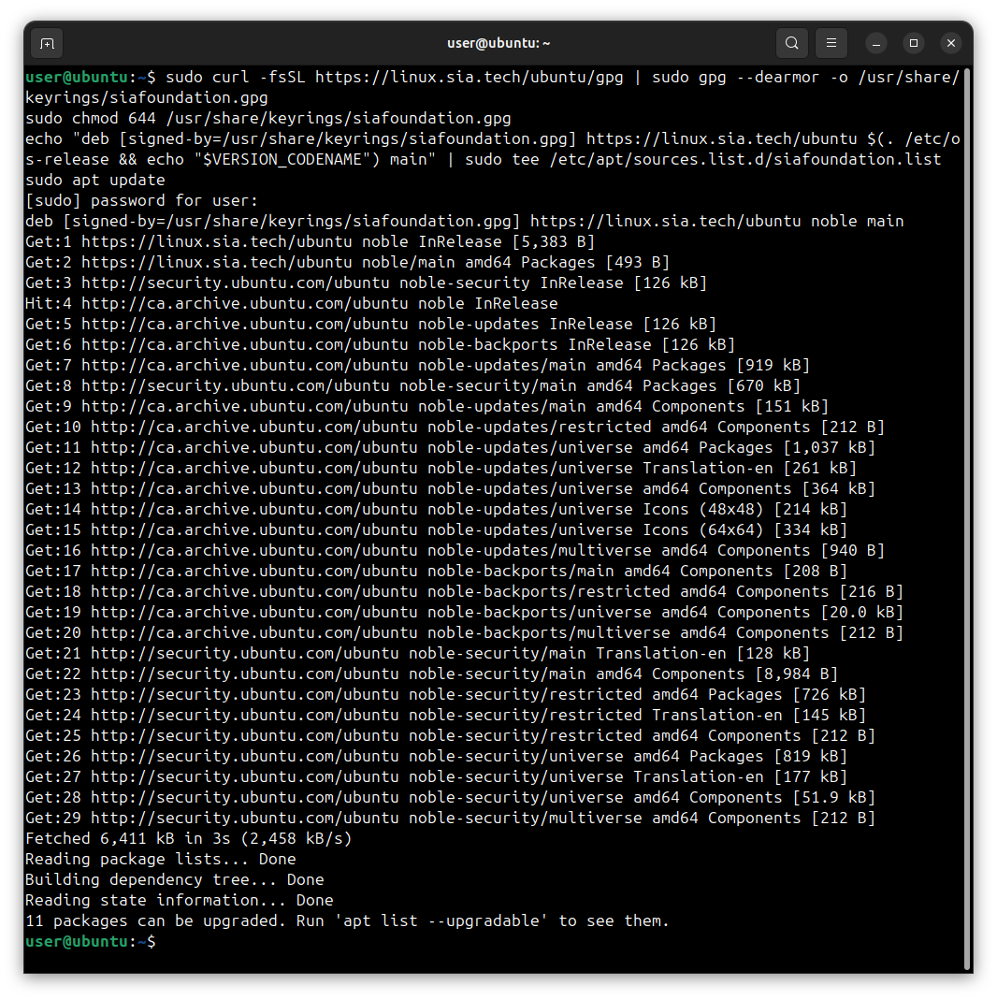
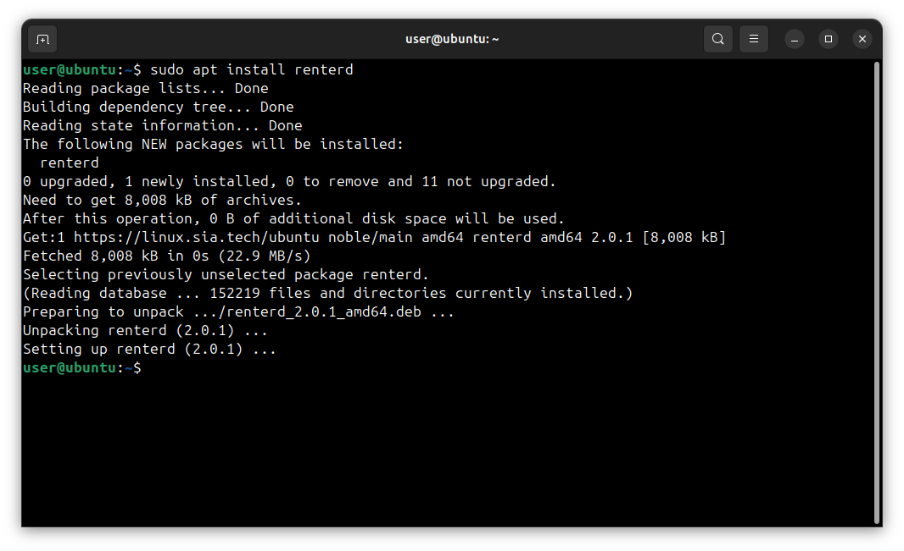
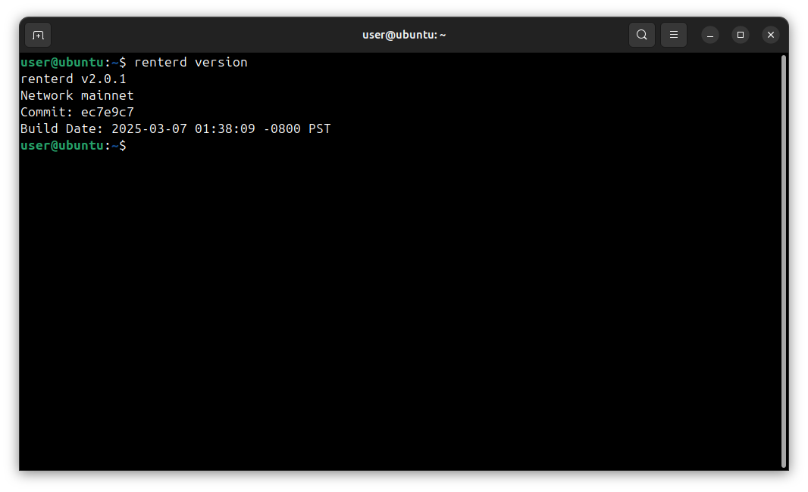
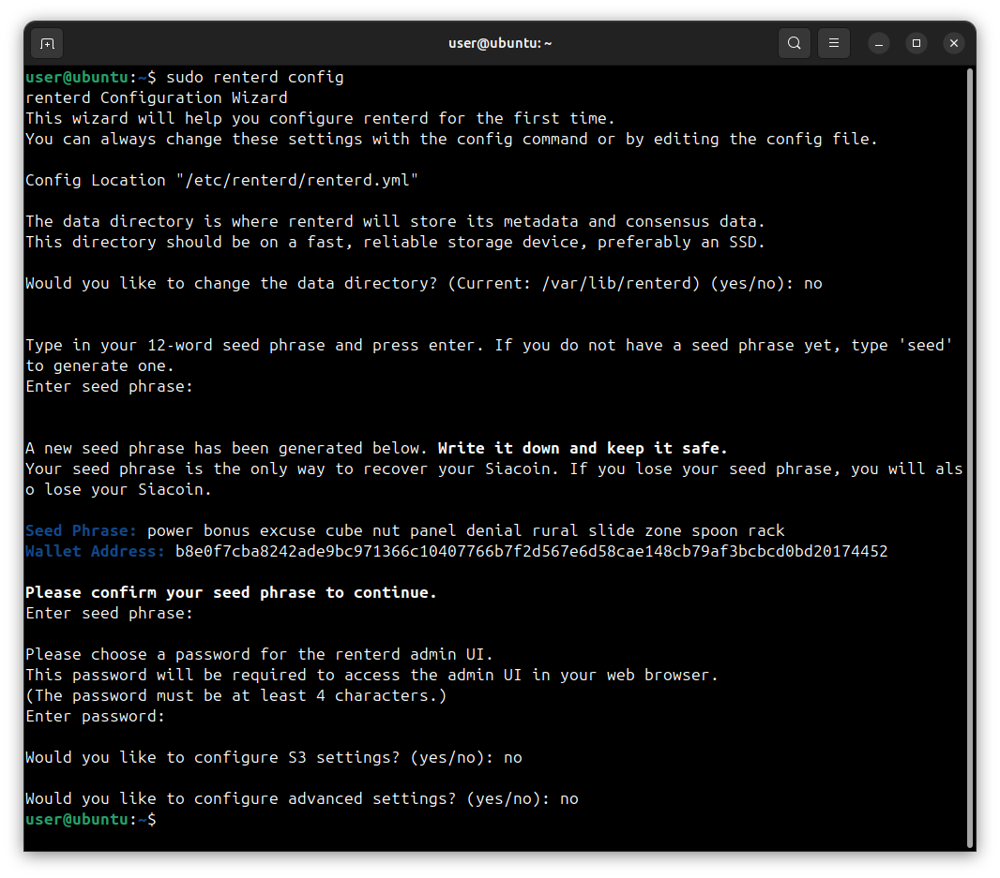
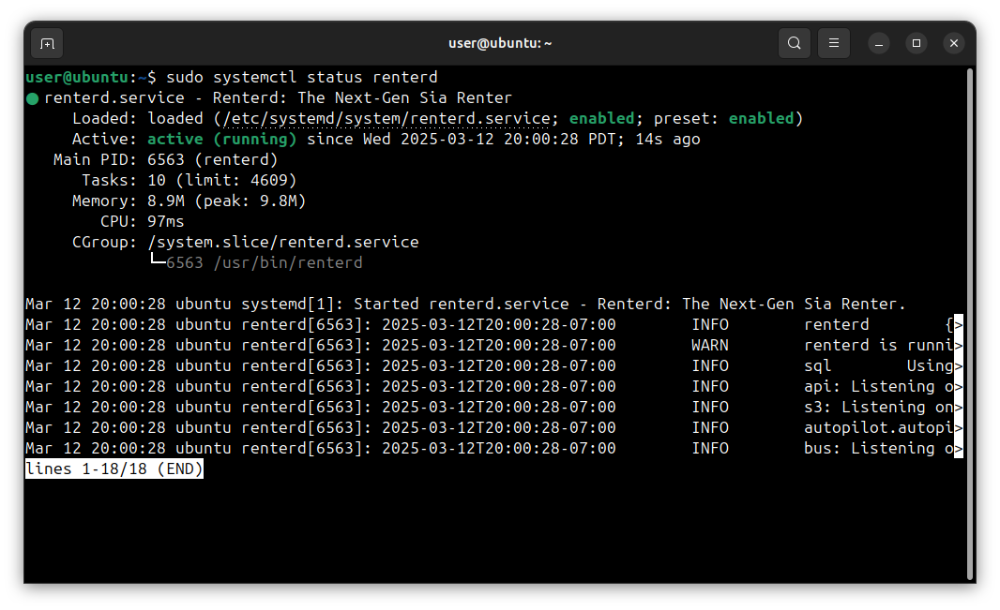

---
layout:
  title:
    visible: true
  description:
    visible: true
  tableOfContents:
    visible: true
  outline:
    visible: true
  pagination:
    visible: true
---

# Ubuntu

This guide will walk you through setting up `renterd` on Linux. At the end of this guide, you should have the following:

* Installed the `renterd` software
* Created a `renterd` wallet

---


## Pre-requisites

To ensure you will not run into any issues with running `renterd` it is recommended your system meets the following requirements:

* **Network Access:** `renterd` needs a stable internet connection and open network access in order to store and retrieve data on the Sia network.

* **Operating System Compatibility:** `renterd` is supported on the following Ubuntu versions:
	- Noble (Ubuntu 24.04)
	- Mantic (Ubuntu 23.10)
	- Jammiy (Ubuntu 22.04)
	- Focal (Ubuntu 20.04)
	

* **System Updates:** Ensure that Ubuntu is up to date with the latest system updates, these updates can contain important security fixes and improvements.

* **Hardware Requirements:** A stable setup that meets the following specifications is recommended. Not meeting these requirements may result in preventing slabs from uploading and can lead to a loss of data.
  - A quad-core CPU
  - 8 GB of RAM
  - An SSD with at least 128GB of free space.


To ensure proper functionality, we are recommending 8 GB RAM. This is because `renterd` will keep full slabs in memory when uploading. A full slab is 120MB, and a single upload may hold two or three slabs in memory. However, it is possible to run `renterd` with less RAM than this, and it may work fine depending on the use case.


## Install `renterd` Using the `apt` repository

Before you install `renterd` for the first time on a new machine, you need to set up the Sia `apt` repository. Afterward, you can install and update `renterd` using `apt`.


Your system will need to have `curl` installed as well. You can check if it is installed by running `curl --version`. If it is not installed, you can install it by running `sudo apt update && sudo apt install curl`


**1. Set up the Sia `apt` repository by copying and pasting the following commands into your terminal:**

```sh
sudo curl -fsSL https://linux.sia.tech/ubuntu/gpg | sudo gpg --dearmor -o /usr/share/keyrings/siafoundation.gpg
sudo chmod 644 /usr/share/keyrings/siafoundation.gpg
echo "deb [signed-by=/usr/share/keyrings/siafoundation.gpg] https://linux.sia.tech/ubuntu $(. /etc/os-release && echo "$VERSION_CODENAME") main" | sudo tee /etc/apt/sources.list.d/siafoundation.list
sudo apt update
```



**2. Install `renterd`**
```sh
sudo apt install renterd
```



**3. Verify `renterd` was installed successfully**

Run the following command to see the version of `renterd` that was installed:

```sh
renterd version
```



## Configure `renterd`

After installing `renterd`, you will need to configure it with a wallet seed and a password to unlock the web interface. There is an interactive configuration process that you can start by running the following command.

```sh
sudo renterd config
```

This will start an interactive configuration process. You will be asked to generate or recover a wallet seed and set a password to unlock the web interface.


You will not see anything when you type in your seed phrase or unlock password. Press enter after typing each one.




## Start `renterd`

Now that you have installed and configured `renterd`, you can start it by running the following command:

```sh
sudo systemctl enable --now renterd
```

## Verify `renterd` has started successfully

Run the following command to verify the `renterd` service has started successfully:

```sh
sudo systemctl status renterd
```



## Updating `renterd`

New versions of `renterd` are released regularly and contain bug fixes and performance improvements.

**To update:**

1. Stop the `renterd` service.
```sh
sudo systemctl stop renterd
```

2. Upgrade `renterd` using the `apt` package manager.
```sh
sudo apt update
sudo apt upgrade renterd
```

3. Start `renterd` service.
```sh
sudo systemctl start renterd
```

## Next Steps

Now that you have `renterd` installed and running, you can start using it to store and retrieve data on the Sia network. You can access the web interface by navigating to [http://127.0.0.1:9980](http://127.0.0.1:9980) in your web browser. If you installed `renterd` on a remote machine or a server, you will need to create an SSH tunnel to access the web interface.


- [About Storing Your Data](../../about-renting.md)
- [Transferring Siacoins](../../transferring-siacoins.md)
- [Managing Your Files](../../renting-storage/managing-your-files.md)
