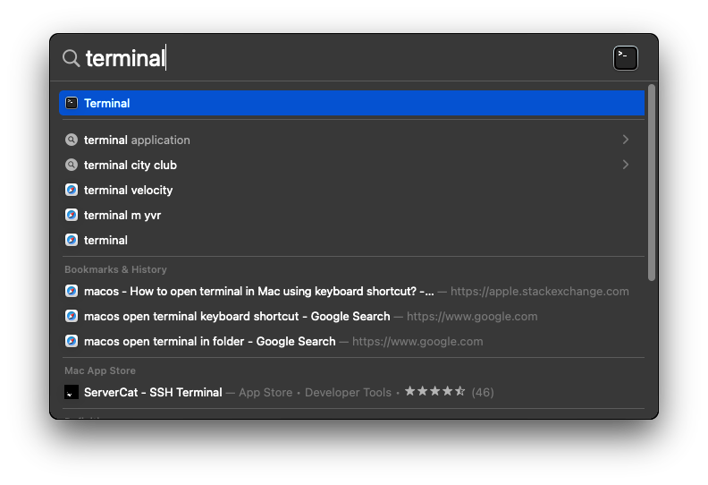
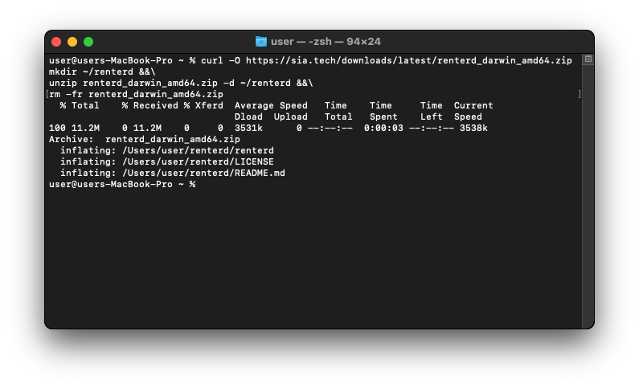
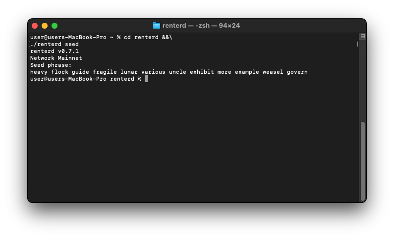
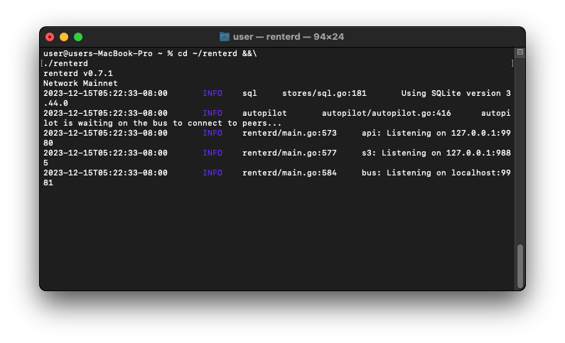
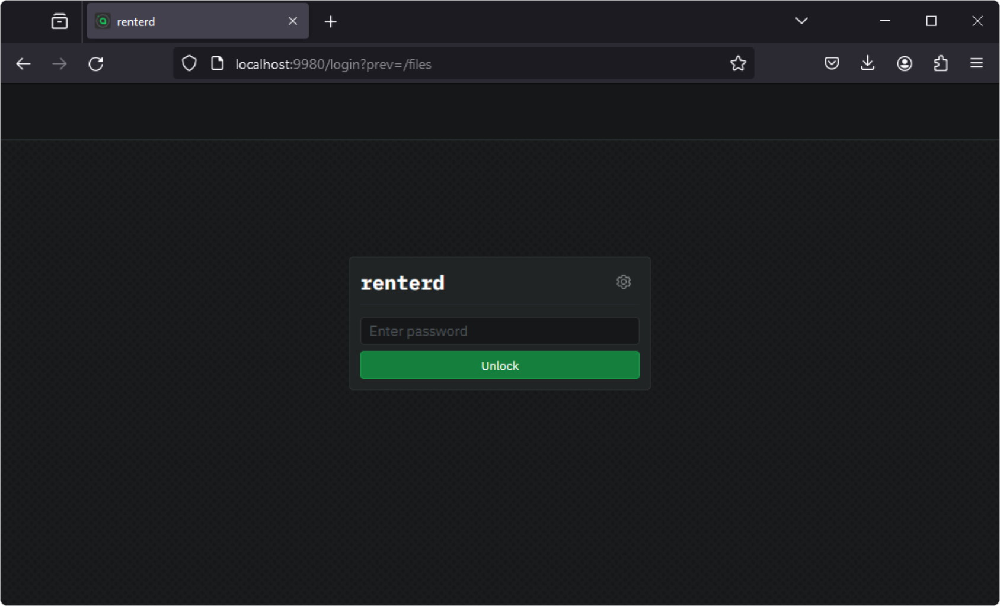

# MacOS

This guide will walk you through setting up `renterd` on MacOS. At the end of this guide, you should have:

* Installed Sia `renterd` software
* Created a `renterd` wallet

---

## Pre-requisites

To ensure you will not run into any issues with running `renterd` it is recommended your system meets the following requirements:

* **Network Access:**
  `renterd` needs a stable internet connection and open network access in order to store and retrieve data on the Sia network.

* **Operating System Compatibility:**
  You will need to ensure you download the correct `renterd` binary for your version of MacOS. To do this, click on the Apple icon in the top left corner of your toolbar, then click "About This Mac". The processor/chips will read one of the following identifiers.

  - **x86_64** — `MacOS AMD64`
  - **M1, M2** — `MacOS ARM64`

* **System Updates:** Ensure that your MacOS is up to date with the latest system updates, as these updates can contain important security fixes and improvements.

* **Hardware Requirements:**
  A stable setup that meets the following specifications is recommended. Not meeting these requirements may result in preventing slabs from uploading and can lead to a loss of data.

  - A dual-core CPU
  - 16GB of RAM
  - An SSD with at least 128GB of free space.


To ensure proper functionality, we are recommending 16GB RAM. This is because `renterd` will keep full slabs in memory when uploading. A full slab is 120MB, and a single upload may hold two or three slabs in memory. However, it is possible to run `renterd` with less RAM than this, and it may work fine depending on the use case.


---

## Installing `renterd`

Press `CMD + Space` to open Spotlight search and open a `terminal`.



Once the Terminal loads, download and install `renterd` to your home folder.


Make sure to install the correct version for your system. If you are unsure which version you should pick, refer to the [Pre-requisites](#pre-requisites) section of this guide for instructions.




```console
curl -O https://sia.tech/downloads/latest/renterd_darwin_amd64.zip
mkdir ~/renterd &&\
unzip renterd_darwin_amd64.zip -d ~/renterd &&\
rm -fr renterd_darwin_amd64.zip
```



```console
curl -O https://sia.tech/downloads/latest/renterd_darwin_arm64.zip
mkdir ~/renterd &&\
unzip renterd_darwin_arm64.zip -d ~/renterd &&\
rm -fr renterd_darwin_arm64.zip
```



```console
curl -O https://sia.tech/downloads/latest/renterd_zen_darwin_amd64.zip
mkdir ~/renterd_zen &&\
unzip renterd_zen_darwin_amd64.zip -d ~/renterd_zen &&\
rm -fr renterd_zen_darwin_amd64.zip
```



```console
curl -O https://sia.tech/downloads/latest/renterd_zen_darwin_arm64.zip
mkdir ~/renterd_zen &&\
unzip renterd_zen_darwin_arm64.zip -d ~/renterd_zen &&\
rm -fr renterd_zen_darwin_arm64.zip
```





---

## Creating a wallet

`renterd` uses BIP-39 12-word recovery phrases. To generate a new wallet recovery phrase, navigate to the `renterd` directory and run `renterd seed`:



```console
cd ~/renterd &&\
renterd seed
```



```console
cd ~/renterd_zen &&\
renterd seed
```




A new 12-word recovery phrase will be generated. Make sure to store it in a safe place, as you will need this phrase to recover your wallet.




---

## Configure your `renterd.yml` file

Under your `renterd` directory, create a new text document named `renterd.yml`.



```console
nano ~/renterd/renterd.yml
```



```console
nano ~/renterd_zen/renterd.yml
```



Once the editor loads, enter the following and configure it as needed.



```yaml
seed: your seed phrase goes here
http:
  password: your_api_password
autopilot:
  heartbeat: 5m
s3:
  enabled: true
  disableAuth: false
  address: "localhost:9985"
  keypairsV4:
    your_access_key: your_private_key
```



```yaml
seed: your seed phrase goes here
http:
  password: your_api_password
autopilot:
  heartbeat: 5m
s3:
  enabled: true
  disableAuth: false
  address: "localhost:9885"
  keypairsV4:
    your_access_key: your_private_key
```



Make sure to add your wallet seed and create an API password. The recovery phrase is the 12-word seed phrase you generated in the previous step. Type it carefully, with one space between each word, or copy it from the previous step. The password is used to unlock the `renterd` web UI; it should be something secure and easy to remember.


`your_access_key` can be anywhere from 16 to 128 characters long, and `your_private_key` must be exactly 40 characters long.


Save your `renterd.yml` configuration using `ctrl-o` and close the editor with `ctrl-x`.

---

## Running `renterd`

Run the following command to start `renterd`.



```console
cd ~/renterd &&\
./renterd
```



```console
cd ~/renterd_zen &&\
./renterd
```





You can now access the Sia network using the `renterd` web UI by opening a browser and going to [http://localhost:9980](http://localhost:9980/).


If you are running `renterd` on the Zen Test Net, you will need to access the web UI on port `9880` by going to [http://localhost:9880](http://localhost:9880).




Enter the API `password` you created in your `renterd.yml` to unlock the `renterd` web UI.


Congratulations, you have successfully set up `renterd`.


---

## Updating

New versions of `renterd` are released regularly and contain bug fixes and performance improvements.

**To update:**

1. Stop `renterd` if it is running. This can be accomplished by pressing `ctrl+c` in the Terminal currently running `renterd`.

2. Download and install the latest version of `renterd`.


Make sure to install the correct version for your system. If you are unsure which version you should pick, refer to the [Pre-requisites](#pre-requisites) section of this guide for instructions.




```console
curl -O https://sia.tech/downloads/latest/renterd_darwin_amd64.zip
mkdir ~/renterd &&\
unzip renterd_darwin_amd64.zip -d ~/renterd &&\
rm -fr renterd_darwin_amd64.zip
```



```console
curl -O https://sia.tech/downloads/latest/renterd_darwin_arm64.zip
mkdir ~/renterd &&\
unzip renterd_darwin_arm64.zip -d ~/renterd &&\
rm -fr renterd_darwin_arm64.zip
```



```console
curl -O https://sia.tech/downloads/latest/renterd_zen_darwin_amd64.zip
mkdir ~/renterd_zen &&\
unzip renterd_zen_darwin_amd64.zip -d ~/renterd_zen &&\
rm -fr renterd_zen_darwin_amd64.zip
```



```console
curl -O https://sia.tech/downloads/latest/renterd_zen_darwin_arm64.zip
mkdir ~/renterd_zen &&\
unzip renterd_zen_darwin_arm64.zip -d ~/renterd_zen &&\
rm -fr renterd_zen_darwin_arm64.zip
```



3. Restart the `renterd` system service.


```console
cd ~/renterd &&\
./renterd
```



```console
cd ~/renterd_zen &&\
./renterd
```





Congratulations, you have successfully updated your version of `renterd`!

