---
layout:
  title:
    visible: true
  description:
    visible: true
  tableOfContents:
    visible: true
  outline:
    visible: true
  pagination:
    visible: true
---

# MacOS

This guide will walk you through setting up `renterd` on macOS. At the end of this guide, you should have:

* Installed Sia `renterd` software
* Created a `renterd` wallet

---

## Pre-requisites

To ensure you will not run into any issues with running `renterd` it is recommended your system meets the following requirements:

* **System Updates:** Ensure that your macOS is up to date with the latest system updates, as these updates can contain important security fixes and improvements.

* **Hardware Requirements:** A stable setup that meets the following specifications is recommended. Not meeting these requirements may result in preventing slabs from uploading and can lead to a loss of data.
  - A quad-core CPU
  - 8GB of RAM
  - 256 GB SSD for `renterd`
 
* **Software Requirements:** Before installing `renterd`, you will need to install the [Homebrew](https://brew.sh) package manager. This will allow you to install and upgrade `renterd` easily.

* **Network Access:**
  `renterd` needs a stable internet connection and open network access in order to store and retrieve data on the Sia network.


To ensure proper functionality, we are recommending a minimum of 8 GB RAM. This is because `renterd` will keep full slabs in memory when uploading. A full slab is 120MB, and a single upload may hold two or three slabs in memory. However, it is possible to run `renterd` with less RAM than this, and it may work fine depending on the use case.


---

## Installing `renterd`

Press `CMD + Space` to open Spotlight search and open a `terminal`.



Before you install `renterd`, make sure you have the [Homebrew](https://brew.sh) package manager installed.


Once the Terminal loads, use `brew` to install `renterd`:

```console
brew install siafoundation/sia/renterd
```

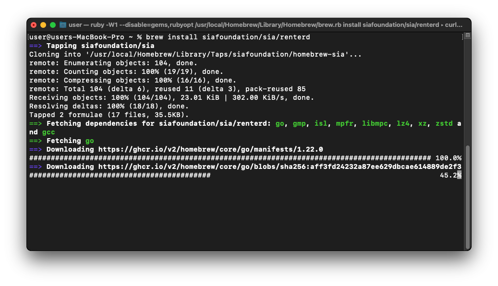

To confirm `renterd` has been installed, run the following:

```console
renterd version
```

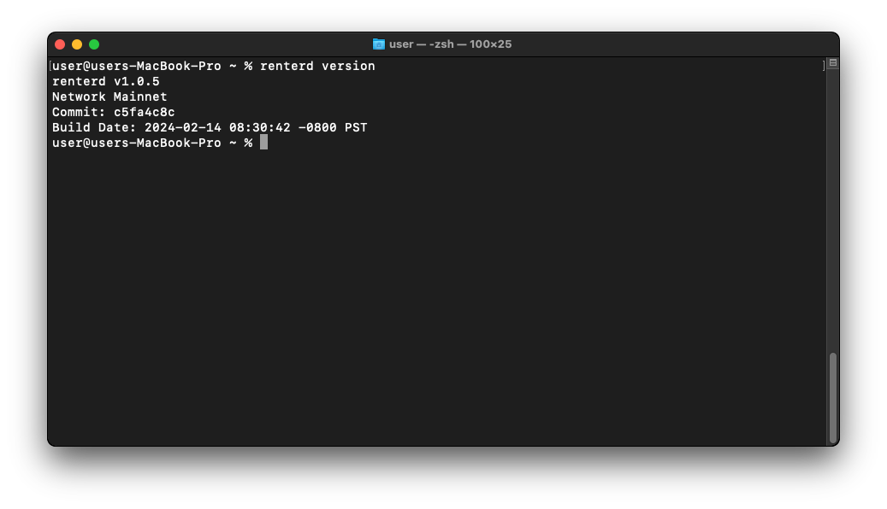

---

## Configuring `renterd`

Now that you have `renterd` installed, you will need to create a seed phrase and admin password. To launch the built-in configuration wizard, run the following:

```console
mkdir "$HOME/Library/Application Support/renterd"
cd "$HOME/Library/Application Support/renterd"
renterd config
```

Once the configuration wizard loads, you will first be asked to enter a seed phrase. If you do not already have one, type `seed` to generate a new one. For the purpose of this guide, we will create a new seed phrase.

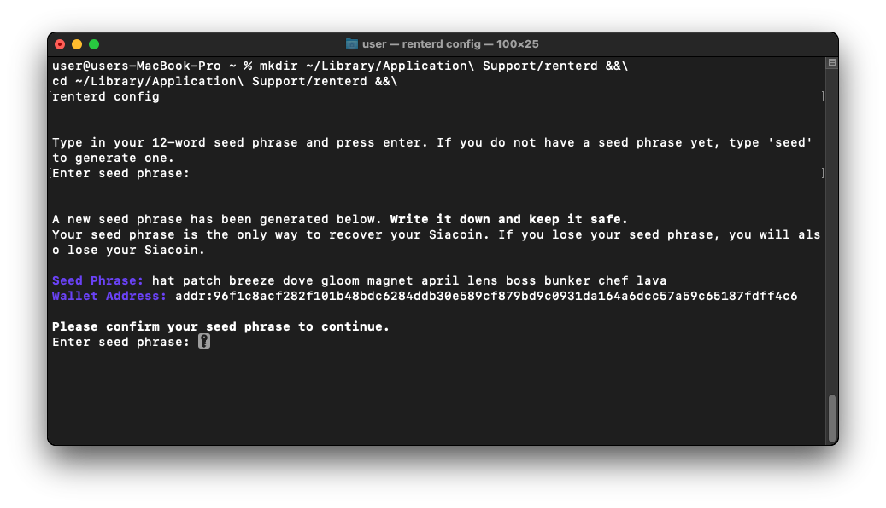

Next, you will be asked to create an admin password. This will be used to unlock the `renterd` web UI.

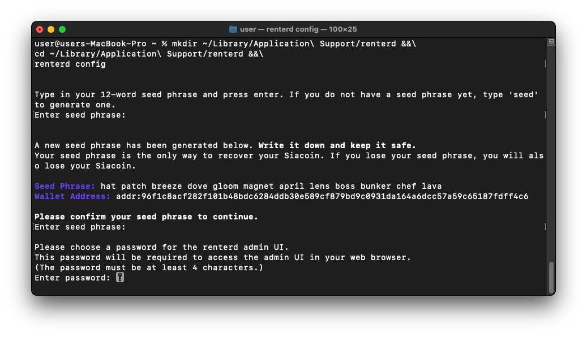

You will now be asked if you would like to configure `renterd`'s S3 settings. If you do not intend to use S3, you can type `no` to skip this step. For the purpose of this guide, however, we will type `yes` and configure the S3 endpoint.

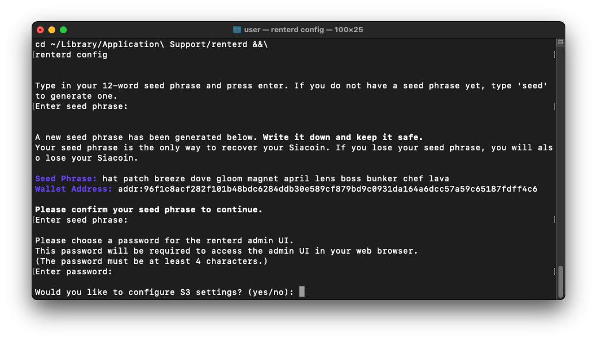

Next, you will be asked to configure the S3 address. If you would like to use something other than the default, you can enter it now. Otherwise, hit enter to use the default port `8080`.

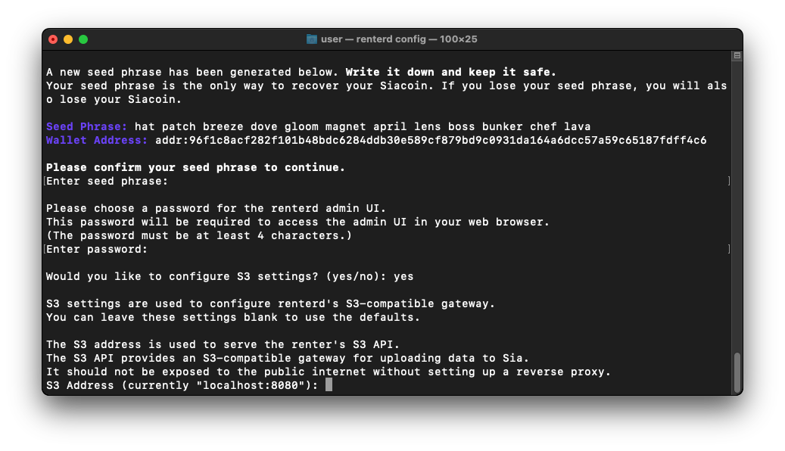

You will now be asked to generate a new key pair. Type `auto` and hit enter to have a key pair generated automatically for you.

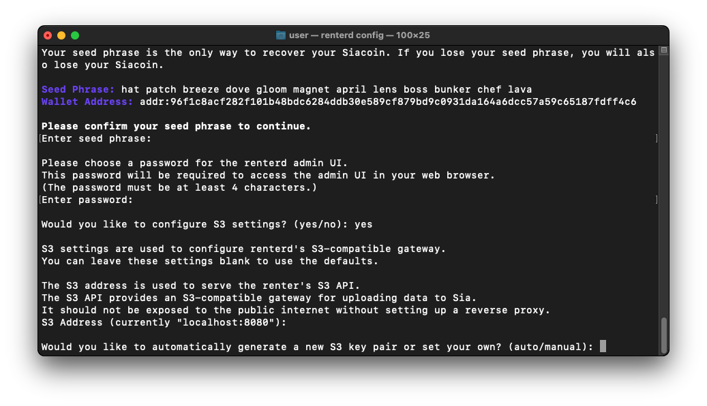

Finally, you will be asked if you would like to configure `renterd`'s advanced settings. Type `no` and hit enter to exit the configuration wizard.

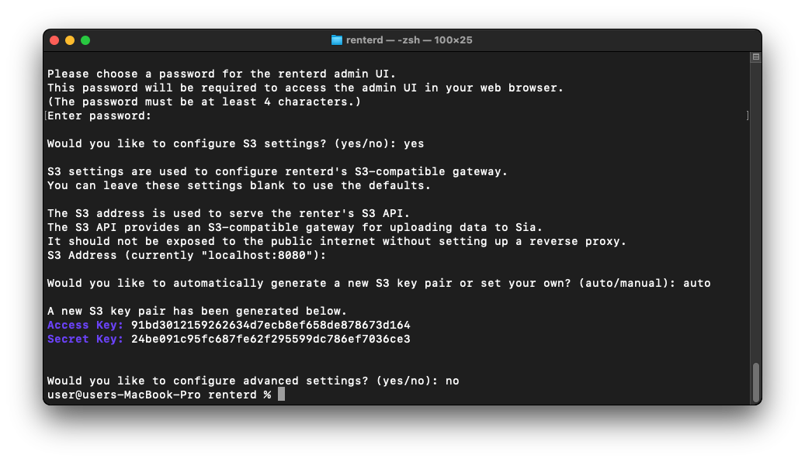

---

## Running `renterd`

Run the following command to start `renterd`.

```console
cd "$HOME/Library/Application Support/renterd"
renterd
```

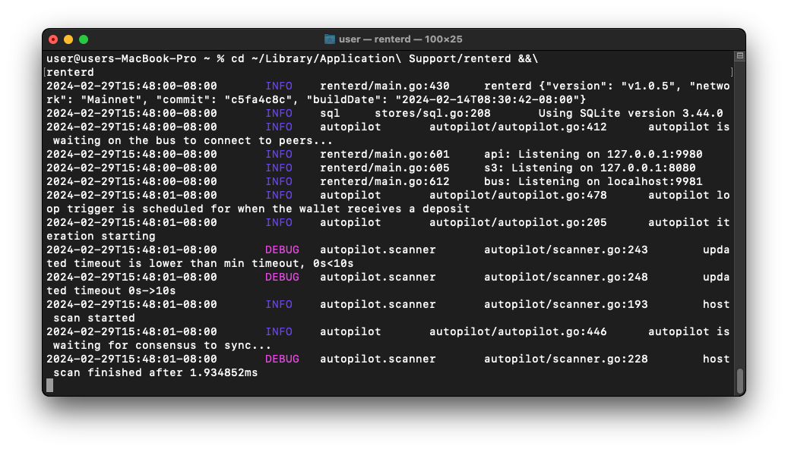

You can now access the Sia network using the `renterd` web UI by opening a browser and going to [http://localhost:9980](http://localhost:9980/).

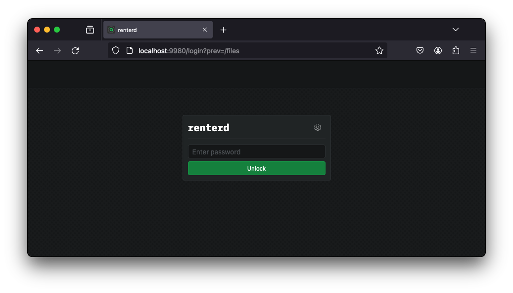


Congratulations, you have successfully set up `renterd`.


---

## Updating

New versions of `renterd` are released regularly and contain bug fixes and performance improvements.

To upgrade your `renterd` to the newest version, make sure you have shut down `renterd` and then run the following:

```console
brew upgrade siafoundation/sia/renterd
```

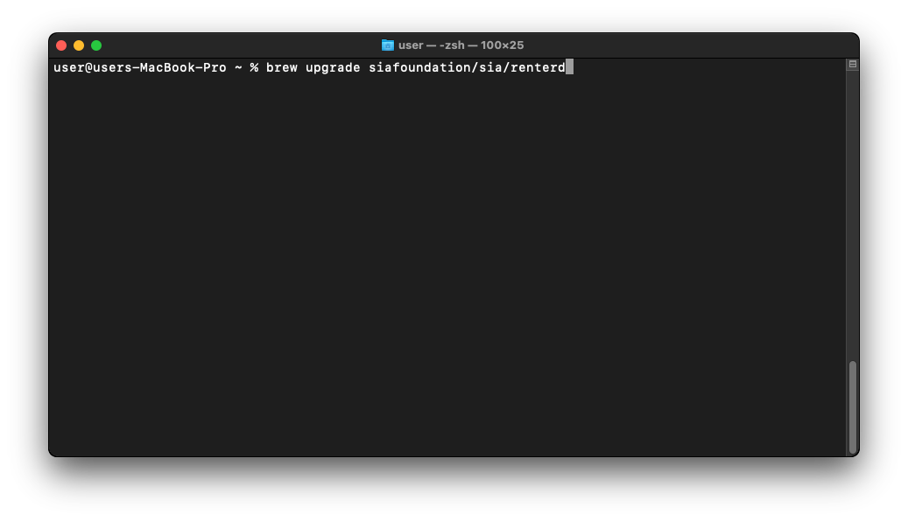

You can confirm you have upgraded to the latest version of `renterd` using the following command:

```console
renterd version
```



Congratulations, you have successfully updated your version of `renterd`!

