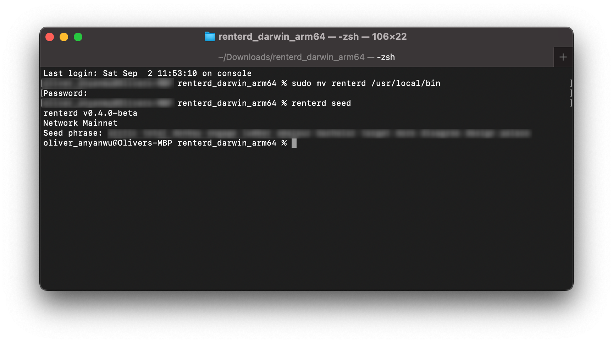
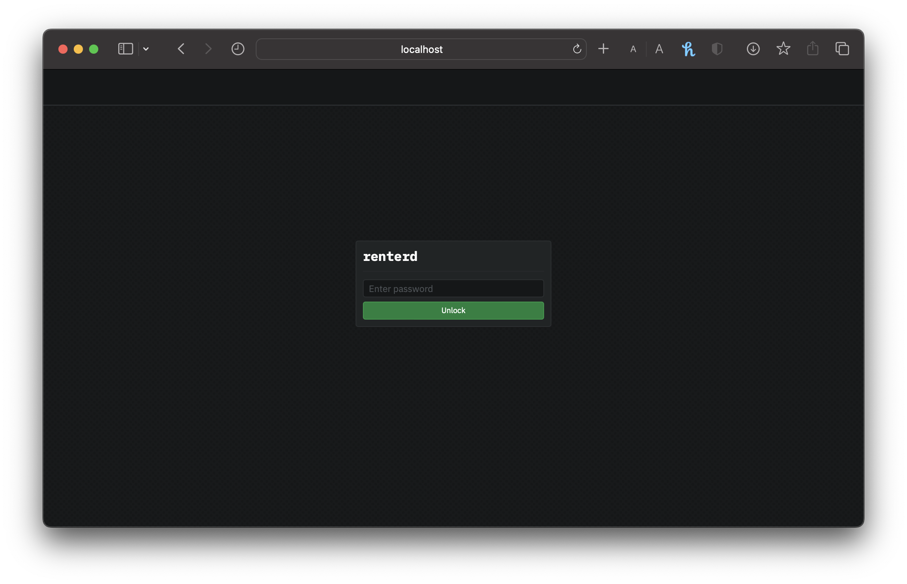

# macOS

This guide will walk you through setting up `renterd` on macOS. At the end of this guide, you should have:

* Installed Sia `renterd` software
* Created a `renterd` wallet

## Pre-requisites

* **Network Access:** `renterd` interacts with the Sia network, so you need a stable internet connection and open network access to connect to the Sia blockchain.
* **Operating System Compatibility:** Ensure your macOS version is compatible with the `renterd` software. Check [releases](../../miscellaneous/releases.md) supported by macOS versions.
* **System Updates:** Ensure that your macOS is up to date with the latest system updates, as these updates can contain important security fixes and improvements.

## Getting `renterd`


Remember to check which version to download to ensure it works correctly with your operating system. To do this, click on the Apple icon in the top left corner of your toolbar, then click **About This Mac**. If the processor/chips says:

* **Intel** - `MacOS AMD64`
* **M1 or M2** - `MacOS ARM64`


1. Download the latest version of `renterd` your operating system from the [official website](https://sia.tech/software/renterd). For this guide, we'll be downloading the macOS version of `renterd`&#x20;
2. Now that we have downloaded `renterd`, you may need to unzip it and move it to a more accessible location:
   * Double-click the downloaded `renterd` zip file to unzip it if it hasn't done so automatically.
   * Click on the newly unzipped directory.
   * Right-click on the path bar at the bottom of the Finder window and click **Open in Terminal**.
3. In the opened terminal window, move the `renterd` binary to `/usr/local/bin` by running the following command and press enter:

```bash
sudo mv renterd /usr/local/bin
```


You'll be prompted to authorize this action by providing your system password. Type this in and press enter to continue.


4. Finally, for good practice, create a folder on the home drive. This folder will be utilized specifically to store data related to the `renterd` software.

```bash
mkdir ~/renterd
```

## Creating a wallet

1. `renterd` uses BIP-39 12-word recovery phrases. If you already have a 12-word seed, skip this step; run the following command to generate a new wallet recovery phrase:

```bash
renterd seed
```

A new 12-word recovery phrase will be generated, so please copy and store it in a safe place, as you will need this phrase to recover your wallet.&#x20;


If you lose this phrase, you will lose access to your wallet and funds. Find out more about [Your Sia Seed](../../get-started-with-sia/the-importance-of-your-seed.md) and why it is essential.


<figure><figcaption><p>Generating a recovery phrase</p></figcaption></figure>

## Running `renterd`

1. Run the following in your terminal command to start `renterd`:

```bash
 renterd
```

You will be prompted to input both:

* `API password` - You choose this password, which can be anything you want. It will be used to unlock the `renterd` UI via your browser and should be something secure and easy to remember.
* `wallet seed` - The recovery phrase is the 12-word phrase you generated in the previous step. Type it carefully, with one space between each word, or copy it from the previous step.

These values are not stored anywhere and will be requested every time you start `renterd`.


You can also set the RENTERD`_SEED` and RENTERD`_API_PASSWORD` environment variables so you do not have to re-enter the values every time.


2. After entering your desired `API password` and the created `seed`, `renterd` will start.&#x20;

<figure><figcaption><p>Starting renterd</p></figcaption></figure>

3. &#x20;You can now access the `renterd` UI by opening a browser and going to `http://localhost:9980`.&#x20;


Remember to leave the terminal window open while `renterd` it is running. If you close the command prompt window, `renterd` stop.



<figure><figcaption><p>renterd Login UI</p></figcaption></figure>

Enter your `API password` you created in the in the previous step to unlock `renterd`.


Congratulations on successfully setting up `renterd` and taking a significant step towards renting storage space on the Sia network.


## Updating

It is essential to keep your renter up to date. New versions of `renterd` are released regularly and contain bug fixes and performance improvements.

To update:

1. Download the latest version of `renterd` from the [official website](https://sia.tech/software/renterd).
2. Stop the `renterd` service with `Cmd+C`.
3. Unzip and replace `renterd` in `/usr/local/bin` with the new version
4. Restart `renterd`.
