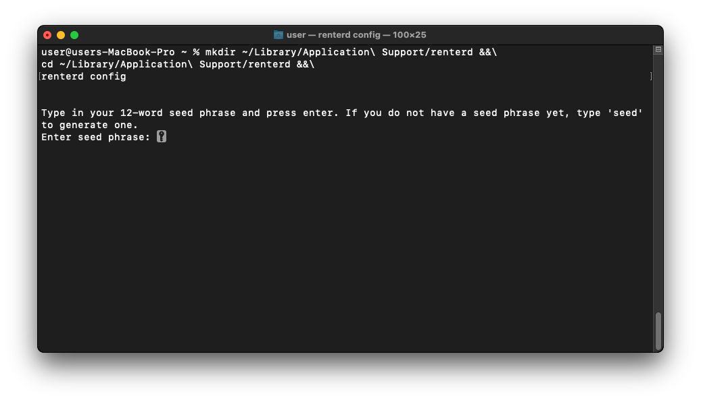
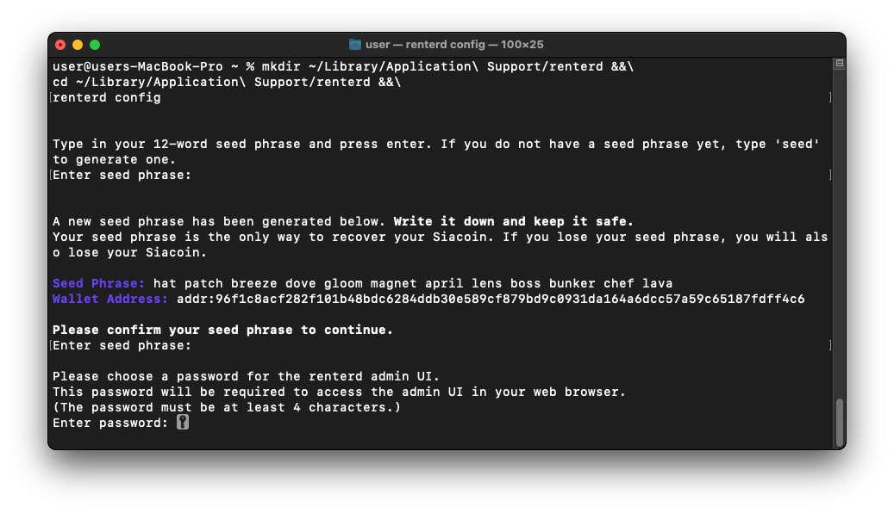
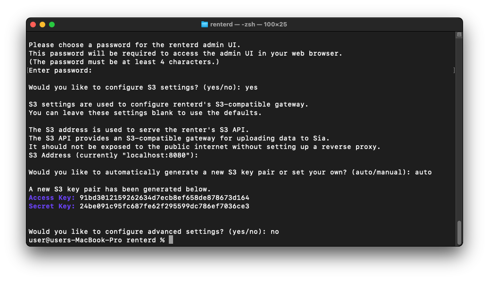
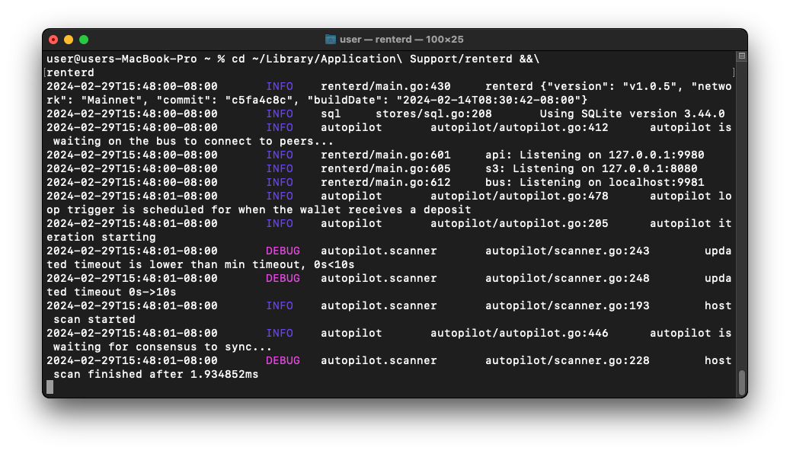

# MacOS

This guide will walk you through setting up `renterd` on MacOS. At the end of this guide, you should have:

* Installed Sia `renterd` software
* Created a `renterd` wallet

---

## Pre-requisites

To ensure you will not run into any issues with running `renterd` it is recommended your system meets the following requirements:

* **Network Access:**
  `renterd` needs a stable internet connection and open network access in order to store and retrieve data on the Sia network.

* **Operating System Compatibility:**
  You will need to ensure you download the correct `renterd` binary for your version of MacOS. To do this, click on the Apple icon in the top left corner of your toolbar, then click "About This Mac". The processor/chips will read one of the following identifiers.

  - **x86_64** — `MacOS AMD64`
  - **M1, M2** — `MacOS ARM64`

* **System Updates:** Ensure that your MacOS is up to date with the latest system updates, as these updates can contain important security fixes and improvements.

* **Hardware Requirements:**
  A stable setup that meets the following specifications is recommended. Not meeting these requirements may result in preventing slabs from uploading and can lead to a loss of data.

  - A dual-core CPU
  - 16GB of RAM
  - An SSD with at least 128GB of free space.


To ensure proper functionality, we are recommending 16GB RAM. This is because `renterd` will keep full slabs in memory when uploading. A full slab is 120MB, and a single upload may hold two or three slabs in memory. However, it is possible to run `renterd` with less RAM than this, and it may work fine depending on the use case.


---

## Installing `renterd`

Press `CMD + Space` to open Spotlight search and open a `terminal`.


Once the Terminal loads, download and install `renterd` to your home folder.


Before installing `renterd` you will first need to have [Homebrew](https://brew.sh/) installed on your system.


```console
brew install siafoundation/sia/renterd
```


To confirm `renterd` has been installed correctly run the following:

```console
renterd version
``` 


---

## Configure `renterd`

Once you have `renterd` installed, you can now use the built in configuration wizard. Before doing this however, you will want to create a new folder which will contain all the runtime files used by `renterd`. We will create this in `~/Library/Application Support/`.

Use the following command to create this folder and run the configuration wizard.

```console
mkdir ~/Library/Application\ Support/renterd &&\
cd ~/Library/Application\ Support/renterd &&\
renterd config
```


Once the configuration wizard loads, you will be asked to enter your seed phrase. If you do not have a seed phrase, type in `seed` to generate a new one.


Please note that for security reasons, yoou will not see anything when you type in your seed phrase or unlock password. Press enter after typing each one.



Next you will be asked to create a new password. This password is used to access the `renterd` web UI.



Once you have created your admin password, you will now be asked if you would like to configure your S3 settings. If you don't intend to use S3, you can skip this step by typing `no`. For the purpose of this guide we will configure our S3 settings by typing `yes`.


Next you will be asked to configure which port you would like your S3 endpoint to run on. If there is a specific port you would like to use you can enter it now, or hit enter to keep the default port of `8080`.


You will now be asked to generate a new S3 key pair. Type `auto` to automatically create a new key pair.


When asked to configure `renterd` advanced settings, type `no` and hit enter to complete the configuration wizard and exit.



---

## Running `renterd`

Run the following command to start `renterd`.

```console
cd ~/Library/Application\ Support/renterd &&\
renterd
```



You can now access the Sia network using the `renterd` web UI by opening a browser and going to [http://localhost:9980](http://localhost:9980/).


Enter the API `password` you created in your `renterd.yml` to unlock the `renterd` web UI.


Congratulations, you have successfully set up `renterd`.


---

## Updating

New versions of `renterd` are released regularly and contain bug fixes and performance improvements.

**To update:**

```console
brew upgrade siafoundation/sia/renterd
```


Once the upgrade has completed, run the following to confirm it has been upgraded successfully.

```console
renterd version
`````````



Congratulations, you have successfully updated your version of `renterd`!

