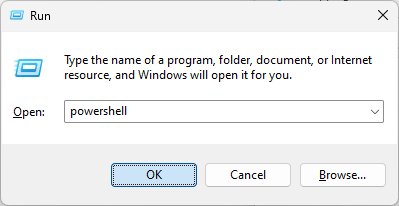
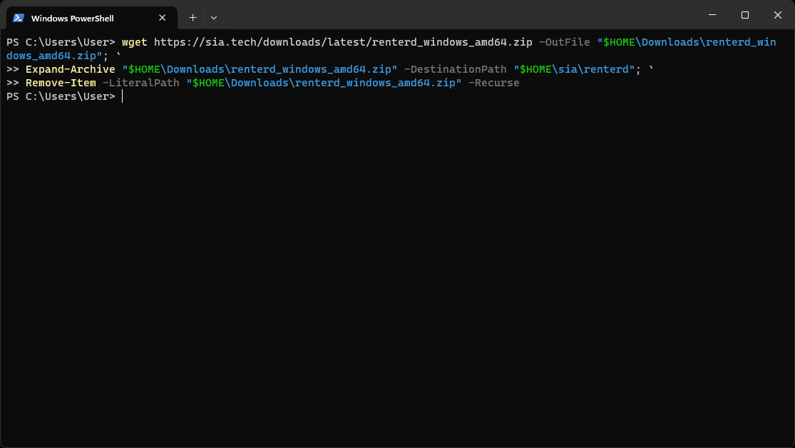
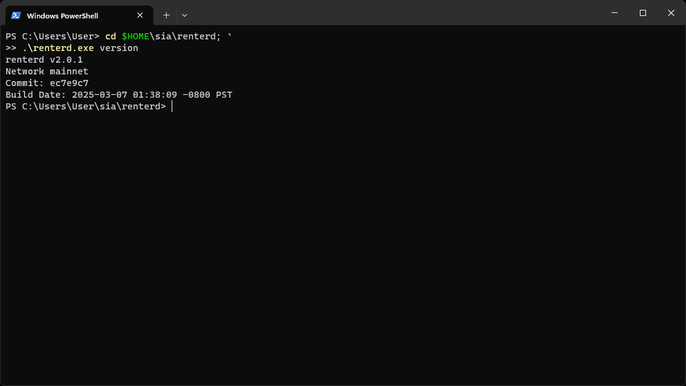
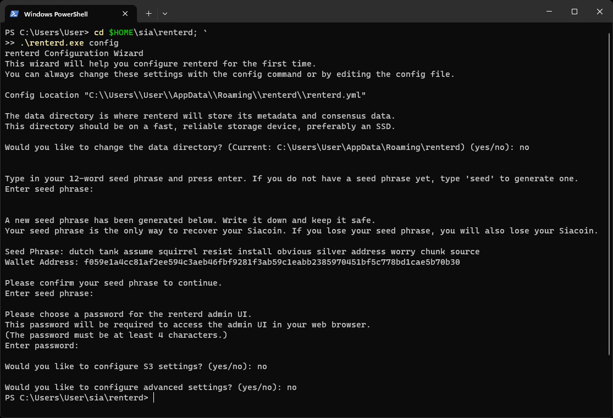
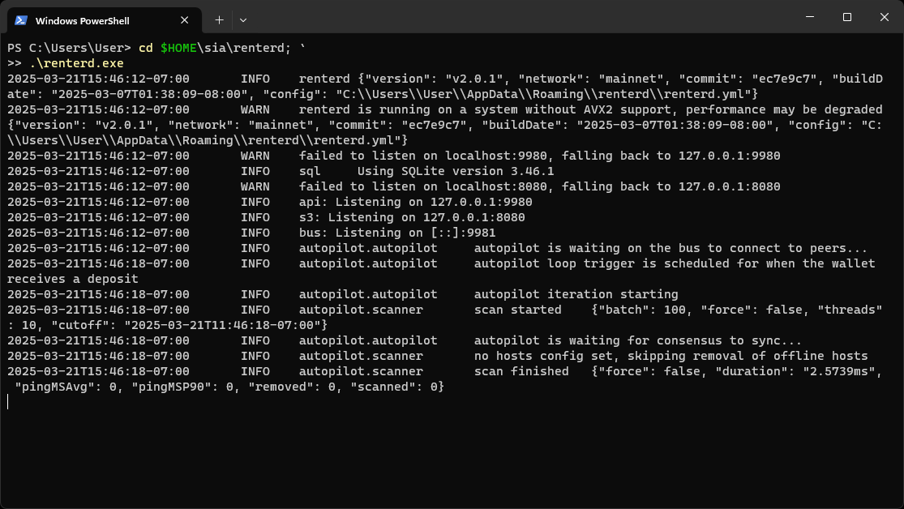

---
layout:
  title:
    visible: true
  description:
    visible: true
  tableOfContents:
    visible: true
  outline:
    visible: true
  pagination:
    visible: true
---

# Windows

This guide will walk you through setting up `renterd` on Windows. At the end of this guide, you should have:

* Installed Sia `renterd` software
* Created a `renterd` wallet

## Pre-requisites

To ensure you will not run into any issues with running `renterd` it is recommended your system meets the following requirements:

* **Network Access:**
  `renterd` needs a stable internet connection and open network access in order to store and retrieve data on the Sia network.

* **Operating System Compatibility:**
  `renterd` is only compatible with Windows 64bit systems.

* **Hardware Requirements:**
  A stable setup that meets the following specifications is recommended. Not meeting these requirements may result in preventing slabs from uploading and can lead to a loss of data.

  - A dual-core CPU
  - 16GB of RAM
  - An SSD with at least 128GB of free space.


To ensure proper functionality, we are recommending 16GB RAM. This is because `renterd` will keep full slabs in memory when uploading. A full slab is 120MB, and a single upload may hold two or three slabs in memory. However, it is possible to run `renterd` with less RAM than this, and it may work fine depending on the use case.


## Installing `renterd`

Press `windows key + R` to open the run dialog. Type in `powershell` and press `OK` to open a Terminal.



Once the Terminal loads, run the following command to download and install the latest version of `renterd`.

```powershell
wget https://sia.tech/downloads/latest/renterd_windows_amd64.zip -OutFile "$HOME\Downloads\renterd_windows_amd64.zip"; `
Expand-Archive "$HOME\Downloads\renterd_windows_amd64.zip" -DestinationPath "$HOME\sia\renterd"; `
Remove-Item -LiteralPath "$HOME\Downloads\renterd_windows_amd64.zip" -Recurse
```


When you paste multi-line commands into PowerShell, you will be prompted with a warning. Make sure you have copied the entire command and click `Paste anyway` to proceed.





## Verify `renterd` was installed successfully

Run the following command to see the version of `renterd` that was installed:

```powershell
cd $HOME\sia\renterd; `
.\renterd.exe version
```



## Configure `renterd`

After installing `renterd`, you will need to configure it with a wallet seed and a password to unlock the web interface. There is an interactive configuration process that you can start by running the following command.

```powershell
cd $HOME\sia\renterd; `
.\renterd.exe config
```



## Running `renterd`

Run the following command to start `renterd`.

```powershell
cd $HOME\sia\renterd; `
.\renterd.exe
```


Remember to leave the PowerShell open while `renterd` is running. If you close the command prompt window, `renterd` will stop.




You can now access the Sia network using the `renterd` web UI by opening a browser and going to [http://localhost:9980](http://localhost:9980/).


Enter the API `password` you created in your `renterd.yml` to unlock the `renterd` web UI.


Congratulations, you have successfully set up `renterd`.


## Updating

New versions of `renterd` are released regularly and contain bug fixes and performance improvements.

**To update:**

1. Stop `renterd` if it is running. This can be accomplished by pressing `ctrl+c` in the PowerShell currently running `renterd`.

2. Download and install the latest version of `renterd`.

```powershell
wget https://sia.tech/downloads/latest/renterd_windows_amd64.zip -OutFile "$HOME\Downloads\renterd_windows_amd64.zip"; `
Expand-Archive "$HOME\Downloads\renterd_windows_amd64.zip" -DestinationPath "$HOME\sia\renterd"; `
Remove-Item -LiteralPath "$HOME\Downloads\renterd_windows_amd64.zip" -Recurse
```

3. Restart the `renterd` system service.

```powershell
cd $HOME\sia\renterd; `
.\renterd.exe
```



Congratulations, you have successfully updated your version of `renterd`!

