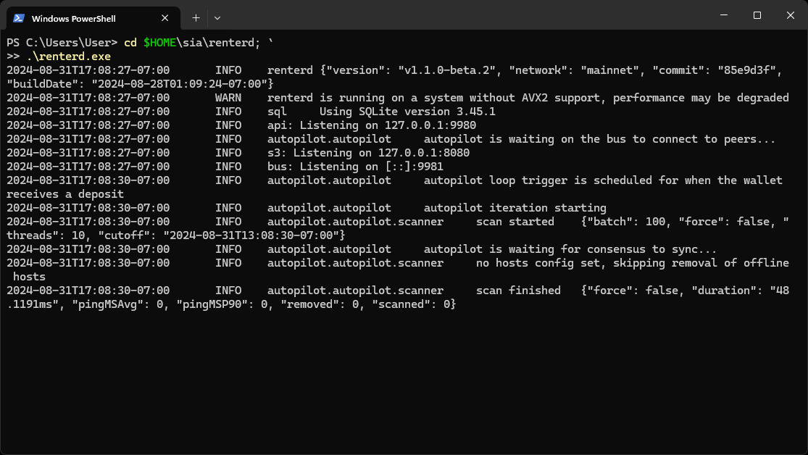

# Windows

This guide will walk you through setting up `renterd` on Windows. At the end of this guide, you should have:

* Installed Sia `renterd` software
* Created a `renterd` wallet

---

## Pre-requisites

To ensure you will not run into any issues with running `renterd` it is recommended your system meets the following requirements:

* **Network Access:**
  `renterd` needs a stable internet connection and open network access in order to store and retrieve data on the Sia network.

* **Operating System Compatibility:**
  `renterd` is only compatible with Windows 64bit systems.

* **Hardware Requirements:**
  A stable setup that meets the following specifications is recommended. Not meeting these requirements may result in preventing slabs from uploading and can lead to a loss of data.

  - A dual-core CPU
  - 16GB of RAM
  - An SSD with at least 128GB of free space.


To ensure proper functionality, we are recommending 16GB RAM. This is because `renterd` will keep full slabs in memory when uploading. A full slab is 120MB, and a single upload may hold two or three slabs in memory. However, it is possible to run `renterd` with less RAM than this, and it may work fine depending on the use case.


---

## Installing `renterd`

Press `windows key + R` to open the run dialog. Type in `powershell` and press `OK` to open a Terminal.


Once the Terminal loads, run the following command to download and install the latest version of `renterd`.


```powershell
wget https://sia.tech/downloads/latest/renterd_windows_amd64.zip -OutFile "$HOME\Downloads\renterd_windows_amd64.zip"; `
Expand-Archive "$HOME\Downloads\renterd_windows_amd64.zip" -DestinationPath "$HOME\sia\renterd"; `
Move-Item -Path "$HOME\sia\renterd\bin\renterd.exe" -Destination "$HOME\sia\renterd\renterd.exe" -Force; `
Remove-Item -LiteralPath "$HOME\sia\renterd\bin" -Recurse
```



When you paste multi-line commands into PowerShell, you will be prompted with a warning. Make sure you have copied the entire command and click `Paste anyway` to proceed.



---

## Configuring `renterd`

Once installed, `renterd` will need to be configure with a wallet seed and a password to unlock the web interface. This can be done using the interactive configuration wizard as seen below.


```powershell
cd $HOME\sia\renterd\; `
.\renterd.exe config
```



You will not see anything when you type in your seed phrase or unlock password. Press enter after typing each one.




If you are generating a new 12-word seed phrase. Make sure to write it down and store it in a safe place. You will need this seed phrase to recover your wallet in the case of unexpected system failure.



## Running `renterd`

Once installed, `renterd` can be run using the following command.


If you are planning on run `renterd` on the `zen` or `anagami` testnet, the `-network` flag should be used to specify. Eg. `./renterd.exe -network zen|anagami`.



```powershell
cd $HOME\sia\renterd; `
.\renterd.exe
```



Remember to leave the PowerShell open while `renterd` is running. If you close the command prompt window, `renterd` will stop.




Once loaded a web browser will open displaying `renterd`'s web UI.



Congratulations, you have successfully set up `renterd`. Follow the on screen setup wizard to begin renting storage on the Sia network!


---

## Updating

New versions of `renterd` are released regularly and contain bug fixes and performance improvements.

**To update:**

1. Stop `renterd` if it is running. This can be accomplished by pressing `ctrl+c` in the PowerShell currently running `renterd`.

2. Download and install the latest version of `renterd`.

```powershell
wget https://sia.tech/downloads/latest/renterd_windows_amd64.zip -OutFile "$HOME\Downloads\renterd_windows_amd64.zip"; `
Expand-Archive "$HOME\Downloads\renterd_windows_amd64.zip" -DestinationPath "$HOME\sia\renterd"; `
Move-Item -Path "$HOME\sia\renterd\bin\renterd.exe" -Destination "$HOME\sia\renterd\renterd.exe" -Force; `
Remove-Item -LiteralPath "$HOME\sia\renterd\bin" -Recurse
```


3. Verify `renterd` has been updated.

```powershell
cd $HOME\sia\renterd; `
.\renterd.exe version
```


4. Start `renterd`.

```powershell
cd $HOME\sia\renterd; `
.\renterd.exe
```




Congratulations, you have successfully updated your version of `renterd`!


## Next Steps

Now that you have `renterd` installed and running, you can start using it to store and retrieve data on the Sia network. You can access the web interface by navigating to `http://127.0.0.1:9980` in your web browser. If you installed `renterd` on a remote machine or a server, you will need to create an SSH tunnel to access the web interface.

- [About Renting](../../about-renting.md)
- [Transferring Siacoins](../../transferring-siacoins.md)
- [Managing Your Files](../../renting-storage/managing-your-files.md)
