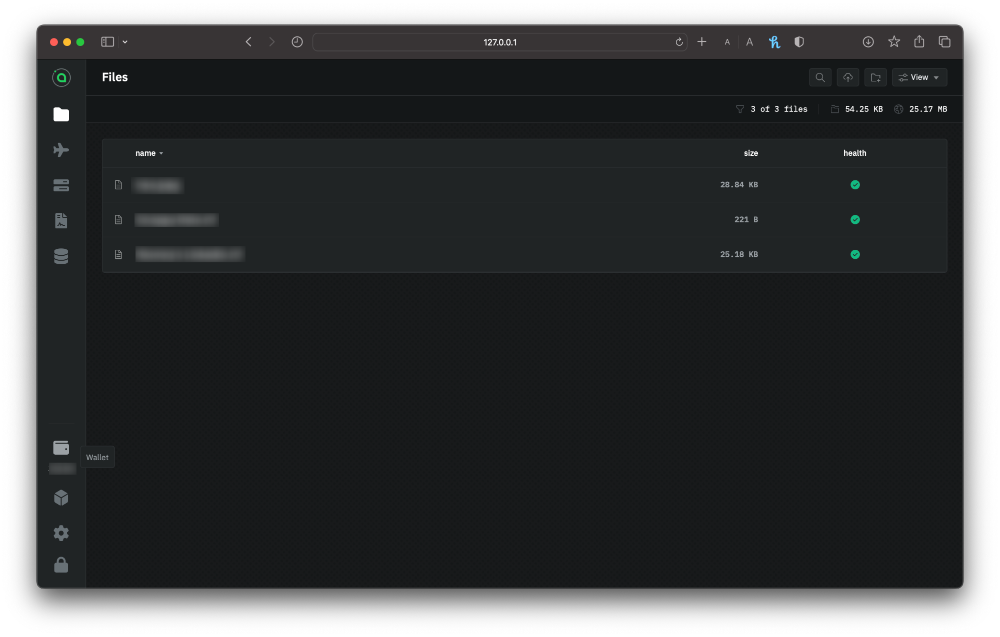

# 📷 Transferring Siacoins

Whether you're sending Siacoins to an exchange or receiving from friend, `renterd` facilitate the transfer of Siacoins and easily achieved via the UI.

## Sending Siacoins (SC)

Go to `renterd`. If you're asked to unlock the UI, use your custom password if you've set one. If you haven't got a wallet set up on `renterd`, visit our [Setting up renterd](setting-up-renterd/), otherwise choose from the **sidebar** a **Wallet**.

<figure><figcaption>
renterd UI choosing "Wallet" from sidebar
</figcaption></figure>

### Setup your transaction

Click on the `Send` button. Enter the recipient's wallet address and the amount of Siacoins you want to send. Make sure that you've entered a Siacoin wallet address, and that you've entered it correctly.

<figure><figcaption>
Sending Siacoins via renterd
</figcaption></figure>


Siacoins sent to mistyped addresses, or addresses of other types of cryptocurrency can not be retrieved.


Click **Generate Transaction.**

### Confirm your info

Next, you need to confirm everything. You'll have a chance to double-check the currency, amount, and recipient address. The window will also show you estimated network fees.

<figure><figcaption>
Confirming your transaction
</figcaption></figure>

Click **Setup** to change something. If it's all good, click B**roadcast transaction**.

<figure><figcaption>
Confirmation of a successful transaction broadcasted
</figcaption></figure>

You'll immediately get a confirmation that your transaction has been successfully broadcasted.

### Checking the status

By looking at the transactions in the **Wallet** section of the UI, you can check the transaction status. It's normal to 'Unconfirmed' at the latest transaction, as it means the transaction is on its way but hasn't yet appeared in a block.

<figure><figcaption>
renterd wallet transaction list
</figcaption></figure>


It might take a minute or two for the transaction to pop up in the wallet's transactions list.


Once it's in a block, you can go back to check the status and see new transaction type of 'siacoin transfer'.

\<image>

## Receiving Siacoins (SC)

Go to `renterd`. If you're asked to unlock the UI, use your custom password if you've set one. If you haven't got a wallet set up on `renterd`, visit our [Setting up renterd](setting-up-renterd/), otherwise choose from the **sidebar** a **Wallet**.

<figure><figcaption>
renterd UI choosing "Wallet" from sidebar
</figcaption></figure>

### Sharing the address or QR

Copy and paste this manually, or use the **Copy** button to the right to make sure you get the full address without any extra spaces, and provide this address to whom ever you're receiving the fund from.

You can also receive Siacoin, simply share your wallet address by displaying your QR code for others to scan.

<figure><figcaption>
Getting the address and QR of your renterd wallet
</figcaption></figure>

By going to your **Dashboard**, and selecting the wallet you made the transaction with, you can check the transaction status. It's normal to 'Unknown' at the top of the list of transactions, it means the transaction is on its way but hasn't yet appeared in a block.


It might take a minute or two for the transaction to pop up in the wallet's transactions list.


Once it's in a block, you can go back to check the status and see new transaction type of 'siacoin transfer'.

\<image>
