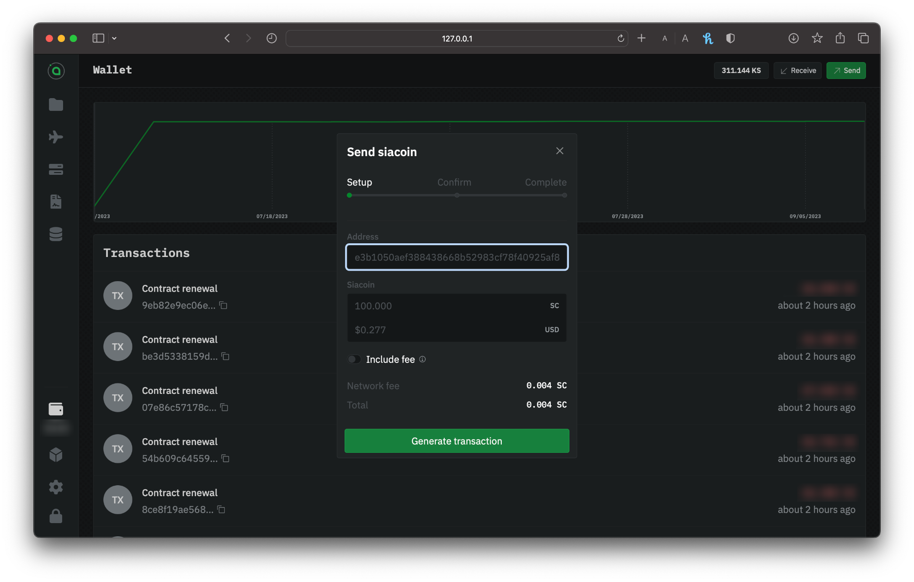
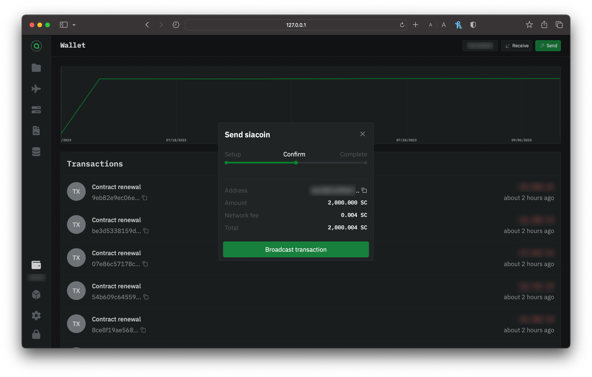
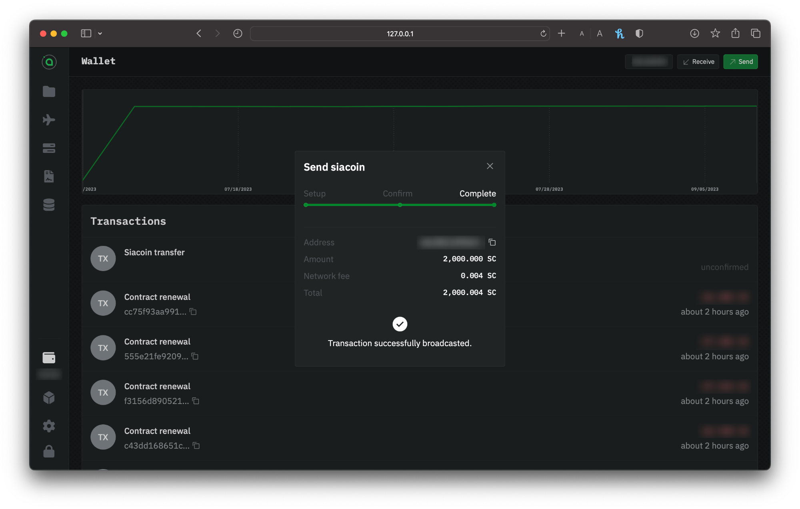
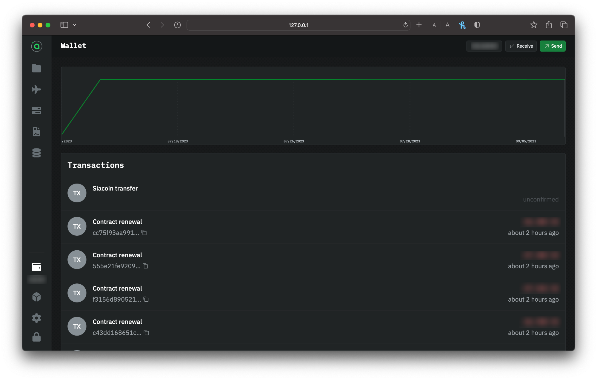
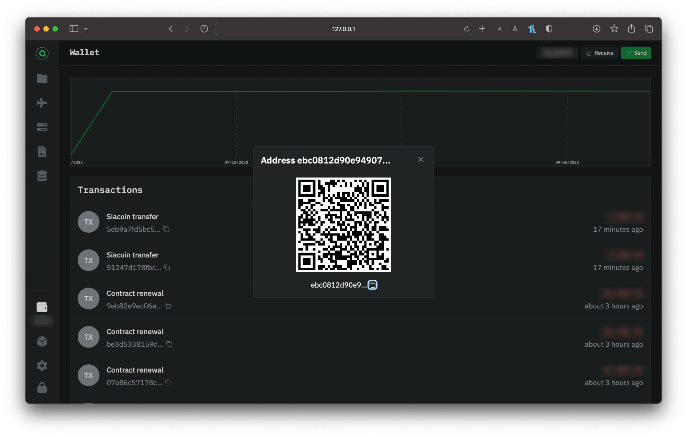

---
layout:
  title:
    visible: true
  description:
    visible: true
  tableOfContents:
    visible: true
  outline:
    visible: true
  pagination:
    visible: true
---

# Transferring Siacoins

Whether you're sending Siacoins to an exchange or receiving from a friend, `renterd` facilitates the transfer of Siacoins (SC) and is easily achieved via the UI.

## Sending Siacoins

Go to `renterd`. If you're asked to unlock the UI, use your custom password if you've set one. If you haven't got a wallet set up in `renterd`, visit our [Setting up `renterd`](setting-up-renterd/) guide; otherwise, choose from the sidebar **Wallet**.

### Setup your transaction

Click on the `Send` button. Enter the recipient's wallet address and the amount of Siacoins you want to send.

<figure><figcaption>
Sending Siacoins via renterd
</figcaption></figure>


Siacoins sent to mistyped addresses or addresses of other types of cryptocurrency can not be retrieved.


Click **Generate Transaction.**

### Confirm your info

Next, you need to confirm everything. You'll have a chance to double-check the amount and recipient address. The window will also show you estimated network fees.

<figure><figcaption>
Confirming your transaction
</figcaption></figure>

Click **Setup** to change something. If it's all good, click **Broadcast transaction**.

<figure><figcaption>
Confirmation of a successful transaction broadcasted
</figcaption></figure>

You'll immediately get a confirmation that your transaction has been successfully broadcasted.

### Checking the status

By looking at the transactions in the **Wallet** section of the UI. It's normal to see **Unconfirmed** as the latest transaction, which means the transaction is on its way but hasn't yet appeared in a block.

<figure><figcaption>
renterd wallet transaction list
</figcaption></figure>


The transaction might take a minute or two to appear in the wallet's transactions list.


Once it's in a block, you can check the status and see a new transaction type of **siacoin transfer**.

## Receiving Siacoins

Go to `renterd`. If you're asked to unlock the UI, use your custom password if you've set one. If you haven't got a wallet set up in `renterd`, visit our [Setting up renterd](setting-up-renterd/); otherwise, choose from the sidebar **Wallet**.

### Sharing the address or QR

Copy and paste your address manually, or use the **Copy** button to the right to ensure you get the full address without any extra spaces, and provide this address to whomever you're receiving the funds from.

You can also receive Siacoins by sharing your QR code for others to scan.

<figure><figcaption>
Getting the address and QR of your renterd wallet
</figcaption></figure>

You can check the transaction status by going to your **Dashboard** and selecting the wallet you made the transaction with. It's normal for unconfirmed transactions to say **Unknown**. It means the transaction is coming but hasn't yet appeared in a block.


The transaction might take a minute or two to appear in the wallet's transactions list.


Once it's in a block, you can check the status and see a new transaction type of **siacoin transfer**.
