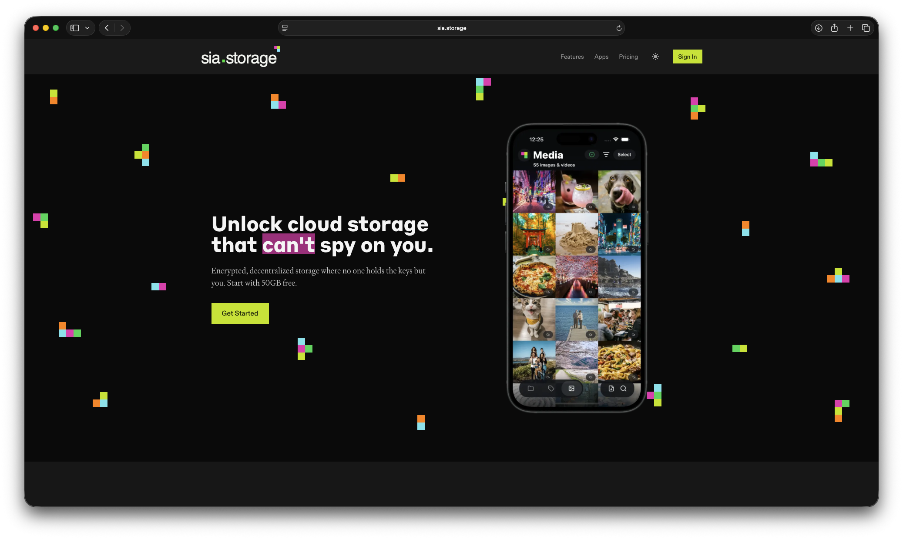
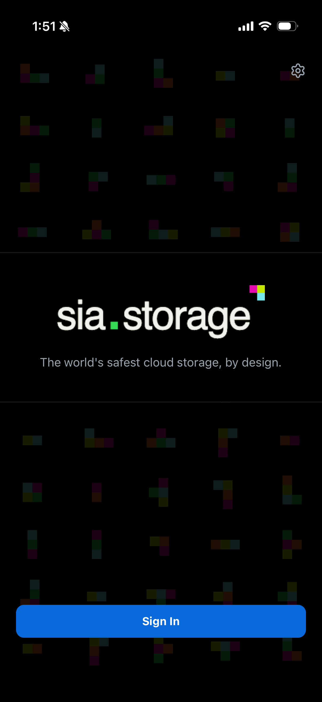
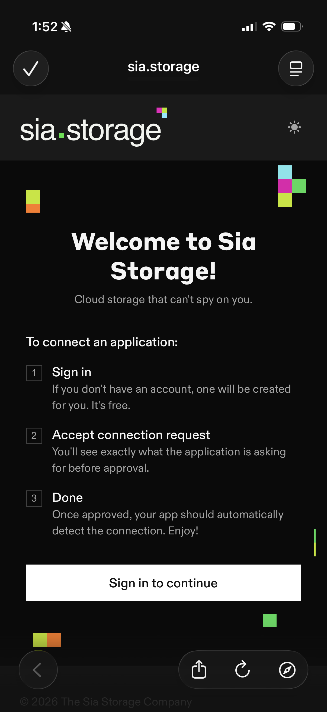
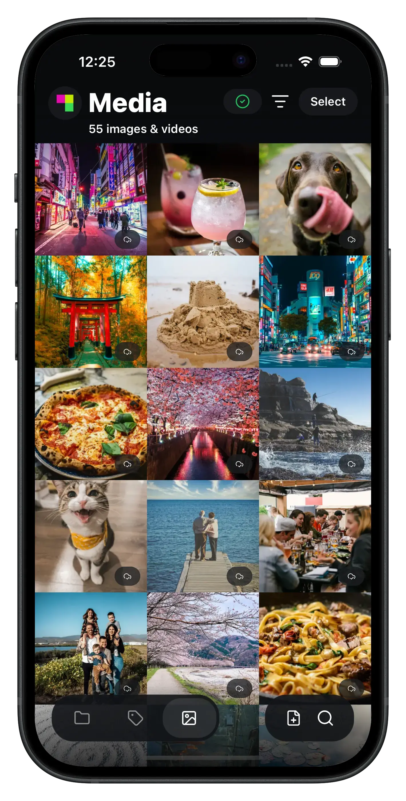

# Using Sia Storage

[Sia Storage](https://sia.storage) is a hosted **indexer** — the managed backend for storing data on Sia. It forms and manages storage contracts and keeps your data healthy for you, so there's no server, database, or contracts for you to run. To actually store and retrieve files, you point a **client** — the Sia Storage app or `s3d` — at your Sia Storage account.

Your files are still encrypted on your own device and erasure-coded across independent storage providers, as described in [About Storing Your Data](about-renting.md); Sia Storage only ever handles encrypted metadata, never your keys or file contents.


**For almost everyone, this is the right place to start.** A Sia Storage account gives you **50 GB free**, with no infrastructure to run. You only need to self-host an [indexer](setting-up-indexd/) if you specifically want to control the backend yourself.


## Why Sia Storage

* **Private.** Files are encrypted on your device before they leave it, with keys derived from your recovery phrase. Neither Sia Storage nor the storage providers can read your data.
* **Decentralized.** Your data is stored across many independent storage providers, not in one company's data center, so no single operator or outage can read it or take it offline.
* **No infrastructure to run.** Sia Storage operates the indexer and manages contracts for you, so you can use the Sia network without running a server or database.

## Store your first file

Getting started takes three steps: sign up, install the app, and upload.

### 1. Create your Sia Storage account

Go to [sia.storage](https://sia.storage) and select **Get Started** to create a free account. The free plan includes **50 GB of storage**, up to **3 connected apps**, and transfer speeds up to 524 Mbps — with no Siacoin to buy and no server to run.

### 2. Install the Sia Storage app

The app is how you upload and browse your files. Install it for your device:

* **iOS** — [App Store](https://apps.apple.com/us/app/sia-storage/id6753593109)
* **Android** — [Google Play](https://play.google.com/store/apps/details?id=sia.storage)

### 3. Connect the app and set your recovery phrase

The first time you open the app, connect it to your Sia Storage account:

1. Tap **Sign In** and approve the connection request on sia.storage. This authorizes the app to use your account. If you don't have an account yet, one is created for you.
2. Back in the app, enter your **recovery phrase** — the 12-word secret that derives the keys used to encrypt your files. If you don't already have one, the app generates a new one for you.

Once connected, the app is ready to store files. Your encryption keys stay on your device, so neither Sia Storage nor the storage providers can read your data.


**Write down your recovery phrase and store it somewhere safe.** It derives the keys that encrypt your files and identify you to your account. If you lose it, your files cannot be decrypted or recovered; if someone else gets it, they can access your data. Never share it, and don't rely on the app alone to keep it. See [Your Sia Seed](../get-started-with-sia/the-importance-of-your-seed.md) for more.


### 4. Upload a file

Choose **Upload** in the app (or drag and drop on desktop) and pick a file. The app encrypts it on your device, splits it into redundant pieces, and distributes those across storage providers. When it finishes, the file appears in your list.

### 5. Access your files

Your files are available from any device where you sign in to your account. Select a file to download it — it's retrieved from the storage providers and decrypted on your device.


Your file is now stored on the decentralized Sia network — encrypted, redundant, and under your control.


## Other ways to use it

* **S3-compatible access.** [`s3d`](https://github.com/SiaFoundation/s3d) is a gateway that exposes an S3-compatible API backed by your Sia Storage account, so existing S3 tools such as Rclone and Cyberduck can use Sia — see our [S3 integration guides](../sia-integrations/s3-integrations/).
* **Build your own app.** Use the [Sia Storage SDKs](https://devs.sia.storage) to store and retrieve data from your own software — see [For developers](#for-developers) below.

Paid plans are available at [sia.storage](https://sia.storage) if you need more storage or connected apps.

## For developers

Sia Storage is also a hosted indexer your applications can build on. If you're building software on Sia, the [Sia Developer Portal](https://devs.sia.storage) covers the SDKs, the app identity model, and a [quickstart](https://devs.sia.storage/docs/quickstart) for uploading and downloading objects.


Your application should let users choose where their data is stored rather than locking them to a single indexer. See [About Storing Your Data](about-renting.md#building-apps) for how applications, the SDK, and the indexer fit together.

