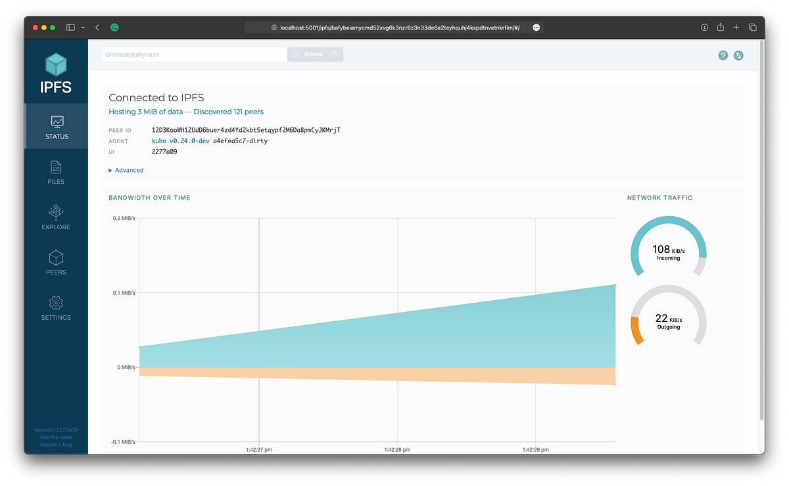

# IPFS

## What is `IPFS`?

`IPFS` is a distributed file system that allows users to store and share files in a decentralized manner. It is an excellent tool for sharing data but requires running a node on your computer to access the network and transfer data between peers. To make `IPFS` more accessible on the web, companies and individuals set up public `IPFS` gateways. These gateways allow users to access and download `IPFS` files through a centralized web server using standard HTTP requests. This article walks through setting up an `IPFS` node using Sia as the backend data store through renterd and then exposing the node as a public gateway.

## Pre-Requisites

### `IPFS` Setup Requirements

  * [**renterd**](../../renting/setting-up-renterd/README.md) — Sia’s new renting software. Enables users to store and retrieve data on the Sia network by forming contracts with storage providers and repairing data.

  * [**Kubo**](https://github.com/ipfs/kubo?tab=readme-ov-file#--------kubo-ipfs-implementation-in-go--) — The original IPFS gateway. Kubo is written in Go and is a great starting point for building your own gateway.

  * [**go-s3-ds**](https://github.com/ipfs/go-ds-s3?tab=readme-ov-file#s3-datastore-implementation) — A plugin for Kubo that allows storing IPFS data in an S3-compatible data store.

### Public Gateway Requirements (Optional)
  * [**Caddy**](https://caddyserver.com/) — Caddy is a great web server that makes setting up a reverse proxy for the gateway easy.

  * **A domain name** — We’ll use a custom domain name to make the gateway easier to access and to enable SSL.

  * **A server** — We’ll need a server to run `renterd` and the gateway on. It needs at least 128 gigabytes of storage to store the Sia blockchain, renterd database, and `IPFS` config files.

## Step 1: Install `renterd` and configure S3
This guide requires that you have a working installation of `renterd`. If you have not already installed `renterd`, you must do so before continuing.


Make sure you configure S3 when installing `renterd`, as this will be required later.




## Step 2: Install `Kubo`

Now that `renterd` is running, the next step is to set up Kubo. Kubo is a great starting point for building a public `IPFS` gateway. It’s written in Go and is easy to modify. Many other options exist, but Kobo is the most well-known and maintained.

To add the S3 data store plugin, you will need to build `Kubo` from the source. This can be done using go-s3-ds to bundle the plugin with `Kubo`.

You can use the following bash script to automate this process.

```shell
#! /bin/bash

# We use go modules for everything.
export GO111MODULE=on

# Clone kubo.
git clone https://github.com/ipfs/kubo
cd kubo

# Pull in the datastore plugin (you can specify a version other than latest if you'd like).
go get github.com/ipfs/go-ds-s3/plugin@latest

# Add the plugin to the preload list.
echo -en "\ns3ds github.com/ipfs/go-ds-s3/plugin 0" >> plugin/loader/preload_list

# ( this first pass will fail ) Try to build kubo with the plugin
make build

# Update the deptree
go mod tidy

# Now rebuild kubo with the plugin
make build

# (Optionally) install kubo
make install
```

Next, we need to initialize `IPFS`. A lot of the configuration is taken from using `ipfs init --profile server`. This will create the necessary config files and directories.

Now, we need to tell `Kubo` to use the S3 data store. By default, `IPFS` stores files locally on your computer. We want to upload them to Sia instead.

`Kubo`'s default config looks like this:

```json
{
  ...
  "Datastore": {
    "StorageMax": "10GB",
    "StorageGCWatermark": 90,
    "GCPeriod": "1h",
    "Spec": {
      "mounts": [
        {
          "child": {
          "path": "blocks",
          "shardFunc": "/repo/flatfs/shard/v1/next-to-last/2",
          "sync": true,
          "type": "flatfs"
         },
         "mountpoint": "/blocks",
         "prefix": "flatfs.datastore",
         "type": "measure"
        },
        {
          "child": {
          "compression": "none",
          "path": "datastore",
          "type": "levelds"
         },
         "mountpoint": "/",
         "prefix": "leveldb.datastore",
         "type": "measure"
        }
      ],
      "type": "mount"
    },
    "HashOnRead": false,
    "BloomFilterSize": 0
  }
  ...
}
```

The first value you will need to change is `StorageMax`. This is the maximum amount of storage that `IPFS` will use. For this guide, we will set it to 1 terabyte. The next value is `BloomFilterSize`, which is the size in bytes of the block store's bloom filter. 1MB (`1048576`) is a good value and is what we will use for this guide.

Lastly, I need to edit the Spec section. This is where we tell `IPFS` to use the S3 datastore plugin instead of the default local datastore.

```json
{
...
  "mounts": [
  {
    "child": {
    "type": "s3ds",
    "region": "us-east-1",
    "bucket": "ipfs",
    "rootDirectory": "",
    "regionEndpoint": "localhost:8080",
    "accessKey": "my-s3-access-key",
    "secretKey": "my-s3-secret-key"
    },
    "mountpoint": "/blocks",
    "prefix": "flatfs.datastore",
    "type": "measure"
  },
  {
    "child": {
    "compression": "none",
    "path": "datastore",
    "type": "levelds"
    },
    "mountpoint": "/",
    "prefix": "leveldb.datastore",
    "type": "measure"
  }
  ],
  ...
}
```

Now that we've edited the configuration, we must edit the `datastore_spec` file to change our data stores. Now, it is time to run `Kubo`. We can run it with `ipfs daemon`. This will start the `IPFS` daemon and `Kubo`. If everything is working correctly, you should see a bunch of output and eventually a line that says `Daemon is ready`.

First, try to access the local web UI and upload a file.



The web UI is working well. Let's pin our first file.


Great! We now have a working IPFS node with data backed up to Sia's decentralized storage. Now that we have a file pinned and uploaded to the Sia network, we can check the `renterd` UI at `http://localhost:9980` to see the pinned blocks.


## Step 3: Setting up a Public Gateway (Optional)

Next, you may want to set up a gateway to enable others to download our file directly from our node. Operating your own IPFS public gateway offers several advantages, including greater control over data and privacy, less reliance on centralized services, and significantly reduced costs. By managing your own infrastructure, you can tailor the gateway to your specific needs, manage its performance, and ensure a seamless experience for your users while contributing to the growth and resilience of the decentralized web.

While there are many options for configuring your public gateway, Caddy offers an easy-to-use solution. If you're unfamiliar with Caddy, it's a simple HTTP server.

First, you need to download and install Caddy for your system.



Next, you will need to configure your `Caddyfile` as follows.

```perl
(cors) {
  @cors_preflight method OPTIONS
  @cors header Origin *

  handle @cors_preflight {
    header Access-Control-Allow-Origin *
    header Access-Control-Allow-Methods "GET, POST, PUT, PATCH, DELETE"
    header Access-Control-Allow-Headers "Content-Type, Authorization"
    header Access-Control-Max-Age "3600"
    respond "" 204
  }

  handle @cors {
    header Access-Control-Allow-Origin *
    header Access-Control-Expose-Headers "Link"
  }
}

yourdomain.com {
  import cors

  @ipfs path /ipfs/* /ipns/*

  route @ipfs {
    reverse_proxy 127.0.0.1:8080
  }
}
```


For more information on setting up and configuring Caddy, please refer to the [Caddy Documentation](https://caddyserver.com/docs/).


## All done.

Congratulations! You have successfully set up an `IPFS` node to store publicly accessible data on the Sia Network.