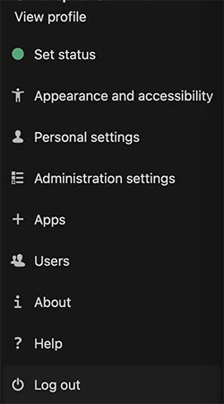
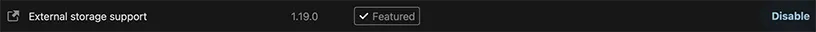
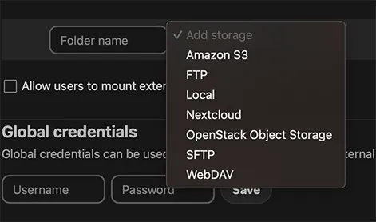
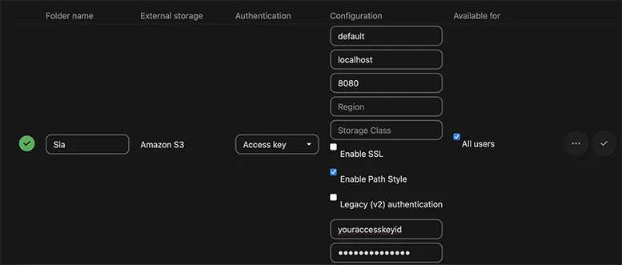
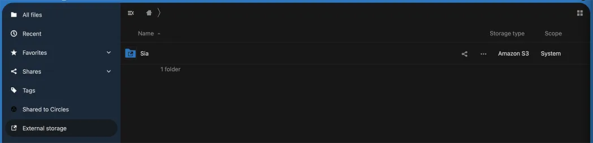

# Nextcloud

## What is `Nextcloud`?

Nextcloud is an open-source content collaboration platform. It’s like your own Cloud service that runs on your own hardware. You can use it for storing and sharing files through a web interface, mobile app, or desktop client, and even to collaborate with others or as a communication platform. There is almost no limit to what it can do with its open plugin store.

## Step 1: Install `renterd` and configure S3
This guide requires that you have a working installation of `renterd`. If you have not already installed `renterd`, you will need to do so before continuing.


Make sure to configure S3 when installing `renterd`, as this will be required later.




## Step 2: Install `Nextcloud`

Once you have `renterd` installed with a working S3 endpoint, you will now need to install the latest version of Nextcloud.




For detailed instructions on installing Nextcloud, please refer to the [Nextcloud Administration Manual](https://docs.nextcloud.com/server/latest/admin_manual/installation/).


## Step 3: Configuring `Nextcloud`

Now that you have both `Nextcloud` and `renterd` running, we can mount a `renterd` bucket as a folder. To keep it simple, this guide will mount the `default` bucket. This bucket is where files will be uploaded by `default` if no other bucket is specified. If you want to use a different one, e.g., a `nextcloud` bucket, this can be done through the `renterd` web UI.

### Enable “External storage support”

Before we mount the folder, we must ensure that “External storage support” has been enabled in `Nextcloud`. From the landing page, click the round shape with your user’s initials in the top right. This will open a dropdown menu.

From there, select “Apps”. This takes you to the apps menu, where you should find the “External storage support” — app. Make sure to enable it if it isn’t already. It should look like this if it is ready to use (The button on the right says “Disable”).

### Configure backend

Now, go to “Administration settings” from the same dropdown menu as before. On the left, you will find two sections. In the lower section labeled “Administration”, select “External storage”. From there, you should get to a menu like below.

Select “Amazon S3” and give your folder a friendly name like “Sia”. For “Authentication”, select “Access key”. Fill in the bucket “default”, the hostname of your renterd instance (e.g., localhost), and the port “8080” (unless you changed the default port). Also, make sure to tick “Enable Path Style” and fill in your access key information. It’s the same as the one you specified when starting renterd. If you want to give all your Nextcloud users access to mount that folder, select “All users” as well. Finally, click the check mark on the right. If everything was configured correctly, a green check mark should appear on the left.

## All done.

Congratulations! You successfully configured Sia as a backend for your `Nextcloud` instance. If you click the “Files” tab on the top and then “External storage” in the menu on the left, you should see the folder as shown below.

