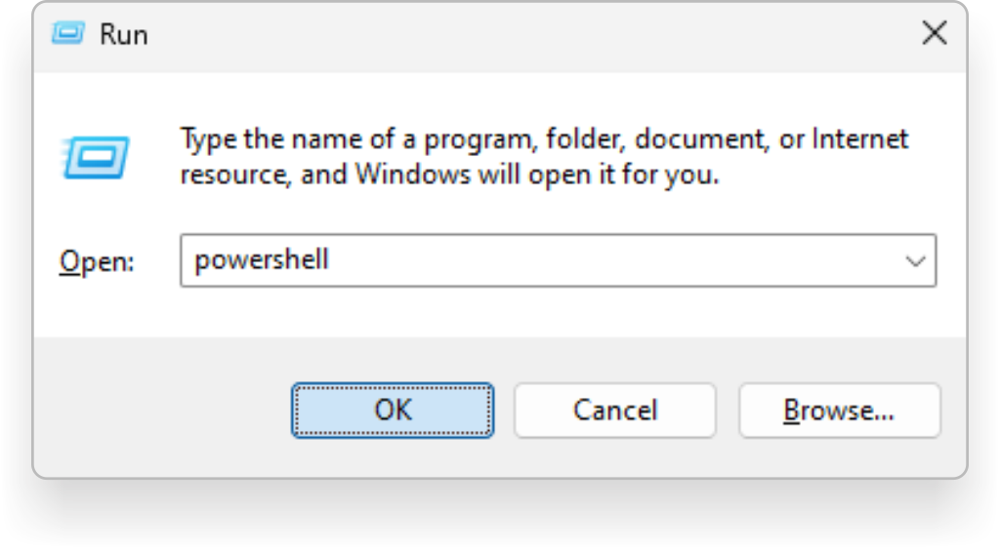

# Caddy Webserver

## What is Caddy?

Caddy is a powerful, extensible platform used to serve web content securely over HTTPS. This guide will teach you how to install and configure Caddy to create an HTTPS connection to the `renterd` S3 API using your custom domain name.

## Why a reverse proxy?

A reverse proxy is a server that sits in front of one or more web servers, redirecting client requests to these servers and returning the responses to the clients. This setup enhances security, load balancing, and performance. When used with `renterd` integrations, a reverse proxy like `Caddy` can securely manage `HTTPS` connections, effectively hiding the backend server details, offering encrypted communication, and simplifying SSL certificate management, making remote connections to `renterd` integrations more secure and efficient.

## **Pre-Requisites**

- A registered domain name with a DNS `A` record pointing to your server’s IP address.

## Step 1: Download and install Caddy




Press `windows key + R` to open the run dialog. Type in `powershell` and press `OK` to open a Terminal.



Once the Terminal loads, run the following command to install `Caddy`.

```console
curl.exe https://webi.ms/caddy | powershell
```

After Caddy has finished installing, close `powershell` and open a new one to load the new environmental variables.




Press `CMD + Space` to open Spotlight search and open a `terminal`.


Once the Terminal loads, run the following command to install `caddy`.

```console
curl -sS https://webi.sh/caddy | sh
```

After Caddy has finished installing, close the `terminal` and open a new one to load the new environmental variables.


Open a Terminal using `Crtl + Alt + T`.


If you cannot open a `Terminal` using the above method, try one of the other methods [listed here](https://www.geeksforgeeks.org/how-to-open-terminal-in-linux/).


Once the Terminal loads, run the following command to download and install the latest version of `caddy`.

```console
sudo apt install -y debian-keyring debian-archive-keyring apt-transport-https curl
curl -1sLf 'https://dl.cloudsmith.io/public/caddy/stable/gpg.key' | sudo gpg --dearmor -o /usr/share/keyrings/caddy-stable-archive-keyring.gpg
curl -1sLf 'https://dl.cloudsmith.io/public/caddy/stable/debian.deb.txt' | sudo tee /etc/apt/sources.list.d/caddy-stable.list
sudo apt update
sudo apt install caddy
```




Caddy should now be installed. To double-check that it is, you can use the following command:

```console
caddy version
```

## Step 2: Configure `Caddyfile`

Now that Caddy is running as a service. You will need to create a new file named `Caddyfile` and configure a `reverse_proxy` using our domain name.




```powershell
New-Item "$env:USERPROFILE\Caddyfile" -type file ;`
Start-Process 'C:\WINDOWS\system32\notepad.exe' "$env:USERPROFILE\Caddyfile"
```

This guide will create the `Caddyfile` under your home directory. If you want to create your `Caddyfile` in a different location, replace `$env:USERPROFILE` with the directory path you want to use.





```console
nano ~/Caddyfile
```




```console
sudo nano /etc/caddy/Caddyfile
```




Once the editor loads, copy and paste the following and replace `yourdomain.com` with your actual domain name.

```console
yourdomain.com {
    reverse_proxy http://localhost:8080
}
```

The `reverse_proxy` directive is set to `http://localhost:8080`, directing traffic to the `renterd` S3 API running locally on port 8080. If you are setting up a reverse proxy for something else, such as the `renterd` web UI, change the port number as needed.

## Start Caddy




```powershell
caddy run --config "$env:USERPROFILE\Caddyfile"
```


If you created your `Caddyfile` in a location other than your home directory, replace `$env:USERPROFILE` with the directory path to your Caddyfile.





```console
caddy run --config "~/Caddyfile"
```




```console
sudo systemctl enable --now caddy
sudo systemctl start caddy
```




## All Done.

Congratulations! Now that you have successfully installed and configured Caddy, you can connect to your device securely over `HTTPS`.