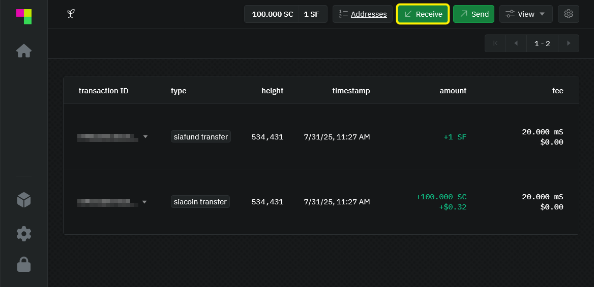
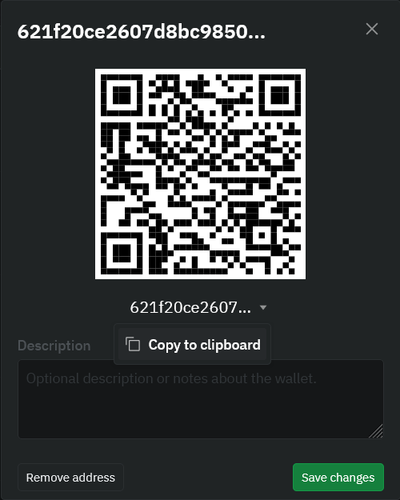
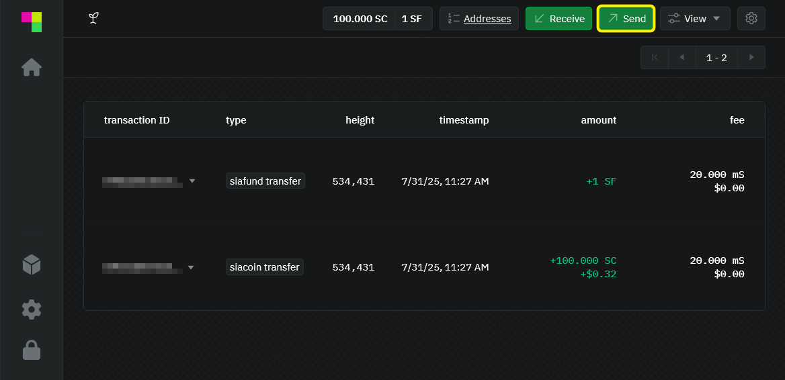
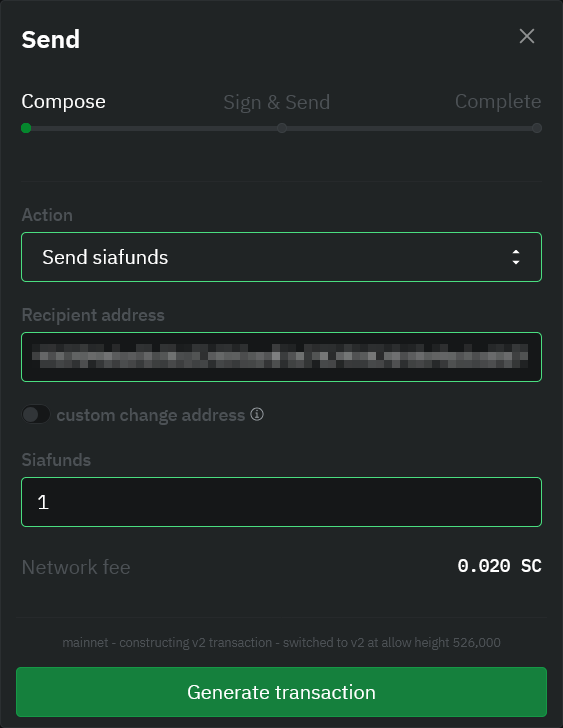
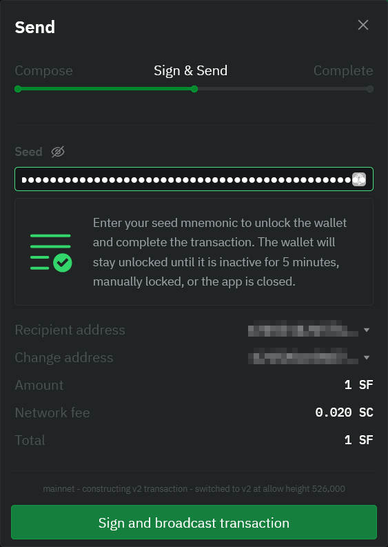
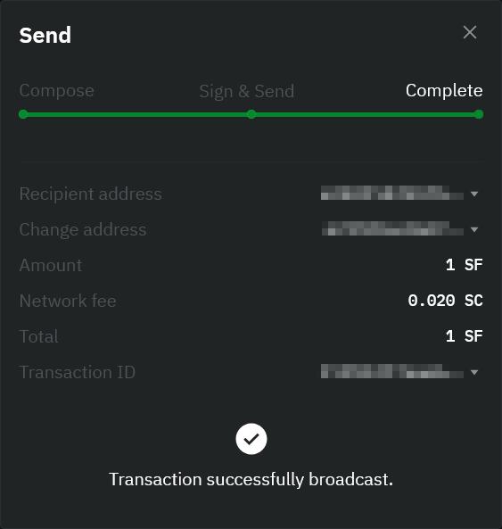

# Withdrawing Siafunds

If you're a Siafund owner, you can cash out these accrued Siacoins at any point by sending your Siafunds to your Sia address. This can be the same wallet the Siafunds are currently in or a different wallet you control.


You **do not** lose the Siafunds in this process. You'll always retain control unless you send them to someone else or a bad address.


## Generate a Sia address

Click **Receive.** in the top right hand corner to get your wallet address.

Click the drop down arrow and copy your address. You will be using it in the next step to send your Siafund.

## Send your Siafunds to this address

Now switch over to the Send section of your wallet by clicking **Send** in the top right.

You will see a **Send** dialog pop up. Enter the wallet address and the amount of Siafunds you want to send. Make sure that you've entered a Sia wallet address you control, and that you've entered it correctly.


Siafunds sent to mistyped addresses cannot be retrieved.


Click **Generate Transaction.**

## Sign & Send

Next, you need to verify everything. You'll have a chance to double-check the currency, amount, and recipient address. If everything looks good, enter your wallet seed phrase and click **Sign and broadcast transaction**.

## Check the status

You'll immediately get a confirmation that your transaction has been broadcast to the network. Note that it will take ~10 min for your transaction to be sent through.


Once the transaction has been complete, your wallet will be credited with any accrued Siacoin generated from your Siafund.
