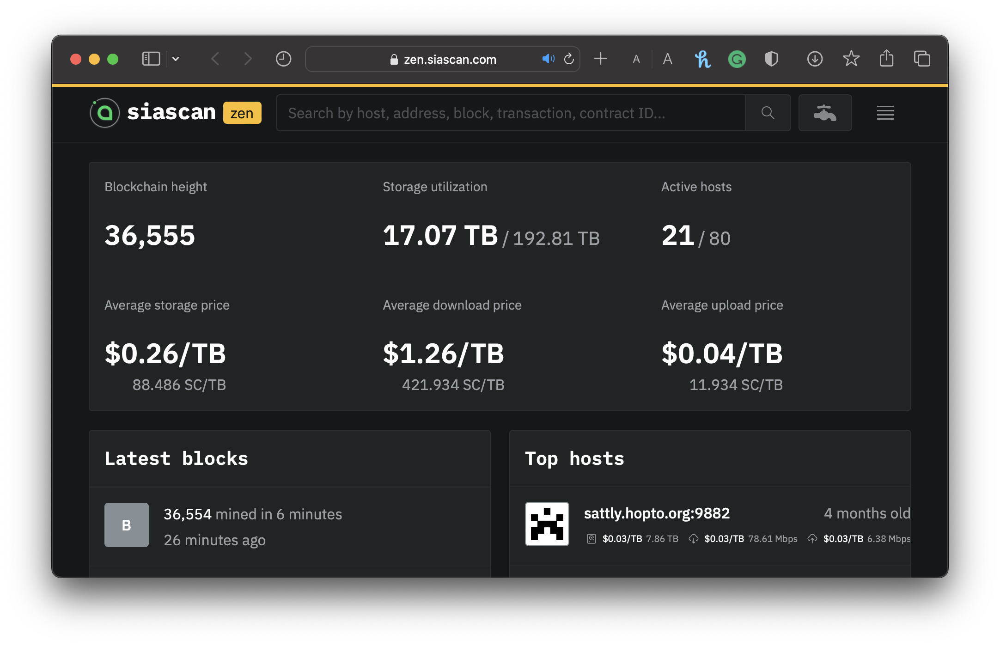

# Zen Testnet

The Sia Foundation has made a test environment available for users wishing to test hardforks, software developments, and integration within the Sia ecosystem via the Zen Testnet.

The Zen Testnet offers a secure environment to experiment with `renterd`, `hostd`, and `walletd`and explore the capabilities of Siacoin without the risk of losing real Siacoins, but also with no real-world value.&#x20;

## Running testnet

Running the testnet version for our software is similar to running it on the mainnet and follows the exact instructions for setting up [renterd](../renting/setting-up-renterd/), [hostd](../hosting/setup-guides/) and [walletd](../wallet/setting-up-walletd/).


Please ensure that you have downloaded the **testnet** binary for either`renterd`, `hostd` or `walletd` compatible with your operating system from our [official website](https://sia.tech).&#x20;


## Funding your testnet address

With the availability of zSC, the [Zen Testnet faucet](https://zen.siascan.com/faucet) provides a convenient way to acquire zSC by simply providing your Sia wallet's address.

Once on the page, enter a Sia wallet address of either. `renterd`, `hostd`, or `walletd` , then enter the amount of Zen Siacoins (zSC) you wish to fund that address with.&#x20;

<figure><figcaption>
Zen Testnet Faucet funding
</figcaption></figure>


It might take a minute or two for your wallet to be funded and for the transaction to appear in its transactions list.


## Block Explorer&#x20;

Our web-based block explorer and analytics tool is tailored for the Sia network. This comprehensive platform offers users a wide range of insights into the intricacies of the Siacoin network.&#x20;

Visit [SiaScan Zen](https://zen.siascan.com), our block explorer, to gain valuable insights into the testnet's activity, view transaction history, and monitor block confirmations.&#x20;

<figure><figcaption>
Siascan Zen
</figcaption></figure>

