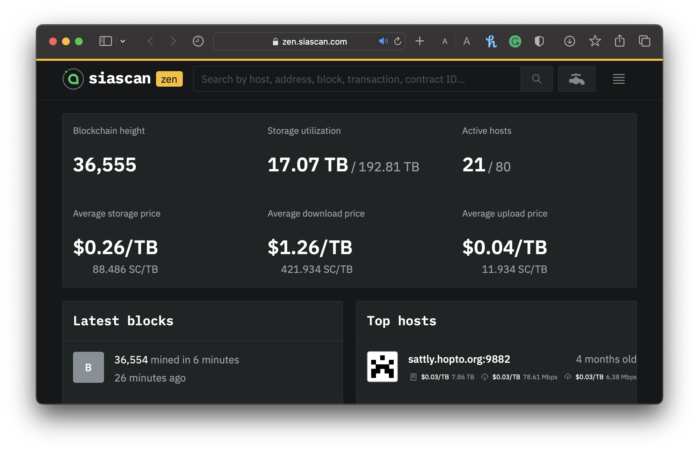

---
layout:
  title:
    visible: true
  description:
    visible: true
  tableOfContents:
    visible: true
  outline:
    visible: true
  pagination:
    visible: true
---

# Zen Testnet

The Sia Foundation has made a test environment available for users wishing to test hardforks, software developments, and integration within the Sia ecosystem via the Zen Testnet.

The Zen Testnet lets you experiment with `renterd`, `hostd`, and `walletd` using Siacoins that have no real-world value, so there is no risk of losing real Siacoins.

## Running testnet

Running our software on the testnet is similar to running it on the mainnet. First, download the binary for [renterd](https://sia.tech/rent), [hostd](https://sia.tech/host), or [walletd](https://sia.tech/wallet) from our official website. Then, follow the same setup instructions for [renterd](../renting/setting-up-renterd/), [hostd](../hosting/setting-up-hostd/) or [walletd](../wallet/setting-up-walletd/), up until the point of running the software.

For Linux or macOS users, run the software with the testnet runtime flag:

```
renterd --network=zen
hostd --network=zen
walletd --network=zen
```

Windows users can run the executable with a similar flag:

```
renterd -network=zen
hostd -network=zen
walletd -network=zen
```

## Funding your testnet address

The [Zen Testnet faucet](https://zen.siascan.com/faucet) lets you acquire zSC by providing your Sia wallet's address.

Once on the page, enter a Sia wallet address of either  `renterd`, `hostd`, or `walletd` , then enter the amount of Zen Siacoins (zSC) you wish to fund that address with.

<figure><figcaption><p>Zen Testnet Faucet funding</p></figcaption></figure>


It might take a minute or two for your wallet to be funded and for the transaction to appear in its transactions list.


## Block Explorer

Our web-based block explorer and analytics tool is built for the Sia network. It provides information about the Siacoin network.

Visit [SiaScan Zen](https://zen.siascan.com), our block explorer, to view the testnet's activity, transaction history, and block confirmations.

<figure><figcaption><p>Siascan Zen</p></figcaption></figure>

