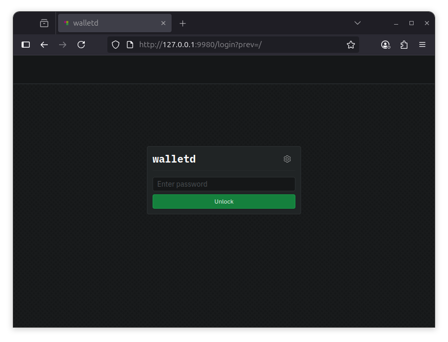

# Ubuntu

This guide will walk you through setting up `walletd` on Linux. At the end of this guide, you should have the following:

* Installed the `walletd` software
* Created a `walletd` wallet

---

## Pre-requisites

To ensure you will not run into any issues with running `walletd` it is recommended your system meets the following requirements:

* **Operating System Compatibility:** `walletd` is supported on the following Ubuntu versions:
  - Plucky (Ubuntu 25.04)
  - Noble (Ubuntu 24.04)
  - Jammy (Ubuntu 22.04)

* **System Updates:** Ensure that Ubuntu is up to date with the latest system updates, these updates can contain important security fixes and improvements.

* **Hardware Requirements:** A stable setup that meets the following specifications is recommended.
  - A quad-core CPU
  - 8GB of RAM
  - 256 GB SSD for `walletd`

* **Network Access:** `walletd` interacts with the Sia network, so you need a stable internet connection and open network access to connect to the Sia blockchain.

## Install `walletd` Using the `apt` repository

Before you install `walletd` for the first time on a new machine, you need to set up the Sia `apt` repository. Afterward, you can install and update `walletd` using `apt`.


Your system will need to have `curl` installed as well. You can check if it is installed by running `curl --version`. If it is not installed, you can install it by running `sudo apt update && sudo apt install curl`


**1. Set up the Sia `apt` repository by copying and pasting the following commands into your terminal:**

```sh
sudo curl -fsSL https://linux.sia.tech/ubuntu/gpg | sudo gpg --dearmor -o /usr/share/keyrings/siafoundation.gpg
sudo chmod 644 /usr/share/keyrings/siafoundation.gpg
echo "deb [signed-by=/usr/share/keyrings/siafoundation.gpg] https://linux.sia.tech/ubuntu $(. /etc/os-release && echo "$VERSION_CODENAME") main" | sudo tee /etc/apt/sources.list.d/siafoundation.list
sudo apt update
```

**2. Install `walletd`**
```sh
sudo apt install walletd
```

**3. Verify `walletd` was installed successfully**

Run the following command to see the version of `walletd` that was installed:

```sh
walletd version
```

## Configure `walletd`

After installing `walletd`, you will need to set a password to unlock the web interface. There is an interactive configuration process that you can start by running the following command.

```sh
sudo walletd config
```

This will start an interactive configuration process. You will be asked to verify the data directory, set a password to unlock the web interface, and optionally configure advanced settings such as the index mode.


`walletd` can manage multiple wallets, so the configuration wizard does not prompt for a seed. You create or import wallets from the web interface after `walletd` is running.



You will not see anything when you type in your unlock password. Press enter after typing it.


## Start `walletd`

Now that you have installed and configured `walletd`, you can start it by running the following command:

```sh
sudo systemctl enable --now walletd
```

## Verify `walletd` has started successfully

Run the following command to verify the `walletd` service has started successfully:

```sh
sudo systemctl status walletd
```

## Updating `walletd`

New versions of `walletd` are released regularly and contain bug fixes and performance improvements.

**To update:**

1. Stop the `walletd` service.
```sh
sudo systemctl stop walletd
```

2. Upgrade `walletd` using the `apt` package manager.
```sh
sudo apt update
sudo apt upgrade walletd
```

3. Start `walletd` service.
```sh
sudo systemctl start walletd
```

## Next Steps

Now that you have `walletd` installed and running, you can start using it to manage your wallets on the Sia network. You can access the web interface by navigating to [http://127.0.0.1:9980](http://127.0.0.1:9980) in your web browser. If you installed `walletd` on a remote machine or a server, you will need to create an SSH tunnel to access the web interface.



- [Your Sia Wallet](../../wallet-overview.md)
- [Transferring Siacoins](../../transferring-siacoins.md)
