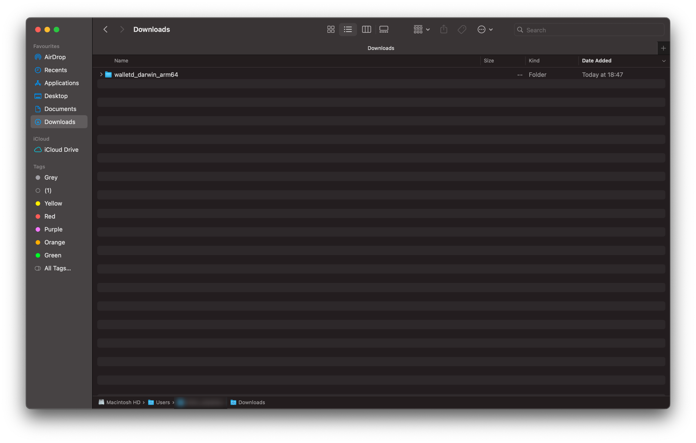

# macOS

This guide will walk you through setting up `walletd` on macOS. At the end of this guide, you should have the following:

* **Installed Sia `walletd` software:** You should have successfully installed the Sia `walletd` software on your macOS system with the appropriate binary.
* **Functional Sia Wallet:** You should have a functional Sia wallet that is set up and ready for transactional use in the Sia network.

## Pre-requisites

* **Network Access:** `walletd` interacts with the Sia network, so you need a stable internet connection and open network access to connect to the Sia blockchain.
* **Operating System Compatibility:** Ensure that your macOS version is compatible with the walletd software. Check [releases](../../miscellaneous/releases.md) supported macOS versions.
* **System Updates:** Ensure that your macOS is up to date with the latest system updates, as these updates can contain important security fixes and improvements.


This guide primarily uses the command line and assumes the user has sudo permissions.


## Getting `walletd`

1. Download the latest version of `walletd` for your operating system from the [official website](https://sia.tech/software/walletd). For the purpose of this guide, we'll be downloading the macOS version of `walletd` and unzip the binary to `/usr/local/bin`.


Remember to check which version to download to ensure it works correctly with your operating system. To do this click on the Apple icon in the top left corner of your toolbar, then click on “About This Mac.” If the processor/chips says:

* **Intel** - `MacOS AMD64`
* **M1 or M2** - `MacOS ARM64`


<figure><figcaption><p>macOS Download folder</p></figcaption></figure>

2. Now that we have downloaded `walletd`, you may need unzip it and move it to a more accessible location:
   * Double-click on the downloaded `walletd` zip file to unzip it if it hasn't done so automatically.
   * Click on the newly unzipped directory.
   * Right-click on the path bar at the bottom of the Finder window and click "Open in Terminal".

<figure><figcaption><p>Options after right-clicking </p></figcaption></figure>

3. In the opened terminal window, move the `walletd` binary to `/usr/local/bin` by running the following command and press enter:

```sh
sudo mv walletd /usr/local/bin
```

<figure><figcaption><p>Moving walletd binary </p></figcaption></figure>

You'll be prompted to authorize this action by providing your system password. Type this in and press enter to continue.

4. Finally, for good practice, create a folder on the home drive. This folder will be utilized specifically to store data related to the `walletd` software, which may includes information, configurations, logs, or any other relevant files. Run the following command to do so:

```sh
mkdir ~/walletd
```

## Running `walletd`

1. In the same terminal, run the following command to start `walletd`:

<pre class="language-sh"><code class="lang-sh"><strong>walletd --dir ~/walletd
</strong></code></pre>

You will be prompted to input a `API password`. This password is chosen by you and can be anything you want it to be. It will be used to unlock the `walletd` UI via your browser, should be something secure and easy to remember. This value is not stored anywhere; you will need to re-enter it every time you start `walletd`.


You can also set the SIA`_API_PASSWORD` environment variables so you do not have to re-enter the values every time.


2. After entering your desired `API password`, `walletd` will start.&#x20;

<figure><figcaption><p>Starting walletd via macOS terminal</p></figcaption></figure>

Your terminal will produce two different values you may not be familiar with, so feel free to check the tabs below to see what each of them is and why they are important:



**p2p (Peer-to-Peer) Component:**

* "p2p" refers to the communication between different nodes or devices without relying on a central server.
* `Listening on 127.0.0.1:9981` means that the application's p2p component is currently set to listen for incoming network connections on the local loopback IP address `127.0.0.1` (also known as `localhost`) and the port `9981`. Localhost refers to the current machine itself.



**api (Application Programming Interface) Component:**

* "api" refers to the application programming interface, which allows different software components to communicate and interact with each other.
* `Listening on 127.0.0.1:9980` indicates that the application's API component is actively waiting for incoming connections on the local loopback IP address `127.0.0.1` and the port `9980`.



3. You can now access the `walletd` UI by opening a browser and going to `http://localhost:9980`.&#x20;


Remember to leave the terminal window open while `walletd` is running. If you close the command prompt window, `walletd`will stop.


<figure><figcaption><p>walletd </p></figcaption></figure>

Enter your `API password` you created in the in the previous step to unlock `walletd`.


Congratulations on successfully setting up `walletd` and taking a significant step towards securing your Siacoins.


## Updating

It is very important to keep your host up to date. New versions of `walletd` are released regularly and contain bug fixes and performance improvements.

To update:

1. Download the latest version of `walletd` from the [official website](https://sia.tech/software/walletd).
2. Stop the `walletd` service with the command `sudo systemctl stop walletd`
3. Unzip and replace `walletd` in `/usr/local/bin` with the new version
4. Restart `walletd` with `sudo systemctl start walletd`

