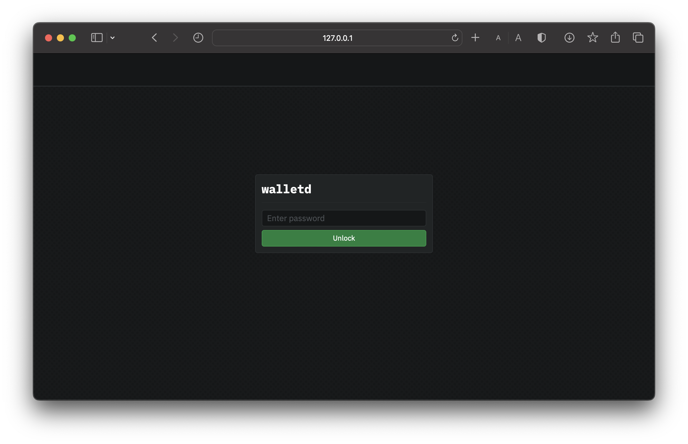

# macOS

This guide will walk you through setting up `walletd` on macOS. At the end of this guide, you should have the following:

* Installed Sia `walletd` software
* Functional Sia Wallet

## Pre-requisites

* **Network Access:** `walletd` interacts with the Sia network, so you need a stable internet connection and open network access to connect to the Sia blockchain.
* **Operating System Compatibility:** Ensure your macOS version is compatible with the `walletd` software. Check [releases](../../miscellaneous/releases.md) supported macOS versions.
* **System Updates:** Ensure that your macOS is up to date with the latest system updates, as these updates can contain important security fixes and improvements.

## Getting `walletd`


Remember to check which version to download to ensure it works correctly with your operating system. To do this, click on the Apple icon in the top left corner of your toolbar, then click on **About This Mac**. If the processor/chips says:

* **Intel** - `MacOS AMD64`
* **M1 or M2** - `MacOS ARM64`


1. Download the latest version of `walletd` for your operating system from the [official website](https://sia.tech/software/walletd). For this guide, we'll be downloading the macOS version of `walletd` .
2. Now that we have downloaded `walletd`, you may need to unzip it.
   * Double-click the downloaded `walletd` zip file to unzip it if it hasn't done so automatically.
   * Click on the newly unzipped directory.
   * Right-click on the path bar at the bottom of the Finder window and click **Open in Terminal**.
3. In the opened terminal window, move the `walletd` binary to `/usr/local/bin` by running the following command and press enter:

```sh
sudo mv walletd /usr/local/bin
```


You'll be prompted to authorize this action by providing your system password. Type this in and press enter to continue.


4. Finally, for good practice, create a folder on the home drive. This folder will be utilized specifically to store data related to the `walletd` software.

```sh
mkdir ~/walletd
```

## Running `walletd`

1. Run the following in your terminal command to start `walletd`:

<pre class="language-sh"><code class="lang-sh"><strong>walletd
</strong></code></pre>

You will be prompted to input a `API password`. You choose this password, which can be anything you want. It will be used to unlock the `walletd` UI, via your browser, should be something secure and easy to remember. This value is not stored anywhere; you will need to re-enter it every time you start `walletd`.


You can also set the SIA`_API_PASSWORD` environment variables so you do not have to re-enter the values every time.


2. After entering your desired `API password`, `walletd` will start.&#x20;

<figure><figcaption><p>Starting walletd</p></figcaption></figure>

3. You can now access the `walletd` UI by opening a browser and going to `http://localhost:9980`.&#x20;


Remember to leave the terminal window open while `walletd` is running. If you close the command prompt window, `walletd`will stop.


<figure><figcaption><p>walletd </p></figcaption></figure>

Enter your `API password` you created in the in the previous step to unlock `walletd`.


Congratulations on successfully setting up `walletd` and taking a significant step towards securing your Siacoins.


## Updating

It is imperative to keep your host up to date. New versions of `walletd` are released regularly and contain bug fixes and performance improvements.

To update:

1. Download the latest version of `walletd` from the [official website](https://sia.tech/software/walletd).
2. Stop the `walletd` service with `Cmd+C`.
3. Unzip and replace `walletd` in `/usr/local/bin` with the new version
4. Restart `walletd`.

